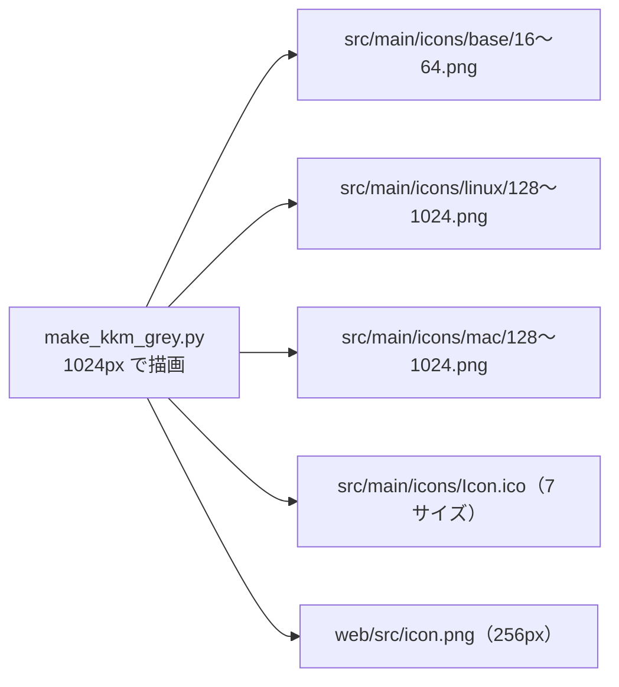

# アプリアイコン（KKM）

更新: 2026-09-27

## 1. 配色

ロゴ（黒の文字＋灰色の縁取り）とアプリのハイライト（明るいグレー）に合わせ、KKM アイコンを KeRT グリーンから
グレーに作り直した。形（角丸の正方形、濃色の枠、中央の「KKM」）は変えていない。

| 部分 | 色 | 由来 |
|---|---|---|
| 地 | `#cccccc` | アプリのハイライト（`branding_theme.py` の Highlight） |
| 枠 | `#303030` | 画面の枠線と同じ（以前と同じ） |
| 文字 | `#000000` | ロゴの文字 |
| 文字の縁取り | `#888888` | ロゴの縁取り |

以前は地が `#00a3a3`、文字が白、文字の縁取りが `#303030` だった。地を `#888888` にして白文字を残す案とも比べたが、
ロゴと同じ「黒い文字＋灰色の縁取り」の方がヘッダーのロゴと揃い、16px でも明暗どちらの背景でも読めたので採用した。

## 2. ファイル

生成スクリプトはリポジトリ外（作業用ディレクトリ）にある。1024px で描いたものを各サイズに縮小し、ICO は
PNG 形式の 7 サイズを束ねる。

## 3. テスト

| テスト | 確認内容 |
|---|---|
| `test_app_icon.py::test_icon_png_is_grey` | 全 PNG（`src/main/icons/*/`、`web/src/icon.png`）の不透明画素が無彩色のみで、最多色が `#cccccc` |
| `test_app_icon.py::test_ico_is_grey` | `Icon.ico` の 7 サイズすべてが無彩色 |
| `test_app_icon.py::test_face_matches_the_highlight` | 地の色がアプリのハイライト色と一致 |
