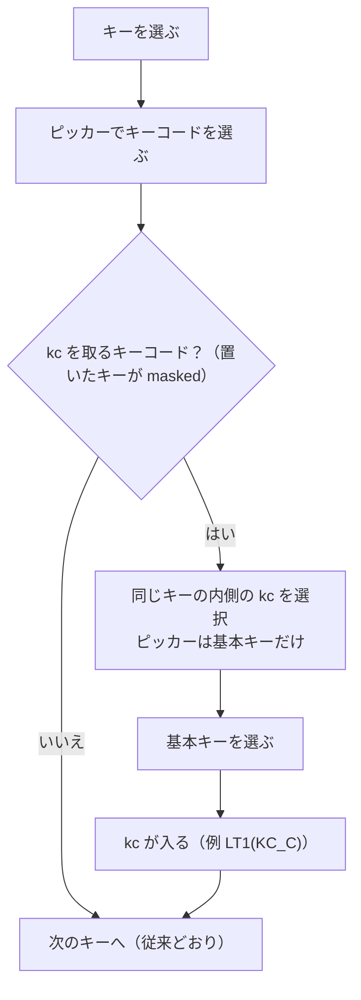

# 「kc」を取るキーを置いたら、そのまま kc を選ぶ 仕様書（2026-10-10）

## 1. 目的

Layers / Quantum タブなどにある「kc」を取るキーコード（`LT1(kc)`、`LCTL_T(kc)`、`LCTL(kc)` など）をキーに置いた
とき、選択をそのキーの内側の「kc」に移し、続けて kc（A や Space など）を選べるようにする。これまでは次のキーへ
移ってしまい、kc を設定するにはキーの内側をクリックし直す必要があった。

## 2. 動き

- `KeymapEditor.set_key()`: 置く前に選んでいたのがキー全体（`active_mask` が偽）で、置いた後そのキーが
  `masked`（kc を取る）なら、`active_mask` を真にして `on_key_clicked()`（ピッカーを基本キーだけにする）を呼び、
  次のキーへは移らない。
- 内側の kc を選んでいるときに基本キーを置くと、従来どおり次のキーへ移る。
- kc を取らないキーコードは従来どおり次のキーへ移る。

## 3. テスト

| テスト | 確認内容 |
|---|---|
| `test_auto_mask.py::test_masked_keycode_selects_its_kc` | `LT1(kc)` を置くと同じキーの内側が選ばれ、ピッカーが基本キーになる。`KC_C` を選ぶと `LT1(KC_C)` になり次のキーへ |
| `test_auto_mask.py::test_mod_tap_and_modifier_keycodes_too` | `LCTL_T(kc)`、`LCTL(kc)` も同じ |
| `test_auto_mask.py::test_plain_keycode_moves_on` | 普通のキーコードは次のキーへ |
| `test_gui.py::test_key_change` | LCtl(kc) を置いた後の期待を「同じキーの内側」に変更 |
