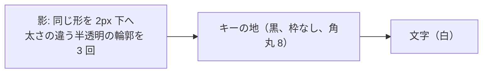

# キーの見た目: 黒いキー（試行）

作成: 2026-09-29

## 1. 目的

キーの見た目を「白地・黒文字・3px の黒枠・角丸」から「黒地・白文字・枠なし・8px 角丸・黒のドロップシャドウ」に
変えて試す。`key_style.DARK_KEYS` を `False` にすれば元の見た目に戻る。

## 2. 対象

| 対象 | 描画 | 変更 |
|---|---|---|
| 上段キーマップのキー、エディタ内の 1 キー表示（`KeyboardWidget` / `KeyWidget`） | Python の `paintEvent` で描く | 地を黒、文字を白、枠なし。先に全キーの影を描き、次にキーを描く（隣のキーに影が重ならない） |
| 下段ピッカーのキー、キーボード型の並び（`SquareButton`、`make_key()` で `keyButton` 属性を付けたもの） | スタイルシート | `QPushButton[keyButton="true"]` で地を黒、文字を白、枠なし、8px 角丸。ボタン内に余白 `KEY_MARGINS` を取り、そこに `SquareButton.paintEvent` が影を描く |
| タブ（すべての `QTabBar`） | スタイルシート + 影 | `QTabBar::tab` を黒地・白文字・枠なし・8px 角丸にし、余白 `KEY_MARGINS` を取る。影は `widgets/key_shadow.py` がタブバーの描画の直前にイベントフィルタで描く（2026-09-30 追加） |
| レイヤーボタン | `LayerHighlight` が下敷きを描く | ボタンは透明・枠なし・白文字。下敷きが全ボタンの影、黒い地、動くハイライトの四角の順に描く。影の分だけ下敷きの領域を広げる（2026-09-30 追加） |
| キーボード名のセレクター（`DeviceComboBox`） | スタイルシート + 影 | 黒地・枠なし・8px 角丸・余白 `KEY_MARGINS`。キーボード名（2 段）を白で描き、影は自身の `paintEvent` で先に描く（2026-09-30 追加） |
| 拡大・縮小ボタン（+ / −） | ピッカーのキーと同じ | `make_key()` で `keyButton` 属性、余白の分だけ `frame_extra` を取る（2026-09-30 追加） |
| 対象外 | | Tap Dance / HostOS / Macro のカード型ボタン、Refresh ボタン、その他のボタンや枠は従来どおり |

## 3. 値（`key_style.py`）

| 名前 | 値 | 用途 |
|---|---|---|
| `KEY_FACE` | `#000000` | キーの地 |
| `KEY_LEGEND` | `#ffffff` | キーの文字 |
| `KEY_RADIUS` | 8 | 角丸（キーマップはキー座標、ピッカーは px） |
| `KEY_HOVER_FACE` | `#333333` | ピッカーのキーにマウスを乗せたとき |
| `KEY_MASK_FACE` | `#3a3a3a` | LT(1, KC_A) などの内側の四角 |
| `KEY_OVERRIDE_LEGEND` | `#79c0ff` | 割り当てを変えたキーの文字（Colemak 表示など）。従来のリンク色の青は黒地で読めない |
| `SHADOW_OFFSET` / `SHADOW_BLUR` / `SHADOW_ALPHA` | 2 / 3 / 45 | 影: 2px 下にずらし、3 段の半透明の輪郭で 3px ぼかす |
| `KEY_MARGINS` | (3, 1, 3, 5) | ピッカーのキーの余白（左・上・右・下）。影の入る場所。合計は旧枠線と同じ幅 |

選択中のキー、選択中のタブ、今のレイヤーはハイライト色 `#F0F0F0` に濃色文字 `#1f2328`（2026-09-30 に `#767676` の白文字から変更）。今のレイヤーのボタンは操作不可（disabled）にしているので、その状態でも濃色文字になるよう、覆われたボタンの文字色の規則を最後に置く。マウスを乗せたタブは `#333333`。押下中・ON 表示は従来どおりハイライト色の明暗。

1 キーだけの表示（`KeyWidget`）は余白が 1px で影が切れるため、黒いキーのときは余白を 5px（ずれ 2 + ぼかし 3）にする。

## 5. マウスが乗ったキーの拡大（2026-10-01 追加）

上段のキーマップでは、マウスが乗っているキーを `key_style.HOVER_SCALE`（1.08 倍）でキーの中心から拡大して描く。

- `KeyboardWidget.hover_zoom` を有効にした部品だけが対象。キーマップの `container` だけが有効で、1 キー表示や
  マトリクステスターなど他の部品は変わらない。
- マウスの移動（`MouseMove`）で乗っているキーを判定し、変わったときだけ描き直す。部品から出た（`Leave`）ら解除。
- 描く順番を変え、乗っているキーを最後に描く（`paint_order()`）。影も同じ順なので、拡大したキーが隣のキーと
  その影の手前に重なる。
- 拡大はアニメーションさせず、乗った瞬間に切り替える。キーボード全体の描画は Python の `paintEvent` で、ブラウザ版
  では重いため、コマ数の要る動きは避けた。
- 端にあるとても横長のキー（スペースなど）は、拡大した分が部品の余白（5px）を超えると端が少し切れる。

| テスト | 確認内容 |
|---|---|
| `test_key_hover.py::test_hover_scale_constant` | 拡大率が 1.03〜1.15 |
| `test_key_hover.py::test_keymap_key_grows_under_the_mouse` | キーに乗ると、キーの左端のすぐ外側がキーの色になり、離れると元に戻る |
| `test_key_hover.py::test_leaving_the_widget_drops_the_hover` | 部品から出ると拡大が解除される |
| `test_key_hover.py::test_other_keyboard_widgets_do_not_zoom` | 1 キー表示は拡大しない |

## 4. テスト

| テスト | 確認内容 |
|---|---|
| `test_dark_keys.py::test_constants` | 値、割り当て変更の文字色と内側の四角の文字のコントラスト比 4.5 以上 |
| `test_dark_keys.py::test_keymap_key_is_black_with_white_legend_and_shadow` | キーマップのキーの地が黒、白文字、縁まで黒（枠なし）、下に影があり下へ行くほど薄い |
| `test_dark_keys.py::test_selected_key_is_highlight_grey` | 選択中のキーはハイライト色に白文字 |
| `test_dark_keys.py::test_picker_key_buttons` | ピッカーのキーに `keyButton` 属性、スタイルの値、地が黒、下の余白に薄れていく影 |
| `test_dark_keys.py::test_off_switch_restores_the_outlined_look` | `DARK_KEYS = False` で元の白地に戻る |
| `test_dark_keys.py::test_tab_style` | タブのスタイルが黒地・白文字・枠なし・角丸 8・余白あり、選択中はハイライト色 |
| `test_dark_keys.py::test_tabs_black_with_shadow` | タブバーに影のフィルタが付き、選択していないタブの地が黒、下に影、選択中はハイライト色 |
| `test_dark_keys.py::test_layer_buttons_black_with_shadow` | 今のレイヤー以外のボタンの地が黒、今のレイヤーはハイライト色、枠なし、最後のボタンの下に影、文字は白 |
| `test_dark_keys.py::test_selector_looks_like_a_key` | セレクターのスタイル、地が黒、キーボード名が白、下に影 |
| `test_dark_keys.py::test_zoom_buttons_look_like_keys` | 拡大・縮小ボタンに `keyButton` 属性と余白、地が黒 |
| `test_theme.py::test_flat_key_paint` ほか | 元の見た目のテストは `DARK_KEYS = False` にして残す |
