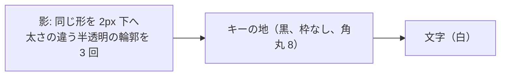
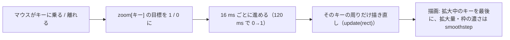

# キーの見た目: 黒いキー（試行）

作成: 2026-09-29

## 1. 目的

キーの見た目を「白地・黒文字・3px の黒枠・角丸」から「黒地・白文字・枠なし・8px 角丸・黒のドロップシャドウ」に
変えて試す。`key_style.DARK_KEYS` を `False` にすれば元の見た目に戻る。

## 2. 対象

| 対象 | 描画 | 変更 |
|---|---|---|
| 上段キーマップのキー、エディタ内の 1 キー表示（`KeyboardWidget` / `KeyWidget`） | Python の `paintEvent` で描く | 地を黒、文字を白、枠なし。先に全キーの影を描き、次にキーを描く（隣のキーに影が重ならない） |
| 下段ピッカーのキー、キーボード型の並び（`SquareButton`、`make_key()` で `keyButton` 属性を付けたもの） | スタイルシート | `QPushButton[keyButton="true"]` で地を黒、文字を白、枠なし、8px 角丸。ボタン内に余白 `KEY_MARGINS` を取り、そこに `SquareButton.paintEvent` が影を描く |
| タブ（すべての `QTabBar`） | スタイルシート + 影 | `QTabBar::tab` を黒地・白文字・枠なし・8px 角丸にし、余白 `KEY_MARGINS` を取る。影は `widgets/key_shadow.py` がタブバーの描画の直前にイベントフィルタで描く（2026-09-30 追加） |
| レイヤーボタン | `LayerHighlight` が下敷きを描く | ボタンは透明・枠なし・白文字。下敷きが全ボタンの影、黒い地、動くハイライトの四角の順に描く。影の分だけ下敷きの領域を広げる（2026-09-30 追加） |
| キーボード名のセレクター（`DeviceComboBox`） | スタイルシート + 影 | 黒地・枠なし・8px 角丸・余白 `KEY_MARGINS`。キーボード名（2 段）を白で描き、影は自身の `paintEvent` で先に描く（2026-09-30 追加） |
| 拡大・縮小ボタン（+ / −） | ピッカーのキーと同じ | `make_key()` で `keyButton` 属性、余白の分だけ `frame_extra` を取る（2026-09-30 追加） |
| 対象外 | | Tap Dance / HostOS / Macro のカード型ボタン、Refresh ボタン、その他のボタンや枠は従来どおり |

## 3. 値（`key_style.py`）

| 名前 | 値 | 用途 |
|---|---|---|
| `KEY_FACE` | `#000000` | キーの地 |
| `KEY_LEGEND` | `#ffffff` | キーの文字 |
| `KEY_RADIUS` | 8 | 角丸（キーマップはキー座標、ピッカーは px） |
| `KEY_HOVER_FACE` | `#333333` | ピッカーのキーにマウスを乗せたとき |
| `KEY_MASK_FACE` | `#3a3a3a` | LT(1, KC_A) などの内側の四角 |
| `KEY_OVERRIDE_LEGEND` | `#79c0ff` | 割り当てを変えたキーの文字（Colemak 表示など）。従来のリンク色の青は黒地で読めない |
| `SHADOW_OFFSET` / `SHADOW_BLUR` / `SHADOW_ALPHA` | 2 / 3 / 45 | 影: 2px 下にずらし、3 段の半透明の輪郭で 3px ぼかす |
| `KEY_MARGINS` | (3, 1, 3, 5) | ピッカーのキーの余白（左・上・右・下）。影の入る場所。合計は旧枠線と同じ幅 |

選択中のキー、選択中のタブ、今のレイヤーはハイライト色 `#F0F0F0` に濃色文字 `#1f2328`（2026-09-30 に `#767676` の白文字から変更）。今のレイヤーのボタンは操作不可（disabled）にしているので、その状態でも濃色文字になるよう、覆われたボタンの文字色の規則を最後に置く。マウスを乗せたタブは `#333333`。押下中・ON 表示は従来どおりハイライト色の明暗。

1 キーだけの表示（`KeyWidget`）は余白が 1px で影が切れるため、黒いキーのときは余白を 5px（ずれ 2 + ぼかし 3）にする。

## 5. マウスが乗ったキーの拡大と枠（2026-10-01 追加、2026-10-02 改訂）

上段のキーマップでは、マウスが乗っているキーを各辺 `HOVER_GROW_PX`（5px）大きく描く。オレンジ色
（`HOVER_FRAME_COLOR` = `#ff8c00`）の枠は、2026-10-02 から選択したキーにだけ付ける（5.2）。拡大・縮小と枠の濃さは `HOVER_ANIM_MS`（120 ms）で滑らかに変わる。

| 値 | 内容 |
|---|---|
| `HOVER_GROW_PX` = 5 | 各辺の拡大量（画面 px）。倍率ではなく一定量にした（1.08 倍だと横長のキーが横に大きく伸び、端のキーの枠が部品の外に出た） |
| `HOVER_ANIM_MS` = 120 | 拡大・縮小の時間。進み具合に smoothstep（ゆっくり始まりゆっくり止まる）を掛ける |
| `HOVER_FRAME_RADIUS` = 10 | 枠の角丸（画面 px） |
| `HOVER_FRAME_WIDTH` = 3 / `HOVER_FRAME_GAP` = 2 | 枠の太さと、拡大したキーとの隙間 |

- `KeyboardWidget.enable_hover_zoom()` を呼んだ部品だけが対象（キーマップの `container`）。拡大分と枠の分だけ余白
  （`padding`）を広げるので、上段や右端のキーでも枠が切れない。1 キー表示やマトリクステスターは変わらない。
- キーごとに拡大の進み具合（0〜1）を持つので、別のキーへ移ると前のキーは縮みながら、次のキーは大きくなる。
- アニメーション中はキーボード全体ではなく、動いているキーの周りだけを描き直し、描画でも描き直す範囲にかかる
  キーだけを描く。ブラウザ版では描画が重いため。
- 枠は拡大の伸び縮みを掛けずに描くので、太さと角丸が均一になる。

| テスト | 確認内容 |
|---|---|
| `test_key_hover.py::test_hover_grow_constant` / `test_frame_and_animation_constants` | 値の範囲、枠がオレンジで角丸 10 |
| `test_key_hover.py::test_keymap_key_grows_under_the_mouse` | 乗ると左端のすぐ外側がキーの色になり、離れると戻る |
| `test_key_hover.py::test_zoom_animates_in_and_out` | 一気に変わらず途中の大きさを通り、縮むときも徐々に戻る |
| `test_key_hover.py::test_orange_frame_around_the_hovered_key` | 拡大したキーのすぐ外側がオレンジ、離れると消える |
| `test_key_hover.py::test_animation_repaints_only_around_the_key` | 各コマの描き直し範囲がキーボード全体の半分未満 |
| `test_key_hover.py::test_frame_fits_inside_the_widget_for_edge_keys` | どのキーでも拡大分と枠が部品の中に収まる |
| `test_key_hover.py::test_leaving_the_widget_drops_the_hover` / `test_other_keyboard_widgets_do_not_zoom` | 部品から出ると解除、1 キー表示は対象外 |

### 5.1 レイヤーボタン（2026-10-02 追加）

レイヤーボタンも同じ表示にする。マウスが乗ったボタンを各辺 5px 大きくし、オレンジの 10px 角丸の枠を付け、
120 ms で拡大・縮小する。

- ボタン自体は透明で、見た目は下敷きの `LayerHighlight` が描くので、拡大と枠も `LayerHighlight` が描く。マウスの
  出入りは各ボタンに付けたイベントフィルタ（`Enter` / `Leave`）で拾う。
- 描く順番: 影 → 地（拡大中のボタンを最後に）→ 今のレイヤーを示す動く四角（重なっているボタンの拡大分だけ大きく）
  → オレンジの枠。
- 下敷きの領域を、影と拡大・枠の分だけボタンの外へ広げる。「Layer」の文字の下にも同じだけ空きを入れ、いちばん上の
  ボタンの枠が文字に重ならないようにした。

| テスト | 確認内容 |
|---|---|
| `test_key_hover.py::test_layer_button_hover_animates` | 乗ると途中の大きさを経て拡大し、離れると戻る |
| `test_key_hover.py::test_layer_button_hover_grows_with_orange_frame` | 拡大した地がボタンの外まで黒く広がり、その外側がオレンジ |
| `test_key_hover.py::test_layer_highlight_has_room_for_the_frame` | 下敷きの領域が拡大と枠を含み、「Layer」の文字と枠が重ならない |

### 5.2 オレンジの枠は選択したキーだけ（2026-10-02 変更）

オレンジの枠は、マウスが乗ったキーではなく、クリックして選択したキー（`active_key`）にだけ付ける。

- マウスを乗せたときは拡大のアニメーションだけで、枠は付けない。レイヤーボタンも同じ（枠なしで拡大のみ）。
- 選択したキーの枠は常に表示し（フェードしない）、そのキーにマウスが乗っていれば拡大した大きさの外側に付く。
- 枠はキーマップ（`enable_hover_zoom()` を呼んだ部品）だけ。エディタ内の 1 キー表示などには付けない。
- 描く順番は、選択したキー、拡大中のキーの順に後ろにし、枠や拡大したキーが隣に隠れないようにする。

| テスト | 確認内容 |
|---|---|
| `test_key_hover.py::test_orange_frame_only_on_the_selected_key` | 乗せただけでは枠が出ず、クリックすると拡大したキーの外側に出る。離れても選択中は元の大きさの外側に残り、選択を外すと消える |
| `test_key_hover.py::test_other_keyboard_widgets_have_no_frame` | 1 キー表示は選択しても枠が出ない |
| `test_key_hover.py::test_layer_button_hover_grows_without_frame` | レイヤーボタンは乗せると拡大するが枠は出ない |

### 5.3 乗せている間は白地（2026-10-02 追加）

マウスを乗せて拡大している間、キーとレイヤーボタンは黒地から白地（`HOVER_FACE` = `#ffffff`）に、文字は白から黒
（`HOVER_LEGEND` = `#000000`）に変わる。色は拡大と同じ進み具合（smoothstep）で混ぜるので、0.12 秒で滑らかに変わる
（`key_style.mix()`）。

- 選択中のキー（選択色 `#F0F0F0` とオレンジの枠）と、押下中・ON 表示のキーは、乗せても色を変えない。
- 割り当てを変えたキーの明るい青の文字は白地で読めないので、半分以上白くなったら濃い青（`HOVER_OVERRIDE_LEGEND`
  = `#0969da`）にする。
- レイヤーボタンは下敷き（`LayerHighlight`）が地の色を混ぜ、半分以上白くなったボタンに `hovered` 属性を付けて、
  スタイルシートで文字を黒にする（操作不可の今のレイヤーにも効くよう `:disabled` も指定）。

| テスト | 確認内容 |
|---|---|
| `test_key_hover.py::test_hover_colours_constants` | 白地・黒文字の値、黒と白の中間がグレーになる |
| `test_key_hover.py::test_hovered_key_turns_white` | 乗せるとグレーを経て白地になり、離れると黒に戻る |
| `test_key_hover.py::test_hovered_key_legend_turns_dark` | 白地の中に黒い文字がある |
| `test_key_hover.py::test_hovered_layer_button_turns_white` | レイヤーボタンが白地・黒文字になり、離れると戻る |

## 4. テスト

| テスト | 確認内容 |
|---|---|
| `test_dark_keys.py::test_constants` | 値、割り当て変更の文字色と内側の四角の文字のコントラスト比 4.5 以上 |
| `test_dark_keys.py::test_keymap_key_is_black_with_white_legend_and_shadow` | キーマップのキーの地が黒、白文字、縁まで黒（枠なし）、下に影があり下へ行くほど薄い |
| `test_dark_keys.py::test_selected_key_is_highlight_grey` | 選択中のキーはハイライト色に白文字 |
| `test_dark_keys.py::test_picker_key_buttons` | ピッカーのキーに `keyButton` 属性、スタイルの値、地が黒、下の余白に薄れていく影 |
| `test_dark_keys.py::test_off_switch_restores_the_outlined_look` | `DARK_KEYS = False` で元の白地に戻る |
| `test_dark_keys.py::test_tab_style` | タブのスタイルが黒地・白文字・枠なし・角丸 8・余白あり、選択中はハイライト色 |
| `test_dark_keys.py::test_tabs_black_with_shadow` | タブバーに影のフィルタが付き、選択していないタブの地が黒、下に影、選択中はハイライト色 |
| `test_dark_keys.py::test_layer_buttons_black_with_shadow` | 今のレイヤー以外のボタンの地が黒、今のレイヤーはハイライト色、枠なし、最後のボタンの下に影、文字は白 |
| `test_dark_keys.py::test_selector_looks_like_a_key` | セレクターのスタイル、地が黒、キーボード名が白、下に影 |
| `test_dark_keys.py::test_zoom_buttons_look_like_keys` | 拡大・縮小ボタンに `keyButton` 属性と余白、地が黒 |
| `test_theme.py::test_flat_key_paint` ほか | 元の見た目のテストは `DARK_KEYS = False` にして残す |
