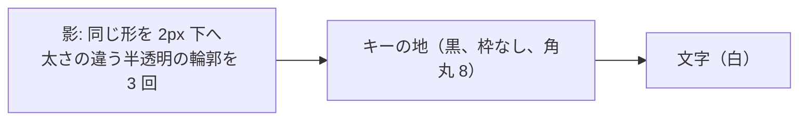
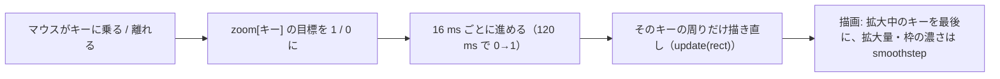
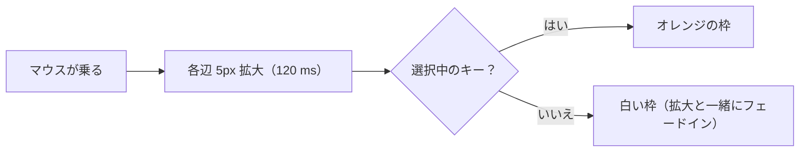
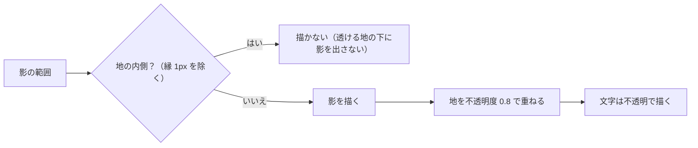
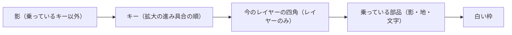
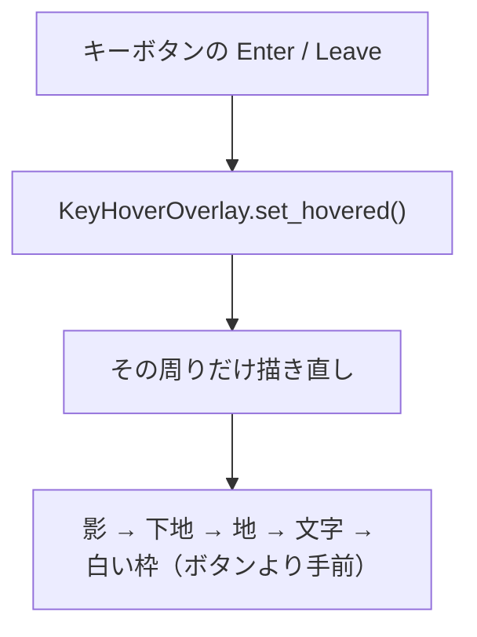

# キーの見た目: 黒いキー（試行）

作成: 2026-09-29

## 1. 目的

キーの見た目を「白地・黒文字・3px の黒枠・角丸」から「黒地・白文字・枠なし・8px 角丸・黒のドロップシャドウ」に
変えて試す。`key_style.DARK_KEYS` を `False` にすれば元の見た目に戻る。

## 2. 対象

| 対象 | 描画 | 変更 |
|---|---|---|
| 上段キーマップのキー、エディタ内の 1 キー表示（`KeyboardWidget` / `KeyWidget`） | Python の `paintEvent` で描く | 地を黒、文字を白、枠なし。先に全キーの影を描き、次にキーを描く（隣のキーに影が重ならない） |
| 下段ピッカーのキー、キーボード型の並び（`SquareButton`、`make_key()` で `keyButton` 属性を付けたもの） | スタイルシート | `QPushButton[keyButton="true"]` で地を黒、文字を白、枠なし、8px 角丸。ボタン内に余白 `KEY_MARGINS` を取り、そこに `SquareButton.paintEvent` が影を描く |
| タブ（すべての `QTabBar`） | スタイルシート + 影 | `QTabBar::tab` を黒地・白文字・枠なし・8px 角丸にし、余白 `KEY_MARGINS` を取る。影は `widgets/key_shadow.py` がタブバーの描画の直前にイベントフィルタで描く（2026-09-30 追加） |
| レイヤーボタン | `LayerHighlight` が下敷きを描く | ボタンは透明・枠なし・白文字。下敷きが全ボタンの影、黒い地、動くハイライトの四角の順に描く。影の分だけ下敷きの領域を広げる（2026-09-30 追加） |
| キーボード名のセレクター（`DeviceComboBox`） | スタイルシート + 影 | 黒地・枠なし・8px 角丸・余白 `KEY_MARGINS`。キーボード名（2 段）を白で描き、影は自身の `paintEvent` で先に描く（2026-09-30 追加） |
| 拡大・縮小ボタン（+ / −） | ピッカーのキーと同じ | `make_key()` で `keyButton` 属性、余白の分だけ `frame_extra` を取る（2026-09-30 追加） |
| 対象外 | | Tap Dance / HostOS / Macro のカード型ボタン、Refresh ボタン、その他のボタンや枠は従来どおり |

## 3. 値（`key_style.py`）

| 名前 | 値 | 用途 |
|---|---|---|
| `KEY_FACE` | `#77dd77`（パステルグリーン。2026-10-04 試行、以前は `#000000`） | キーの地 |
| `KEY_LEGEND` | `#1f2328`（以前は `#ffffff`） | キーの文字 |
| `KEY_RADIUS` | 8 | 角丸（キーマップはキー座標、ピッカーは px） |
| `KEY_HOVER_FACE` | `#5fd35f`（濃いめの緑。以前は `#333333`） | ピッカーのキー・タブ・キーボード名にマウスを乗せたとき |
| `KEY_MASK_FACE` | `#b3ecb3`（薄い緑。以前は `#3a3a3a`） | LT(1, KC_A) などの内側の四角 |
| `KEY_OVERRIDE_LEGEND` | `#0a3069`（濃紺。以前は `#79c0ff`） | 割り当てを変えたキーの文字（Colemak 表示など）。リンク色の青は緑地では薄い |
| `SHADOW_OFFSET` / `SHADOW_BLUR` / `SHADOW_ALPHA` | 2 / 3 / 45 | 影: 2px 下にずらし、3 段の半透明の輪郭で 3px ぼかす |
| `KEY_MARGINS` | (3, 1, 3, 5) | ピッカーのキーの余白（左・上・右・下）。影の入る場所。合計は旧枠線と同じ幅 |

選択中のキー、選択中のタブ、今のレイヤーはハイライト色 `#F0F0F0` に濃色文字 `#1f2328`（2026-09-30 に `#767676` の白文字から変更）。今のレイヤーのボタンは操作不可（disabled）にしているので、その状態でも濃色文字になるよう、覆われたボタンの文字色の規則を最後に置く。マウスを乗せたタブは `KEY_HOVER_FACE`。パステルグリーンの地では、ハイライト色は明るさの差（コントラスト比約 1.5）より色味（灰と緑）の違いで目立つ。押下中・ON 表示は従来どおりハイライト色の明暗。

1 キーだけの表示（`KeyWidget`）は余白が 1px で影が切れるため、黒いキーのときは余白を 5px（ずれ 2 + ぼかし 3）にする。

## 5. マウスが乗ったキーの拡大と枠（2026-10-01 追加、2026-10-02 改訂）

上段のキーマップでは、マウスが乗っているキーを各辺 `HOVER_GROW_PX`（5px）大きく描く。オレンジ色
（`HOVER_FRAME_COLOR` = `#ff8c00`）の枠は、2026-10-02 から選択したキーにだけ付ける（5.2）。拡大・縮小と枠の濃さは `HOVER_ANIM_MS`（120 ms）で滑らかに変わる。

| 値 | 内容 |
|---|---|
| `HOVER_GROW_PX` = 5 | 各辺の拡大量（画面 px）。倍率ではなく一定量にした（1.08 倍だと横長のキーが横に大きく伸び、端のキーの枠が部品の外に出た） |
| `HOVER_ANIM_MS` = 120 | 拡大・縮小の時間。進み具合に smoothstep（ゆっくり始まりゆっくり止まる）を掛ける |
| `HOVER_FRAME_RADIUS` = 10 | 枠の角丸（画面 px） |
| `HOVER_FRAME_WIDTH` = 3 / `HOVER_FRAME_GAP` = 2 | 枠の太さと、拡大したキーとの隙間 |

- `KeyboardWidget.enable_hover_zoom()` を呼んだ部品だけが対象（キーマップの `container`）。拡大分と枠の分だけ余白
  （`padding`）を広げるので、上段や右端のキーでも枠が切れない。1 キー表示やマトリクステスターは変わらない。
- キーごとに拡大の進み具合（0〜1）を持つので、別のキーへ移ると前のキーは縮みながら、次のキーは大きくなる。
- アニメーション中はキーボード全体ではなく、動いているキーの周りだけを描き直し、描画でも描き直す範囲にかかる
  キーだけを描く。ブラウザ版では描画が重いため。
- 枠は拡大の伸び縮みを掛けずに描くので、太さと角丸が均一になる。

| テスト | 確認内容 |
|---|---|
| `test_key_hover.py::test_hover_grow_constant` / `test_frame_and_animation_constants` | 値の範囲、枠がオレンジで角丸 10 |
| `test_key_hover.py::test_keymap_key_grows_under_the_mouse` | 乗ると左端のすぐ外側がキーの色になり、離れると戻る |
| `test_key_hover.py::test_zoom_animates_in_and_out` | 一気に変わらず途中の大きさを通り、縮むときも徐々に戻る |
| `test_key_hover.py::test_orange_frame_around_the_hovered_key` | 拡大したキーのすぐ外側がオレンジ、離れると消える |
| `test_key_hover.py::test_animation_repaints_only_around_the_key` | 各コマの描き直し範囲がキーボード全体の半分未満 |
| `test_key_hover.py::test_frame_fits_inside_the_widget_for_edge_keys` | どのキーでも拡大分と枠が部品の中に収まる |
| `test_key_hover.py::test_leaving_the_widget_drops_the_hover` / `test_other_keyboard_widgets_do_not_zoom` | 部品から出ると解除、1 キー表示は対象外 |

### 5.1 レイヤーボタン（2026-10-02 追加）

レイヤーボタンも同じ表示にする。マウスが乗ったボタンを各辺 5px 大きくし、オレンジの 10px 角丸の枠を付け、
120 ms で拡大・縮小する。

- ボタン自体は透明で、見た目は下敷きの `LayerHighlight` が描くので、拡大と枠も `LayerHighlight` が描く。マウスの
  出入りは各ボタンに付けたイベントフィルタ（`Enter` / `Leave`）で拾う。
- 描く順番: 影 → 地（拡大中のボタンを最後に）→ 今のレイヤーを示す動く四角（重なっているボタンの拡大分だけ大きく）
  → オレンジの枠。
- 下敷きの領域を、影と拡大・枠の分だけボタンの外へ広げる。「Layer」の文字の下にも同じだけ空きを入れ、いちばん上の
  ボタンの枠が文字に重ならないようにした。

| テスト | 確認内容 |
|---|---|
| `test_key_hover.py::test_layer_button_hover_without_animation` | 乗ると拡大し、離れると戻る（2026-10-04 からアニメーションなし。5.5） |
| `test_key_hover.py::test_layer_button_hover_grows_with_orange_frame` | 拡大した地がボタンの外まで黒く広がり、その外側がオレンジ |
| `test_key_hover.py::test_layer_highlight_has_room_for_the_frame` | 下敷きの領域が拡大と枠を含み、「Layer」の文字と枠が重ならない |

### 5.2 オレンジの枠は選択したキーだけ（2026-10-02 変更）

オレンジの枠は、マウスが乗ったキーではなく、クリックして選択したキー（`active_key`）にだけ付ける。

- マウスを乗せたときはオレンジの枠を付けない（2026-10-03 から白い枠を付ける。5.3）。レイヤーボタンも同じ。
- 選択したキーの枠は常に表示し（フェードしない）、そのキーにマウスが乗っていれば拡大した大きさの外側に付く。
- 枠はキーマップ（`enable_hover_zoom()` を呼んだ部品）だけ。エディタ内の 1 キー表示などには付けない。
- 描く順番は、選択したキー、拡大中のキーの順に後ろにし、枠や拡大したキーが隣に隠れないようにする。

| テスト | 確認内容 |
|---|---|
| `test_key_hover.py::test_orange_frame_only_on_the_selected_key` | 乗せただけでは枠が出ず、クリックすると拡大したキーの外側に出る。離れても選択中は元の大きさの外側に残り、選択を外すと消える |
| `test_key_hover.py::test_other_keyboard_widgets_have_no_frame` | 1 キー表示は選択しても枠が出ない |
| `test_key_hover.py::test_layer_button_hover_grows_with_white_frame` | レイヤーボタンは乗せると拡大し、オレンジではなく白い枠（5.3） |

### 5.3 乗せている間は白い枠（2026-10-03 変更。2026-10-02 の「白地」は廃止）

マウスを乗せて拡大している間も、キーとレイヤーボタンは黒地・白文字のまま。代わりに、選択したキーのオレンジの枠と
同じ形（10px 角丸、太さ 3px、キーとの隙間 2px、拡大した大きさの外側）の白い枠（`HOVER_RING_COLOR` = `#ffffff`）を
付ける。枠は拡大と同じ進み具合（smoothstep）で不透明になり、離れると拡大の縮小とともに消える。

- 選択中のキーにマウスが乗ったときは、オレンジの枠を優先する（白い枠は描かない）。
- レイヤーボタンの白い枠は下敷き（`LayerHighlight`）が最後（動く四角の上）に描く。
- 2026-10-02 の白地化に使った `HOVER_FACE` / `HOVER_LEGEND` / `HOVER_OVERRIDE_LEGEND`、`key_style.mix()`、
  レイヤーボタンの `hovered` 属性とそのスタイルシート規則は削除した。

| テスト | 確認内容 |
|---|---|
| `test_key_hover.py::test_hover_ring_constants` | 白い枠の色、白地化の値が無くなっている |
| `test_key_hover.py::test_hovered_key_stays_black` | 乗せている間も地が黒のまま |
| `test_key_hover.py::test_hovered_key_keeps_its_colours` | 乗せてもキーの地の色と文字の色のまま |
| `test_key_hover.py::test_hovered_key_gets_white_frame` | 拡大したキーの外側が白くなり、離れると消える |
| `test_key_hover.py::test_selected_and_hovered_key_shows_orange_frame` | 選択中のキーに乗せるとオレンジの枠 |
| `test_key_hover.py::test_hovered_layer_button_keeps_its_colours` | レイヤーボタンが地の色・文字の色のまま、`hovered` 属性なし |
| `test_key_hover.py::test_layer_button_hover_grows_with_white_frame` | レイヤーボタンの拡大した地が黒、その外側が白い枠、オレンジではない、離れると消える |

### 3.1 地の不透明度 0.8（2026-10-04 試行）

キーとボタンの地（`KEY_FACE`、マウスを乗せたときの `KEY_HOVER_FACE`）を不透明度 0.8（`KEY_FACE_OPACITY`、アルファ 204）で
描く。文字（`KEY_LEGEND`）・内側の四角（`KEY_MASK_FACE`）・選択色は不透明のまま。

- Python で描く地は `key_style.face_color()`、スタイルシートは `key_style.face_css()`（`rgba(119, 221, 119, 204)`）。
- 地が透けるので、影が地の下に見えないようにする。`paint_shadow()` は図形の内側（縁の 1px を除く）を切り抜いて
  影を描く。縁の 1px だけ残すのは、アンチエイリアスの縁に明るい筋が出ないようにするため。
- レイヤーボタンは上のボタンの影が下のボタンにかかるので、全ボタンの地をまとめて切り抜く（`exclude`）。

| テスト | 確認内容 |
|---|---|
| `test_dark_keys.py::test_constants` | `KEY_FACE_OPACITY` が 0.8、`face_color()` のアルファ 204、`face_css()` の値 |
| `test_dark_keys.py::test_keymap_key_is_black_with_white_legend_and_shadow` | 地の上端・下端の内側が「背景に 0.8 で重ねた地の色」で、影が透けていない |
| 画素で地を調べる各テスト | `is_face()`: 地の色を窓の色 `#f5f6f8` または白に 0.8 で重ねた色（±3） |

## 4. テスト

| テスト | 確認内容 |
|---|---|
| `test_dark_keys.py::test_constants` | 値、割り当て変更の文字色と内側の四角の文字のコントラスト比 4.5 以上 |
| `test_dark_keys.py::test_keymap_key_is_black_with_white_legend_and_shadow` | キーマップのキーの地が黒、白文字、縁まで黒（枠なし）、下に影があり下へ行くほど薄い |
| `test_dark_keys.py::test_selected_key_is_highlight_grey` | 選択中のキーはハイライト色に白文字 |
| `test_dark_keys.py::test_picker_key_buttons` | ピッカーのキーに `keyButton` 属性、スタイルの値、地が黒、下の余白に薄れていく影 |
| `test_dark_keys.py::test_off_switch_restores_the_outlined_look` | `DARK_KEYS = False` で元の白地に戻る |
| `test_dark_keys.py::test_tab_style` | タブのスタイルが黒地・白文字・枠なし・角丸 8・余白あり、選択中はハイライト色 |
| `test_dark_keys.py::test_tabs_black_with_shadow` | タブバーに影のフィルタが付き、選択していないタブの地が黒、下に影、選択中はハイライト色 |
| `test_dark_keys.py::test_layer_buttons_black_with_shadow` | 今のレイヤー以外のボタンの地が黒、今のレイヤーはハイライト色、枠なし、最後のボタンの下に影、文字は白 |
| `test_dark_keys.py::test_selector_looks_like_a_key` | セレクターのスタイル、地が黒、キーボード名が白、下に影 |
| `test_dark_keys.py::test_zoom_buttons_look_like_keys` | 拡大・縮小ボタンに `keyButton` 属性と余白、地が黒 |
| `test_theme.py::test_flat_key_paint` ほか | 元の見た目のテストは `DARK_KEYS = False` にして残す |

### 5.4 マウスを乗せた部品をいちばん上に（2026-10-04）

拡大する部品が、隣の部品の下に隠れたまま大きくならないようにする。

- キーマップ: 描く順番の最後を「マウスが乗っているキー」にする（`KeyboardWidget.paint_order()`、並べ替えの
  キーは「乗っているか → 拡大の進み具合 → 選択中か」）。マウスが隣のキーへ移った直後、縮んでいく途中の前のキーの
  方が大きくても、新しいキーが上になる。乗っているキーの影も、最初にまとめて描く影からは外し、そのキーの直前に
  描く（隣のキーの上に影が落ちる）。
- レイヤーボタン: 同じ順番（`LayerHighlight.paint_order()`）。さらに、乗っているボタンが今のレイヤーでなければ、
  今のレイヤーを示す四角より後に描く（隣が今のレイヤーのとき、四角の下に隠れない）。今のレイヤーに乗っている
  ときは、四角がそのボタンと一緒に大きくなる。
- ただし、乗っているボタンが四角の行き先（押したボタン、`target`）のときは四角より先に描く。スライド中の四角が
  そのボタンの下に潜らず、上を通って着く（2026-10-04、`test_sliding_box_goes_over_its_hovered_target`）。

| テスト | 確認内容 |
|---|---|
| `test_key_hover.py::test_hovered_key_painted_last` | 前のキーの方が大きくても、乗っているキーが最後。縮んでいくキーは普通のキーより上 |
| `test_key_hover.py::test_hovered_layer_button_painted_last` | レイヤーボタンも同じ順番 |
| `test_key_hover.py::test_hovered_layer_button_over_the_highlight_box` | 今のレイヤーの隣のボタンに乗ると、拡大した地が四角の上に出る |

地は不透明度 0.8（§3.1）で透けるので、上に描くだけでは下の部品（隣のボタンの地や縁、今のレイヤーの四角、隣のキー）が
透けて見え、下に潜っているように見える。そこで、乗っている部品の地の前に、同じ形をページの色（パレットの Window、
不透明）で塗る。こうすると、乗っている部品は隣と重なった所もページの上と同じ色になり、いちばん上に見える。

| テスト | 確認内容 |
|---|---|
| `test_key_hover.py::test_hovered_layer_button_hides_the_next_one` | 拡大したボタンが隣のボタンに重なった所が、ページの上と同じ地の色（隣が透けない） |
| `test_key_hover.py::test_hovered_key_hides_its_neighbour` | キーマップでも同じ（試験用キーボードはキーの間が 10px なので、この試験だけ拡大を 16px にする） |

### 5.5 拡大・縮小のアニメーションをやめる（2026-10-04 試行）

ブラウザ版で重く感じるため、キーマップのキーとレイヤーボタンの拡大・縮小のアニメーションをやめる。
`HOVER_ANIM_MS = 0`（以前は 120）のとき、マウスが乗った瞬間に拡大した大きさになり、離れた瞬間に元に戻る。
タイマーは動かさない（`set_hover()` が 1 回で目標まで進める）。白い枠もフェードせずにすぐ出る。値を 120 に戻せば
アニメーションに戻る。

| テスト | 確認内容 |
|---|---|
| `test_key_hover.py::test_frame_and_animation_constants` | `HOVER_ANIM_MS` が 0 |
| `test_key_hover.py::test_zoom_without_animation` | キーが乗った瞬間に拡大、離れた瞬間に戻り、タイマーが動いていない |
| `test_key_hover.py::test_layer_button_hover_without_animation` | レイヤーボタンも同じ |

### 5.6 下段（ピッカー）のキーも同じホバー表示に（2026-10-04）

下段のキー（`keyButton` の `SquareButton`: ピッカーのキー、ISO/JIS などの表示キーボード）も、上段と同じく、マウスが
乗ったキーを各辺 `HOVER_GROW_PX` 大きくし、白い枠を付け、隣のキーの上に出す（アニメーションなし）。乗っても色は
変えない（スタイルシートの `QPushButton[keyButton="true"]:hover` の濃い緑を削除）。

ボタンは自分の四角の外に描けず、後から並ぶボタンが上に描かれるので、透明な重ね板（`widgets/key_hover_overlay.py` の
`KeyHoverOverlay`）を置き、乗っているボタンだけをそこに描く。重ね板はブロックではなく、その外側のページ
（`AlternativeDisplay`、タブの幅いっぱい）に置き、ブロック（ピッカーのキー）と表示キーボード（ISO/JIS など）の
両方のボタンを受け持つ。ブロックの左右の端のキーも、拡大と枠がページの中に収まる。

- 重ね板はマウスを素通しし（`WA_TransparentForMouseEvents`）、ページと同じ大きさで、子が増えるたびに最前面に戻す。
- マウスの出入りは `SquareButton` 自身が `enterEvent` / `leaveEvent`（押した・離したは `mousePressEvent` /
  `mouseReleaseEvent`）で、祖先にある重ね板へ知らせる（`overlay_for()`）。全ボタンにイベントフィルタを付けると、
  全ボタンの全イベントで Python が動いて重くなるため、使わない（ブラウザ版の起動時間で、重ね板の有無による差が
  ないことを確認: 17.4 秒 / 17.1 秒。どちらもキーボードとの通信 11 秒が大半）。
- 描く順: 影 → 背景色の不透明な下地（地が透けるため）→ 地（不透明度 0.8）→ 文字（ボタンの文字・フォント、割り当て
  変更中は `override_color`）→ 白い枠。押している間は地をハイライト色、文字をハイライト文字色にする。
- ブロックはページの上端から始まるので、ブロックの上下にだけ `room()`（拡大 + 枠の隙間 + 枠の太さ = 10px）の余白を
  入れる。左右に余白を入れると、ブロックの幅・中央寄せ・カードの幅の計算が変わるため入れない。

| テスト | 確認内容 |
|---|---|
| `test_key_hover.py::test_picker_has_no_hover_colour` | スタイルシートにキーボタンの `:hover` の色がない |
| `test_key_hover.py::test_picker_key_grows_with_white_frame` | 乗ると地が縁の外まで広がり、その外に白い枠。離れると元どおり |
| `test_key_hover.py::test_picker_hovered_key_on_top` | 枠が隣のボタンの地の上に描かれる（キーの間が拡大より広いので、この試験だけ拡大を隙間の幅にする） |
| `test_key_hover.py::test_picker_hovered_key_keeps_its_legend` | 拡大した地の上に濃い文字がある |
| `test_key_hover.py::test_picker_has_room_for_edge_keys` | 重ね板がブロックの外側のページにあり、全キーの拡大した地と枠がその中に収まる |

### 5.7 ホバーの枠を黒に（2026-10-04）

マウスを乗せたキー・レイヤーボタン・下段のキーに付ける枠の色（`HOVER_RING_COLOR`）を白 `#ffffff` から黒 `#000000` に
変える。形（10px 角丸、太さ 3px、隙間 2px）はそのまま。選択したキーのオレンジの枠も変えない。

| テスト | 確認内容 |
|---|---|
| `test_key_hover.py::test_hover_ring_constants` | 枠の色が黒 |
| 枠を調べる各テスト（`is_ring()`） | 枠の位置が `HOVER_RING_COLOR` の色（±12） |

### 5.8 下段のキーの文字も一緒に大きく（2026-10-10）

下段（ピッカー）で乗せたキーは、地だけでなく文字も拡大する。重ね板（`KeyHoverOverlay.paintEvent`）は、文字を
ボタン本来の地の四角に描き、その中心を基準に「拡大した地 ÷ 元の地」の比（縦横それぞれ）で拡大して描く。上段の
キーマップ（`KeyboardWidget.key_transform`）と同じ拡大の仕方。

| テスト | 確認内容 |
|---|---|
| `test_key_hover.py::test_picker_hovered_legend_grows_with_the_key` | 乗せると文字の濃い部分の幅・高さが広がる |

### 5.9 レイヤーボタンの文字も一緒に大きく（2026-10-10）

レイヤーボタンの数字はボタン（透明な `QPushButton`）自身が描くので、外から拡大できない。フォントを大きくすると
ボタンの大きさが変わって並びがずれるため、次のようにする。

- 乗せている（拡大中の）ボタンには `hoverLabel` 属性を付け、スタイルシートで文字色を透明にして自分では描かせない
  （`LayerHighlight.update_hover_labels()`、`:disabled` も指定）。
- 代わりに `LayerHighlight.paintEvent` が、そのボタンの文字（`QPushButton.text()`、フォントはボタンのもの）を、
  ボタンの四角の中心を基準に「拡大した地 ÷ 元の四角」の比で拡大し、地・四角・枠の後に描く。色は今のレイヤー
  （`lit`）なら選択文字色、それ以外はキーの文字色。

| テスト | 確認内容 |
|---|---|
| `test_key_hover.py::test_layer_button_legend_grows_with_the_button` | 乗せると数字の幅・高さが広がり、離れると元に戻る。ボタンの文字そのものは変わらない |
