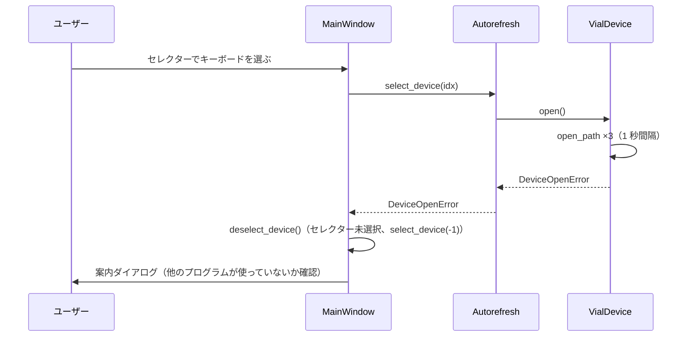

# キーボードを開けないときの表示（アプリ版）

作成: 2026-09-23

## 1. 背景

HID 接続は 1 つのプログラムしか開けない。ブラウザ版、別に起動した KeRT-Keymapper、Vial などが
キーボードを使っている状態で右上のセレクターからそのキーボードを選ぶと、`VialDevice.open` が
`open_path` を 10 回（10 秒）再試行したあと `RuntimeError("unable to open the device")` を投げ、
例外フックがトレースバックをそのままダイアログに出していた。

## 2. 仕様

| 項目 | 内容 |
|---|---|
| 再試行 | `open_path` を 3 回（1 秒間隔）。刺した直後のキーボードはこれで開ける。それでも失敗したら `DeviceOpenError`（`RuntimeError` の派生）を投げる |
| 表示 | `MainWindow.on_device_selected` が `DeviceOpenError` を受けて `QMessageBox.warning` で案内文を出す（日本語 / 英語、`kert_ja.ts`） |
| 案内文 | 「キーボードを開けませんでした。他のプログラム（ブラウザ版、別に起動した KeRT-Keymapper、Vial など）がキーボードを使っていないか確認して、もう一度選択してください。」 |
| 選択状態 | 失敗したキーボードは選択解除（セレクターを未選択、`Autorefresh.select_device(-1)`）。ユーザーが原因を解消して選び直す |
| ブラウザ版 | 変更なし（起動ページに同趣旨の `open_failed` メッセージがすでにある） |

## 3. テスト

| テスト | 確認内容 |
|---|---|
| `test_device_open_error.py::test_open_retries_briefly_then_raises` | 再試行の合計待ち時間が 1〜3 秒で `DeviceOpenError` を投げる |
| `test_device_open_error.py::test_busy_keyboard_shows_message_and_deselects` | 開けないキーボードを選ぶと案内文の警告が 1 回出て、選択が解除される |
