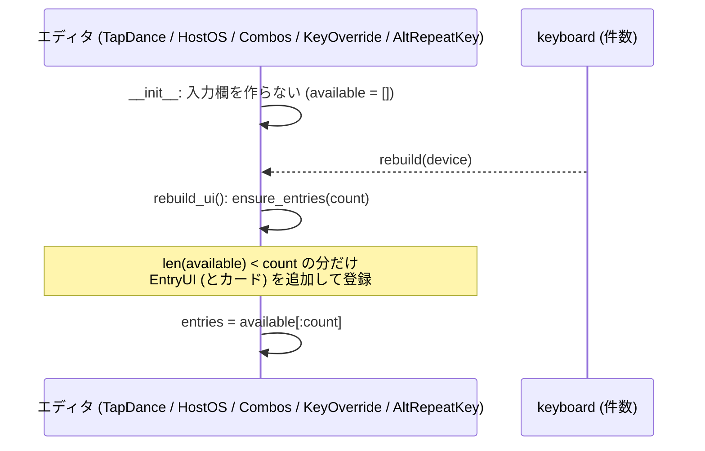

# エディタ入力欄の遅延生成 仕様書

作成日: 2026-09-22

## 1. 目的

「起動中…」（ブラウザ版）／キーボード接続後（デスクトップ版）の待ち時間を短くする。

メインウィンドウ生成の計測（2026-09-21、Mac ネイティブ、仮想キーボード、ピッカー遅延生成後）:

| 処理 | 時間 | 内容 |
| --- | --- | --- |
| Key Override エディタ | 1.2 秒 | 入力欄 128 件（各 6 個のチェックボックス群・キー 2 個・スクロール領域）を起動時に生成 |
| Alt Repeat Key エディタ | 0.5 秒 | 同 128 件 |
| Combos エディタ | 0.3 秒 | 同 128 件（カード付き） |
| Tap Dance エディタ | 0.2 秒 | 同 128 件（カード付き） |
| その他 | 0.3 秒 | |
| 合計 | 2.5 秒 | |

キーボードが実際に持つ件数は数件〜数十件（Key Override 0〜16、Tap Dance 16〜32 など）なので、
生成の大半は使われない。ブラウザ版（WebAssembly）では Python の実行が数倍遅く、この差がそのまま
「起動中…」の長さに乗る。

## 2. 方針

**入力欄は、接続したキーボードの件数だけ作る。件数が増えたら足りない分だけ追加する。**

- 各エディタに `ensure_entries(count)` を追加する。`*_entries_available`（カードのあるエディタは
  `cards_available` も）が `count` 件になるまで、従来 `__init__` の `for x in range(128)` で行っていた
  生成と接続（シグナル、コンテナへの登録）を 1 件ずつ行う。既存の入力欄は作り直さない（同じオブジェクト）。
- `__init__` のループは削除し、`rebuild_ui()` の先頭で `ensure_entries(count)` を呼ぶ。`count` の計算は
  従来どおり（Tap Dance は HostOS 分を除いた数、HostOS は `MAX_HOST_OS_ENTRIES` で上限、他は
  キーボードの件数）。上限 128 も従来どおり `ensure_entries` 内で守る。
- 別のキーボードに切り替えて件数が減った場合は、余った入力欄を隠すだけ（従来と同じ）。増えた場合は追加生成。
- 対象: `editor/tap_dance.py`、`editor/host_os.py`、`editor/combos.py`、`editor/key_override.py`、
  `editor/alt_repeat_key.py`。動作・見た目は変えない。

## 3. 期待する効果

仮想キーボード（Tap Dance 4、Combo 3、Key Override 0、Alt Repeat 0）でのメインウィンドウ生成が
2.5 秒 → 約 0.5 秒。実機（例: Tap Dance 16、Combo 8、Key Override 8）でも 1 秒前後の見込み。
ブラウザ版の「起動中…」はこれに比例して短くなる（キーボードからの読み込み時間は別で、変わらない）。

## 4. テスト (`src/main/python/test/test_editor_lazy.py`)

| テスト | 内容 |
| --- | --- |
| `test_entries_match_keyboard_counts` | 仮想キーボード（Tap Dance 4、Combo 3）接続後、各エディタの `*_entries_available` の件数がキーボードの件数と一致し（Key Override / Alt Repeat Key は 0）、128 件は作られない |
| `test_entries_grow_on_demand` | `ensure_entries(12)` で 12 件に増え、既存の入力欄は同じオブジェクトのまま。もう一度呼んでも増えない。129 を要求しても 128 で止まる |
| `test_startup_widget_budget` | 接続直後の MainWindow 内の `KeyWidget` が 100 個未満（従来は約 1,800 個） |
| `test_editor_still_works` | 遅延生成後も既存の GUI テスト（`test_tap_dance`、`test_combos`、`test_host_os`、カード表示）が通る（既存テストで確認） |

既存テスト `test_i18n.py::test_editor_labels_translated` は 0 件のキーボードで Key Override / Alt Repeat Key の
入力欄を参照しているため、`ensure_entries(1)` を呼んでから参照するように変更する。
