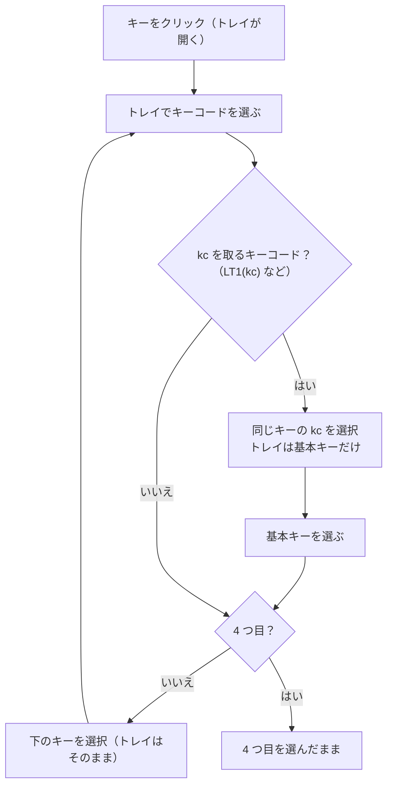

# Tap Dance / HostOS: 続けて設定・クリアボタン 仕様書（2026-10-10）

## 1. 目的

Tap Dance と HostOS のカードにある 4 つのキー（Tap Dance: On tap / On hold / On double tap / On tap + hold、
HostOS: Mac / Win / Linux / Default）を、続けて設定しやすくする。

- どれかを下のトレイ（キーコード一覧）で設定すると、すぐ下のキーが選ばれ、トレイも開いたままになる。
- 4 つ目を設定したときは、4 つ目が選ばれたまま。
- 各カードの右上に「クリア」ボタンを置き、押すと 4 つのキーをすべて未設定（`KC_NO`）にする。

## 2. 動き

- `widgets/key_widget.py` の `chain(keys)`: 4 つの `KeyWidget` をつなぐ（`chained`、`next_key`）。
- `KeyWidget.on_keycode_changed()`（トレイからの設定）の後、つながったキーなら `after_pick()`:
  - kc を取るキーコードを置いたとき（内側の kc を選んでいなかった、置いたキーが masked）は、同じキーの kc を
    選んでトレイを基本キーにする（キーマップの「kc を自動で選ぶ」と同じ。docs/auto-mask-spec.md）。
  - それ以外は `next_key.select_for_tray()`（次のキー全体を選び、トレイをそのキーに向ける）。最後のキーには
    `next_key` がないので、選ばれたまま。
- 読み込み（`load()`）はシグナルを止めて値を入れるだけなので、つながりは動かない。

## 3. クリアボタン

- `EntryCard.add_clear_button(callback)`: カードの見出し行の右端に「Clear」（日本語「クリア」、
  `kert_ja.ts` の `EntryCard` コンテキスト）ボタンを置く。Tap Dance と HostOS のカードだけに付ける（Combos には
  付けない）。
- `TapDanceEntryUI.clear()` / `HostOSEntryUI.clear()`: 4 つのキーをシグナルを止めて `KC_NO` にし、最後に
  `key_changed` を 1 回だけ出す（キーボードへの書き込みは 1 回）。Tap Dance の Tapping term は変えない。
- クリアの後は、いちばん上のキー（Tap Dance: On tap、HostOS: Mac）を選び、トレイをそのキーに向ける
  （`select_for_tray()`、2026-10-10）。そのまま上から設定し直せる。

## 4. テスト（`test_entry_chain.py`）

| テスト | 確認内容 |
|---|---|
| `test_tap_dance_moves_to_the_next_key` | 1〜3 つ目を設定するたびに次のキーが選ばれトレイが開いたまま、4 つ目は選ばれたまま。キーボードに保存される |
| `test_host_os_moves_to_the_next_key` | HostOS でも同じ |
| `test_masked_keycode_selects_its_kc_first` | `LT1(kc)` は同じキーの kc を先に選び、C を選ぶと `LT1(KC_C)` になって次のキーへ |
| `test_clear_button_tap_dance` | 見出し行の右上の「Clear」で 4 つが `KC_NO`、Tapping term はそのまま。いちばん上のキーが選ばれ、トレイが開く |
| `test_clear_button_host_os` | HostOS でも同じ（いちばん上の Mac が選ばれる） |
| `test_clear_is_translated` | 日本語訳が「クリア」 |
