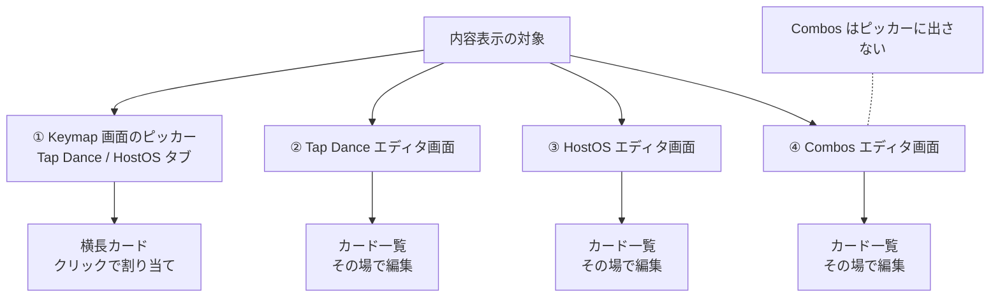
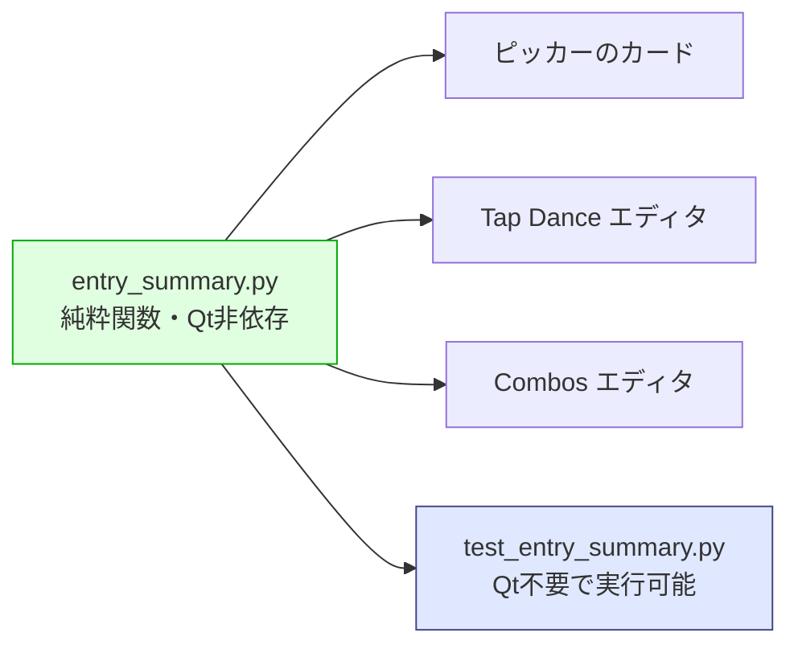
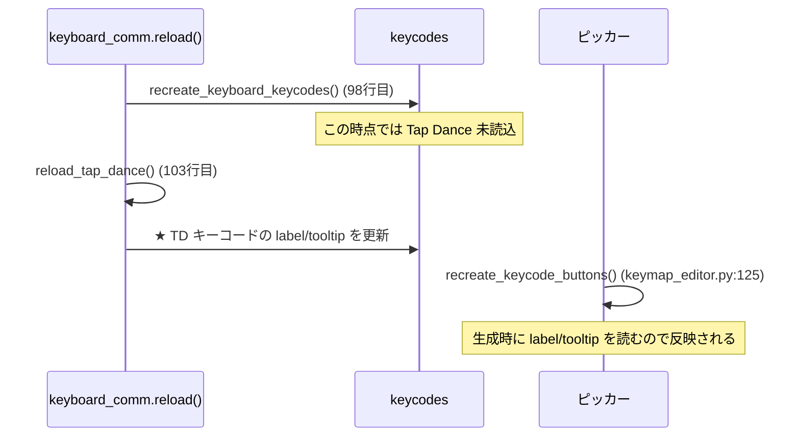
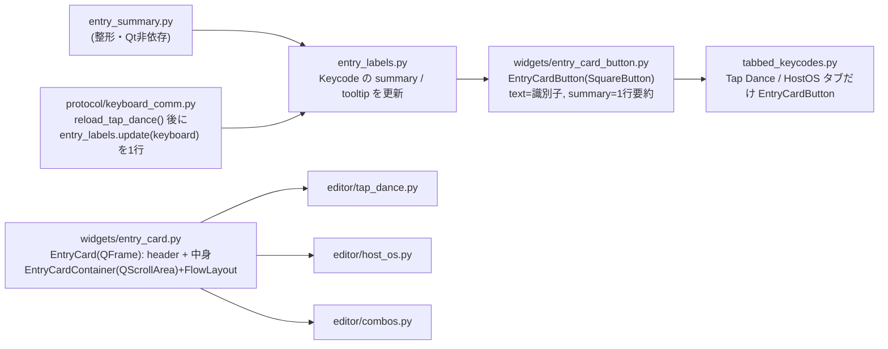

# Tap Dance / Combos 内容表示 仕様書

作成日: 2026-09-20
状態: **実装完了**（2026-09-21、macOS 側で GUI 組み込みまで完了。未コミット）

- `entry_summary.py`（整形モジュール）とその単体テスト27件: **完了・全件パス**
- GUI 組み込み（カード表示・レイアウト差し替え）: 完了。GUI テスト 7 件（第9章）を含め全体 58 件パス（macOS で以前から落ちる upstream の 2 件を除く）

## 1. 目的と背景

現在、Tap Dance と Combos は識別子（`TD(0)`、`0`、`1` …）しか表示されないため、
どのエントリがどんな設定になっているかを知るには、いちいち設定画面を開いて確認する必要がある。

キーマップ編集中に「このキーに割り当てたい Tap Dance はどれか」を判断できるようにし、
エディタ画面でも一覧したまま内容を把握できるようにする。

### 現状の表示

| 画面 | 現在の表示 | 該当コード |
|---|---|---|
| Keymap 画面下半分のピッカー「Tap Dance」タブ | `TD(0)` の正方形ボタン | `tabbed_keycodes.py:56-64` |
| 同「HostOS」タブ | `HOS(0)` の正方形ボタン | 同上 |
| Tap Dance エディタ画面の内側タブ | `0` `1` `2` … | `tap_dance.py:137` |
| HostOS エディタ画面の内側タブ | `0` `1` `2` … | `host_os.py:129` |
| Combos エディタ画面の内側タブ | `1` `2` `3` … | `combos.py:96` |

正方形になっているのは `widgets/square_button.py` の `sizeHint()` が
`QSize(size, size)` を返すため（`size` = フォント高 × `KEYCODE_BTN_RATIO`、`constants.py:7` で `3`）。

## 2. 対象範囲



**Combos はキーコードを持たない**（キーに割り当てる対象ではない）ため、
ピッカーには追加しない。エディタ画面のみカード表示とする。

**Macro**（2026-09-21 追加）: ピッカーの Macro タブの `M0`…もカードにし、マクロの先頭 **4 アクション**を 1 行ずつ表示する
（`entry_summary.macro_lines()`: `Text: Hello` / `Tap: A + B` / `Down: ⇧` / `Up: ⇧` / `Delay: 100 ms`、1 行 24 文字で省略、空なら `—`）。
データは `keyboard.macro` を `macros_deserialize()` したもので、`entry_labels.update()` が `KEYCODES_MACRO` の `lines` に入れる。
Macro エディタで保存した直後にも `entry_labels.update()` を呼ぶ。マクロカードは内容量によらず同じ大きさ（見出し + 4 行の高さ、24 文字分の幅の長方形。正方形にはしない）にする。

## 3. 表示内容

「案B（詳細）」を採用する。空きスロット（`KC_NO`）は `—` で表す。

### 3.1 Tap Dance

| 行 | 内容 | データ位置 |
|---|---|---|
| ヘッダ | `TD(0)` と Tapping term | - |
| Tap | On tap のキー | `entry[0]` |
| Hold | On hold のキー | `entry[1]` |
| 2×Tap | On double tap のキー | `entry[2]` |
| Tap+Hold | On tap + hold のキー | `entry[3]` |
| - | Tapping term (ms) | `entry[4]` |

```
┌───────────────┐
│ TD(0)   200ms │
│ Tap      A    │
│ Hold     ⇧    │
│ 2×Tap    B    │
│ Tap+Hold —    │
└───────────────┘
```

HostOS エントリは同じ構造を OS 名で読み替える（`Mac` / `Windows` / `Linux` / `Default`）。
HostOS には Tapping term の概念がないためヘッダには出さない。

### 3.2 Combos

入力キー4つのうち `KC_NO` でないものを `+` で連結し、出力キーを `→` の後に置く。

```
┌────────────────┐
│ 1              │
│ A + B  →  ESC  │
└────────────────┘
```

## 4. 中核設計：Qt 非依存の整形モジュール

### 4.1 方針

整形処理を **Qt に一切依存しない純粋関数**として新規ファイルに切り出す。



この設計には2つの利点がある。

1. **新規ファイルなので upstream とコンフリクトしない**
2. **Qt に依存しないため、Linux コンテナ上でもテストを実行できる**
   （PyQt5 の aarch64 wheel が無い環境でもテスト駆動開発を回せる。
   GUI への組み込み部分のみ macOS で確認する）

### 4.2 API

```python
# src/main/python/entry_summary.py

EMPTY = "—"

TAP_DANCE_SLOT_LABELS = ("Tap", "Hold", "2×Tap", "Tap+Hold")
HOST_OS_SLOT_LABELS = ("Mac", "Windows", "Linux", "Default")


def tap_dance_rows(entry, label_fn, slot_labels=TAP_DANCE_SLOT_LABELS):
    """[(スロット名, キー表示), ...] を返す。entry は5要素タプル。"""


def tap_dance_summary(entry, label_fn):
    """1行の要約。例: "A / ⇧ / B / —" """


def tap_dance_tooltip(entry, label_fn, index=None, slot_labels=TAP_DANCE_SLOT_LABELS,
                      prefix="TD", show_tapping_term=True):
    """ツールチップ用の複数行テキスト。index 指定で見出しが付く。"""


def combo_rows(entry, label_fn):
    """([入力キー表示, ...], 出力キー表示) を返す。entry は5要素タプル。"""


def combo_summary(entry, label_fn):
    """1行の要約。例: "A + B → ESC" """


def combo_tooltip(entry, label_fn, index=None):
    """コンボ1件のツールチップ用テキスト。"""


def build_entry_tooltips(entries, host_os_base, host_os_count, label_fn):
    """Tap Dance スロット全体から {qmk_id: ツールチップ} を作る。

    HostOS が後半を間借りしている構成を解決し、HostOS 側は OS 名で読み替え、
    Tapping term を出さない。キーはどちらも "TD(x)"。
    """
```

`build_entry_tooltips()` が HostOS の間借り構成を解決する唯一の場所であり、
呼び出し側は Tap Dance と HostOS の区別を意識しなくてよい。

**`label_fn` を引数で注入する**のが設計の要点。実運用では
`KeycodeDisplay.get_label`（Qt 依存）を渡し、テストではダミー関数を渡す。
これにより整形ロジックから Qt 依存を完全に排除する。

### 4.3 仕様の詳細

| 項目 | 規則 |
|---|---|
| 空きスロット | `KC_NO` は `EMPTY`（`—`）に変換する |
| Combos の入力 | `KC_NO` のスロットは連結から除外する |
| Combos の入力が全て空 | 要約は `EMPTY` のみとする |
| Combos の出力が空 | `→ —` と表示する |
| キー表示名 | `label_fn` に委ねる（国別キーマップの上書きに追従させるため） |
| 改行 | ラベル内の `\n` は空白に置換する（`ᴹᴵᴰᴵ\nCH₁₃` 等が2行になるのを防ぐ） |

## 5. 画面ごとの実装方針

### 5.1 ピッカー（Keymap 画面下半分）

`AlternativeDisplay` は既に `FlowLayout` を使っており（`tabbed_keycodes.py:31`）、
`Tab` は `QScrollArea` を継承している。**横に並べて折り返す処理は実装済み**で、
ウィジェットを差し替えるだけでよい。

| 変更 | 内容 |
|---|---|
| 新規 `widgets/entry_card_button.py` | `SquareButton` を継承し、`sizeHint()` で横長を返すカード |
| `tabbed_keycodes.py` | ボタン生成箇所（56-64行）でタブに応じてカードを使う。**数行に留める** |

`tabbed_keycodes.py` は upstream で53回更新されている高リスクファイルのため、
変更は生成箇所の分岐のみとし、カードの実装は新規ファイルに置く。

### 5.2 Tap Dance / Combos エディタ画面

`QTabWidget` をやめ、**全エントリをカードとして同時に表示**する。
エントリ編集用ウィジェットは既に128個が事前生成されタブに隠れているだけなので、
レイアウトを差し替えるだけで全件表示になる。

```
┌──────────────────────────────────────────────────┐
│ ┌───────────────┐┌───────────────┐┌────────────┐ │
│ │ TD(0)   200ms ││ TD(1)   180ms ││ TD(2)      │ │
│ │ Tap    [ A ]  ││ Tap    [ESC]  ││ Tap    [ ] │ │
│ │ Hold   [ ⇧ ]  ││ Hold   [   ]  ││ Hold   [ ] │ │
│ │ 2×Tap  [ B ]  ││ 2×Tap  [   ]  ││ 2×Tap  [ ] │ │
│ │Tap+Hold[   ]  ││Tap+Hold[   ]  ││…          │ │
│ │ term   [200]  ││ term   [180]  ││            │ │
│ └───────────────┘└───────────────┘└────────────┘ │
│                    （スクロール）                  │
└──────────────────────────────────────────────────┘
```

カード内の `KeyWidget` はそのまま編集に使えるため、**一覧と編集が同一画面になる**。

| 変更 | 内容 |
|---|---|
| `editor/tap_dance.py` | `TabWidgetWithKeycodes` → `QScrollArea` + `FlowLayout` |
| `editor/host_os.py` | 同上（独自追加ファイルなのでコンフリクトなし） |
| `editor/combos.py` | 同上 |

両ファイルは upstream での変更が 4回 / 2回（最後の実質的な変更は2022年）と少なく、
作り変えてもコンフリクトのリスクは低い。

#### 注意: キーコードトレイの閉じ処理

`TabWidgetWithKeycodes` は、タブ切り替え時とマウス離上時に
`TabbedKeycodes.close_tray()` を呼んでいる。`QTabWidget` をやめるとこの挙動が失われるため、
**カードのコンテナ側で同等の処理を実装する**こと。

#### 注意: 変更マーカー

現在 `update_modified_state()` は `setTabText(x, "{}*")` で未保存を示している。
カード表示ではタブが無くなるため、**カードのヘッダに `*` を出す**方式に変更する。

### 5.3 ラベル更新のタイミング

`protocol/keyboard_comm.py` の読み込み順序に制約がある。



`recreate_keyboard_keycodes()` は `reload_tap_dance()` より**先**に走るため、
キーコード生成時に内容を埋め込むことはできない。`reload_tap_dance()` の後に
`Keycode` オブジェクトの `label` / `tooltip` を書き換える処理を挟む（★の位置、1行）。

ピッカーのボタン生成は `keymap_editor.py:125` で `keyboard.reload()` 完了後に行われるため、
この順序で問題なく反映される。

エディタ画面でユーザーが編集した直後も、同じ更新処理を呼んでピッカーに反映させる。

## 6. テスト計画

共通要件に従いテスト駆動で実装する。**まずテストを書き、レビューを受けてから実装する。**

### 6.1 Qt 非依存のテスト（このコンテナで実行可能）

`src/main/python/test/test_entry_summary.py`

| # | 対象 | 期待 |
|---|---|---|
| 1 | `tap_dance_rows` 全スロット設定済み | 4行が順に返る |
| 2 | `tap_dance_rows` 一部が `KC_NO` | 該当行が `—` になる |
| 3 | `tap_dance_summary` | `"A / ⇧ / B / —"` 形式 |
| 4 | `tap_dance_tooltip` | Tapping term を含む |
| 5 | `tap_dance_rows` の HostOS ラベル | `Mac` / `Windows` / `Linux` / `Default` |
| 6 | `combo_summary` 入力2個 | `"A + B → ESC"`（空スロットは除外） |
| 7 | `combo_summary` 入力4個 | 4つとも連結される |
| 8 | `combo_summary` 入力が全て空 | `—` |
| 9 | `combo_summary` 出力が空 | `→ —` |
| 10 | `label_fn` の委譲 | 渡した関数の戻り値が使われる |
| 11 | ラベル内の改行 | 空白に置換される |
| 12 | `combo_tooltip` | 入力・出力・見出しを含む |
| 13 | `build_entry_tooltips` のキー | HostOS 分も含めて `TD(x)` で揃う |
| 14 | 同・Tap Dance スロット | Tapping term を含む |
| 15 | 同・HostOS スロット | OS 名で表示され、Tapping term を含まない |
| 16 | 同・HostOS の見出し | `HOS(n)`（base からの相対番号） |
| 17 | 同・HostOS 無効時 | 全スロットが Tap Dance 扱い |
| 18 | 同・エントリ未読み込み | 空の辞書 |

**実装済み。27件すべてパス**（`PYTHONPATH=src/main/python python3 -m unittest test.test_entry_summary`）。

### 6.2 GUI を伴うテスト（macOS 側で実行）

既存の `test_gui.py` に準じる。カードの生成数、クリックでキーコードが割り当てられること、
編集内容がカード表示に反映されることを確認する。

## 7. コンフリクト面のまとめ

| ファイル | 種別 | upstream 変更回数 | リスク |
|---|---|---|---|
| `entry_summary.py` | 新規 | - | なし |
| `widgets/entry_card_button.py` | 新規 | - | なし |
| `test/test_entry_summary.py` | 新規 | - | なし |
| `editor/tap_dance.py` | 作り変え | 4回 | 低 |
| `editor/host_os.py` | 作り変え | 独自追加 | なし |
| `editor/combos.py` | 作り変え | 2回 | 低 |
| `protocol/keyboard_comm.py` | 1行追加 | - | 低 |
| `tabbed_keycodes.py` | 数行 | **53回** | 中（変更を最小に留める） |

## 8. 未決定事項

- **カードの寸法**: 1カードあたりの幅と高さ。ピッカー領域の高さが限られるため、
  縦に長いカードだとスクロール量が増える。横長（ラベルと値を横並び）にする案もある
- **Tapping term の表示**: HostOS では使わないが、Tap Dance では表示するか
- **エディタ画面の Save / Revert ボタン**: カード表示にした際の配置

## 9. GUI 組み込みの決定事項（2026-09-21）

第8章の未決定事項は次のとおり決める。

| 項目 | 決定 |
|---|---|
| カードの寸法 | エディタもピッカーも**正方形**（内容の長辺に合わせる）。行間は詰め、欄の KeyWidget は 0.7 倍で描く。ピッカーのカードはエディタと同じ見た目（見出し + ラベル + 表示専用のキー）で、カード全体が 1 つのボタン |
| Tapping term | Tap Dance のカードヘッダに `200ms` の形で表示する。HostOS には出さない |
| Save / Revert | Tap Dance エディタは従来どおり画面下に据え置く（Combos / HostOS は即時保存なので無し） |
| 未保存マーカー | カードのヘッダ末尾に `*`（`TD(2)*`） |
| トレイの閉じ処理 | カード一覧の空き領域をクリックしたときに `TabbedKeycodes.close_tray()` を呼ぶ |
| ヒント文 | カードごとには出さず、タブ上部に 1 つ（`editor.hint`）。HostOS のカード見出しは `HOS(0)`（格納先の Tap Dance スロットは表示しない） |

### 9.1 クラス構成



### 9.2 テストから見た API

| 対象 | API |
|---|---|
| エディタ | `editor.cards`: 表示中の `EntryCard` のリスト（エントリ順）。`editor.container`: `EntryCardContainer` |
| カード | `card.header`: 見出しの `QLabel`（`TD(0)  200ms` / `HOS(0)` / `Combo 1`、未保存時は末尾 `*`）。`card.findChildren(KeyWidget)` で欄を取得 |
| ピッカー | Tap Dance / HostOS タブのボタンは `EntryCardButton`。`btn.text` は識別子（`TD(0)` / `HOS(0)`）、`btn.header` は見出し（`TD(0)  200ms` / `HOS(0)`）、`findChildren(KeyWidget)` で各欄の表示専用キー、ツールチップは各欄の内訳。子ウィジェットはマウスイベントを透過し、カードのどこを押しても割り当てられる |
| 更新 | エディタで欄を変更すると、ピッカー・トレイのカードの `summary` とツールチップも同じ内容に更新される |

### 9.3 GUI テスト（`test_gui.py`）

| テスト | 検証内容 |
|---|---|
| `test_tap_dance`（書き換え） | カード数と見出し、各欄の値、キー変更の即時書き込み、Tapping term の遅延保存と `*` マーカー、Save / Revert |
| `test_combos`（書き換え） | カード数と見出し（`Combo 1`…）、各欄の値、入力・出力・マスク付きキーの変更 |
| `test_host_os`（書き換え） | HostOS タブがカード表示になり、既存の検証項目（ラベル・ヒント・書き込み・正規化・`.vil`）をカード経由で満たす |
| `test_entry_cards_in_picker`（新規） | ピッカーの Tap Dance / HostOS タブが要約付きカードになり、ツールチップに内訳がある。エディタで変更するとピッカーの要約も変わる。カードをクリックすると従来どおりキーコードが割り当たる |
| `test_entry_card_container_closes_tray`（新規） | カード一覧の空き領域クリックでトレイが閉じる |
