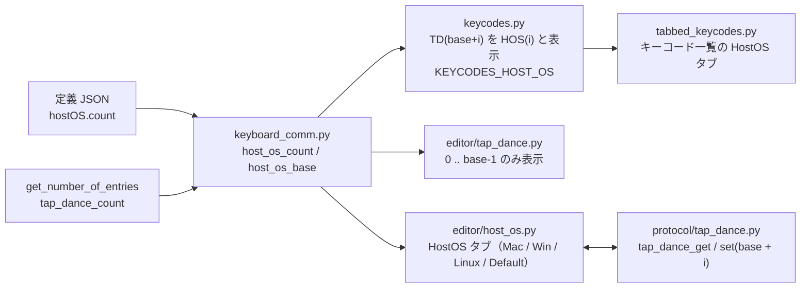

# HostOS GUI 仕様書（vial-gui 側）

対象: vial-gui（このフォーク）
ファームウェア側仕様: `vial-qmk/quantum/host_os/docs/host-os-protocol.md`
作成日: 2026-09-08

---

## 1. 目的

接続先 OS に応じてキーコードを差し替える **HostOS** キーを Vial GUI から編集できるようにする。
HostOS は **Tap Dance の末尾 `count` 個のスロットを借りる**方式で、プロトコル・EEPROM・`.vil` の形式は変えない。
GUI の役割は表示の読み替えだけである。2026-09-04 の「OS Dance 独立方式」（サブコマンド 0x09/0x0A、`OSD(n)`）は廃止する。

## 2. 全体構成

## 3. 対応判定と件数

| 項目 | 内容 |
|---|---|
| 定義 JSON | `"hostOS": {"count": N}`（ファームウェアのビルドが注入） |
| `keyboard.host_os_requested` | 定義から読んだ `count`。無い・不正なら 0 |
| `keyboard.host_os_count` | `min(host_os_requested, tap_dance_count)`。`reload_dynamic()` の後で確定 |
| `keyboard.host_os_base` | `tap_dance_count - host_os_count` |
| タブ表示 | `host_os_count > 0` のときだけ HostOS タブとキーコード一覧の HostOS タブを出す |

## 4. スロットの読み替え

HostOS i は Tap Dance スロット `base + i`。エントリは既存の 5 要素 `(on_tap, on_hold, on_double_tap, on_tap_hold, custom_tapping_term)`。

| Tap Dance の欄 | HostOS の意味 | 画面ラベル |
|---|---|---|
| on_tap | macOS（iOS も） | Mac |
| on_hold | Windows | Win |
| on_double_tap | Linux（ChromeOS も） | Linux |
| on_tap_hold | Default（判別不能時、および該当欄が空のときのフォールバック） | Default |
| custom_tapping_term | シード済みマーカー（`0x4F53`）。画面に出さない | — |

- 空欄は `KC_NO` で書く。`KC_TRNS` が選ばれた場合も書き込み時に `KC_NO` に正規化する。
- 保存時は `custom_tapping_term` に **`0x4F53` を書く**（仕様書 §6 の任意規則を採用。全欄を意図的に空にしても再シードされない）。
- 読み書きは既存の `tap_dance_get(base + i)` / `tap_dance_set(base + i, ...)`。キー変更は即時書き込み（Save / Revert なし）。

## 5. キーコード表示 `HOS(i)`

| 項目 | 内容 |
|---|---|
| 内部 ID（qmk_id、`.vil`、ワイヤ） | `TD(base + i)`（変更なし。stock の Vial と互換） |
| 表示名 | `HOS(i)` |
| 解析 | `HOS(i)` と `TD(base+i)` の両方を受け付ける（`Keycode.qmk_id_to_keycode` に別名登録） |
| 一覧 | `KEYCODES_HOST_OS` に `HOS(0..count-1)`、`KEYCODES_TAP_DANCE` は `TD(0..base-1)` のみ |
| 優先順位 | `KEYCODES_HIDDEN` の `TD(x)` 予備項目より後ろに結合し、`HOS(i)` の表示が勝つようにする |

## 6. 画面

- HostOS タブは Tap Dance の右隣。サブタブ `0 .. count-1`（上限 32）。
- 各サブタブは Mac / Win / Linux / Default の KeyWidget 4 つと、ヒント
  「Use HOS(i) (HostOS tab) to place this key in the keymap. Stored as TD(base+i). Leave a field empty to fall back to Default.」
- Tap Dance タブは `base` 件だけ表示し、再接続のたびにタブを作り直す。

## 7. `.vil`

変更なし。`tap_dance` 配列に HostOS の内容も含まれる。

## 8. テスト

| テスト | 検証内容 |
|---|---|
| `test_keyboard.py::test_host_os_definition` | `hostOS.count` の読み込み（無い・不正なら 0、tap dance が無ければ 0 に丸める） |
| `test_keycode.py::test_host_os_keycodes` | `TD(base+i)` が `HOS(i)` と表示され、`HOS(i)` の綴りでも同じ値に解決し、ワイヤ表記は `TD(x)` のまま |
| `test_gui.py::test_host_os_hidden_without_definition` | `hostOS` が無ければタブなし、Tap Dance は全件 |
| `test_gui.py::test_host_os` | タブ位置、4 欄の値とラベル、ヒント、一覧の `HOS(n)` / `TD(n)` の振り分け、即時書き込みとマーカー、`KC_TRNS` 正規化、`.vil` |
| `test_gui.py::test_host_os_count_clamped` | `count` が tap dance 数を超えても丸める |
