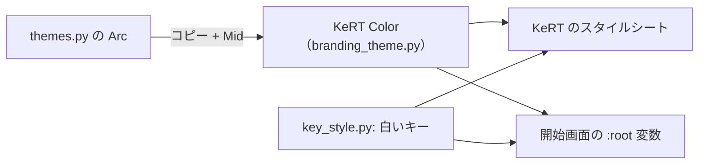

# テーマ「KeRT Color」の作り直し（Arc のコピー）仕様書（2026-10-04）

## 1. 目的

テーマ「KeRT Color」を、上流のテーマ「Arc」をコピーした配色で作り直す。キーの見た目はパステルグリーンから白に
変える。Web 版の開始画面も同じ配色に合わせる。

## 2. 配色（`branding_theme.py`）

- `BRAND_THEMES` の KeRT Color = `themes.py` の Arc の辞書をそのままコピーし、`QPalette.Mid` だけを足す。
  Mid は KeRT のスタイルシートが枠線（3px の角丸の箱、チェックボックス）に使う色で、Arc は設定していないため、
  Arc の縁の色 `KERT_OUTLINE = "#2b2e39"`（窓の色より少し暗い）にする。
- 主な色: 窓 `#353945`、文字 `#d3dae3`、選択色 `#5294e2`（青）に文字 `#d3dae3`、ボタン `#353945`。
- 暗いテーマになったので、`LIGHT_THEME_NAMES` から KeRT Color を外す（`mask_light_factor` は Arc と同じ 150）。
- KeRT のスタイルシート（角丸・3px の線・タブ中央寄せなど）は今までどおり付ける。

## 3. キー（`key_style.py`）

| 名前 | 値 | 以前 |
|---|---|---|
| `KEY_FACE` | `#c0c0c0`（銀色。2026-10-04 に白 `#ffffff` → ピーチ `#ffc2a8` → `#f0f0f0` → この色） | `#77dd77`（パステルグリーン） |
| `KEY_FACE_OPACITY` | 1.0（不透明） | 0.8 |
| `KEY_LEGEND` | `#1f2328` | 同じ |
| `KEY_HOVER_FACE` | `#b0b0b0`（タブ・キーボード名にマウスが乗ったとき、少し濃い灰色） | `#5fd35f` |
| `KEY_MASK_FACE` | `#d4d4d4`（LT などの内側の四角、地より明るい灰色） | `#b3ecb3` |
| `KEY_OVERRIDE_LEGEND` | `#0a3069` | 同じ |

## 4. Web 版の開始画面（`web/src/index.html`）

色はすべて `:root` の変数にまとめ、アプリの配色と揃える。

| 変数 | 値 | 元 |
|---|---|---|
| `--kert-window` | `#353945` | Window（ページの背景、カード、タブ切り替えのフェード） |
| `--kert-text` | `#d3dae3` | WindowText（説明文、見出し、進み具合の文字、スピナー） |
| `--kert-border` | `#2b2e39` | Mid（カード・ボタン・バーの枠） |
| `--kert-highlight` / `--kert-highlight-text` | `#5294e2` / `#d3dae3` | Highlight / HighlightedText（ボタン、選んだキーボード、バーの塗り） |
| `--kert-highlight-hover` | `#6aa3e8` | 選択色を少し明るく |
| `--kert-key` / `--kert-key-text` / `--kert-key-hover` | `#c0c0c0` / `#1f2328` / `#b0b0b0` | キーの色（キーボード一覧の箱、バーの地） |

- キーボード一覧: 箱はキーと同じ銀色の地に濃い文字。押した箱は選択色（青）、他は不透明度 0.1。
- 進み具合のバー: キーの色の地を青が右へ伸びる。パーセントは地の所では濃い文字、青い所では明るい文字。

## 5. テスト

| テスト | 確認内容 |
|---|---|
| `test_theme.py::test_kert_color_registered` | KeRT Color のパレットが Arc の全色と同じで、Mid が `KERT_OUTLINE`。`mask_light_factor` が 150 |
| `test_dark_keys.py::test_constants` | キーが白・不透明、文字との対比、マウスが乗ったときの色が少し暗い白 |
| `test_ui_motion.py::test_highlight_light_with_dark_text` | 選択色が Arc の青と明るい文字、白いキーとの対比 |
| `test_web_start_page.py::test_start_page_uses_the_app_highlight` | `:root` の変数がアプリの配色・キーの色と同じ、旧い明るい配色の色が CSS に残っていない |
| `test_web_start_page.py::test_keyboard_list_black_chosen_white` | 一覧の箱がキーの色、押した箱が選択色 |
| `test_web_start_page.py::test_progress_bar_black` / `test_progress_percentage_two_tone` | バーの塗りが選択色、地がキーの色、文字の 2 色 |

明るい配色を前提にしていた既存テスト（影の濃淡の幅、平らなキーの縁、チェックボックスの白、今のレイヤーの濃い
文字）は、パレットの値と比べる形に直した。
