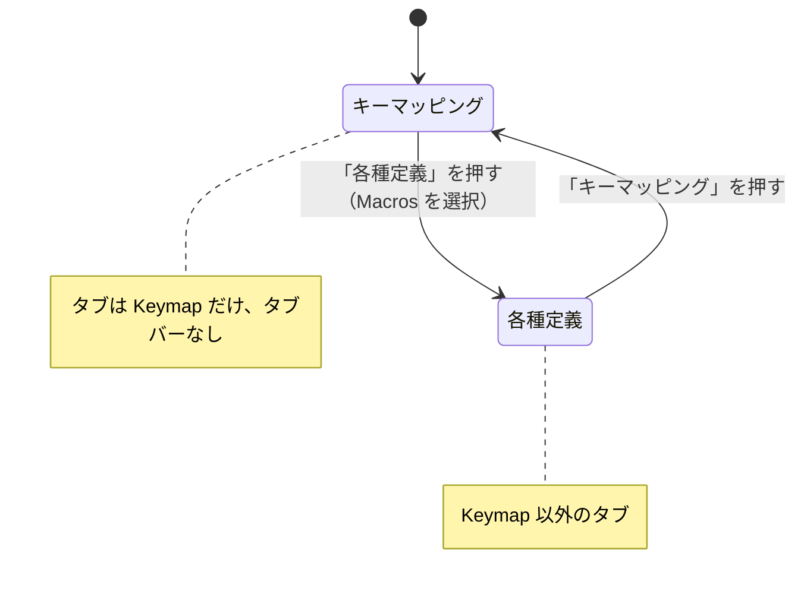

# 「キーマッピング」「各種定義」モードボタン 仕様書（2026-10-10）

## 1. 目的

これまで上部のタブに「Keymap」と、Macros・Tap Dance などの定義のタブが一列に並んでいて、キーを割り当てる作業と
各種の定義を作る作業が混ざって見えていた。ヘッダーにモードの切り替えボタンを置き、二つを分ける。

## 2. 画面

- ヘッダーのロゴの右に、大きめのボタン「キーマッピング」「各種定義」（英語表示 Key mapping / Definitions、
  `kert_ja.ts` の `MainWindow`）を並べる。高さはキーボード名のセレクターと同じ、フォントもセレクターと同じ大きさ。
  どちらか一方だけが押された状態（チェック可能、排他）。
- **キーマッピング**（起動時）: 上部のタブには Keymap だけを入れ、タブバーは隠す。今の Keymap タブと同じ画面になる。
- **各種定義**: Keymap 以外の、使えるエディタのタブ（Layout・Macros・Lighting・Tap Dance・HostOS・Combos・Key
  Overrides・Alt Repeat Key・QMK Settings・Matrix tester・Firmware updater のうち有効なもの）を並べ、毎回 Macros を
  選んだ状態で開く（Macros が無いときは先頭。§7 でタップダンスに変更）。



## 3. 実装（`main_window.py`）

- `self.mode`（`"keymap"` / `"definitions"`）、`set_mode(mode)`、`in_mode(label)`。
- `refresh_tabs()`: 有効で、かつ今のモードに入るエディタだけをタブにする。エディタを包む `EditorContainer` は
  `self.tab_pages` に取っておき、モードを切り替えても作り直さない（ブラウザ版で作り直しは重い）。タブバーは
  各種定義モードでだけ表示する。
- `tab_bar_left()`: タブバーが隠れているときは `None`（キーマッピングモードではレイヤーボタンの列をタブバーの左端に
  そろえない）。

## 4. テスト

| テスト | 確認内容 |
|---|---|
| `test_mode_buttons.py::test_buttons_right_of_the_logo` | ロゴの右、セレクターの左に「Key mapping」「Definitions」の順。セレクターと同じ高さ、既定より大きいフォント、チェック可能 |
| `test_mode_buttons.py::test_starts_in_key_mapping_mode` | 起動時はキーマッピング: タブは Keymap だけ、タブバーなし |
| `test_mode_buttons.py::test_definitions_show_the_other_tabs_macros_first` | 各種定義: Keymap 以外の有効なタブ、Macros が選ばれ、タブバーあり。戻すと Keymap だけ |
| `test_mode_buttons.py::test_definitions_open_on_macros_each_time` | 別のタブを見ていても、各種定義を開き直すと Macros |
| `test_mode_buttons.py::test_editors_kept_between_modes` | モードを切り替えてもエディタの入れ物は同じもの |
| `test_mode_buttons.py::test_mode_buttons_translated` | 日本語訳「キーマッピング」「各種定義」 |

既存のテストのうち、上部のタブを使うものは各種定義モードに切り替えてから調べるように直した（`test_gui.find_tab`
は探すタブに合わせてモードを切り替える）。Web 版の同梱フォント（`web/src/fonts/kert-ja.otf`）は「各種」などの
新しい文字を含むよう `web/make_font_subset.py` で作り直した。

## 5. 調整（2026-10-10）

- 2 つのボタンの横幅を、広い方（「キーマッピング」）にそろえる（`setFixedWidth`）。
- フォントをキーボード名のセレクターより `MODE_FONT_SMALLER = 2` ポイント小さくする（16 → 14pt。既定は 12pt）。
- 各種定義のタブの並びを次の順にし、タブ名を国際化する（`tr("MainWindow", label)`、`kert_ja.ts`）。一部の
  キーボードにだけあるタブ（Layout、Lighting、Firmware updater）は最後に置き、英語のまま。開いたときに選ぶのは
  これまでどおり Macros（マクロ）。

| 順 | 英語 | 日本語 |
|---|---|---|
| 1 | Tap Dance | タップダンス |
| 2 | HostOS | ホストOS |
| 3 | Combos | コンボ |
| 4 | Macros | マクロ |
| 5 | Key Overrides | キー上書き |
| 6 | Alt Repeat Key | 代替キー |
| 7 | QMK Settings | QMK設定 |
| 8 | Matrix tester | キーテスター |

| テスト | 確認内容 |
|---|---|
| `test_mode_buttons.py::test_buttons_right_of_the_logo` | 2 つのボタンが同じ幅、フォントは既定より大きくセレクターより小さい |
| `test_mode_buttons.py::test_definitions_show_the_other_tabs_macros_first` | タブの並びが上の表の順 |
| `test_mode_buttons.py::test_mode_buttons_translated` | 8 つのタブ名の日本語訳 |
| `test_i18n.py::test_tab_labels_not_in_catalog` | 各種定義の 8 つだけ訳し、ほかのエディタのタブ・下段のタブ・QMK Settings 内のタブは英語のまま（以前の「タブは訳さない」方針を変更） |
| `test_i18n.py::test_install_ja_translates` | Keymap は英語、Tap Dance は「タップダンス」 |

## 6. 調整 2（2026-10-10）

- 2 つのボタンの高さを、キーボード名のセレクターの `MODE_HEIGHT_RATIO = 0.8` 倍にする（53 → 42 px）。
- 下段（キーコードの一覧）のタブ名も国際化する（`tr("TabbedKeycodes", tab.label)`、`kert_ja.ts` の
  `TabbedKeycodes` コンテキスト）。ISO/JIS・Quantum・MIDI は英語のまま。

| 英語 | 日本語 |
|---|---|
| Basic | 基本 |
| ISO/JIS | ISO/JIS |
| Layers | レイヤー |
| Quantum | Quantum |
| Backlight | バックライト |
| App, Media and Mouse | メディア・マウス |
| Tap Dance | タップダンス |
| HostOS | ホストOS |
| User | ユーザー定義 |
| Macro | マクロ |

- `TabbedKeycodes.recreate_keycode_buttons()` は、作り直す前に選んでいたタブを、表示名（訳されている）ではなく
  英語のラベル（`currentWidget().label`）で覚えて選び直す。表示名で比べていたため、訳すと選んでいたタブが
  戻らなくなっていた。
- Web 版の同梱フォントを作り直した（「基本」などの新しい文字）。

| テスト | 確認内容 |
|---|---|
| `test_mode_buttons.py::test_buttons_right_of_the_logo` | 2 つのボタンが同じ高さで、セレクターの 0.7〜0.85 倍、文字より十分高い |
| `test_i18n.py::test_editor_labels_translated` | 下段のタブが日本語（ISO/JIS・Quantum はそのまま）。作り直しても選んでいたタブ（レイヤー）のまま |
| `test_i18n.py::test_tab_labels_not_in_catalog` | 下段のタブは ISO/JIS・Quantum・MIDI 以外が訳の対象 |
| `test_i18n.py::test_install_ja_translates` | 「App, Media and Mouse」→「メディア・マウス」、Quantum はそのまま |

## 7. 調整 3（2026-10-10）

- 各種定義モードを開いたときに選ぶタブを Macros からタップダンス（Tap Dance）に変える（無いキーボードでは先頭）。
- KeRT Color 以外のテーマでは、押されているモードボタンがほとんど目立たなかった（KeRT Color のスタイルシートは
  押されたボタンを選択色で塗るが、ほかのテーマは Qt 標準の見た目で、差がわずか）。モードボタンに `modeButton`
  属性を付け、KeRT Color 以外のテーマにだけ次の規則（`branding_theme.MODE_BUTTON_STYLE`）を足す。
  KeRT Color は今の見た目（3px の枠、10px の角丸）のまま。

```css
QPushButton[modeButton="true"]:checked {
    background-color: palette(highlight);
    color: palette(highlighted-text);
    border: 2px solid palette(highlight);   /* 枠を指定すると、陰影のない平らな塗りになる */
    border-radius: 6px;
}
```

| テスト | 確認内容 |
|---|---|
| `test_mode_buttons.py::test_definitions_show_the_other_tabs_macros_first` / `test_definitions_open_on_tap_dance_each_time` | 各種定義を開くとタップダンスが選ばれる |
| `test_mode_buttons.py::test_checked_mode_button_shows_in_every_theme` | Dark・Light・Nord で規則があり、押されたボタンが選択色で塗られる（±30）。KeRT Color には規則を足さない |

## 8. 文字の左右の余白（2026-10-10）

モードボタンの文字の左右に、スタイルの余白に加えて `MODE_SIDE_MARGIN = 12` px ずつ余白を足す。幅は広い方
（「キーマッピング」）の推奨幅 + 2 × 12 px で、2 つのボタンをそろえる。

| テスト | 確認内容 |
|---|---|
| `test_mode_buttons.py::test_buttons_right_of_the_logo` | どちらのボタンも「幅 − 文字の幅」が 2 × `MODE_SIDE_MARGIN` + 16 px 以上、2 つは同じ幅 |
