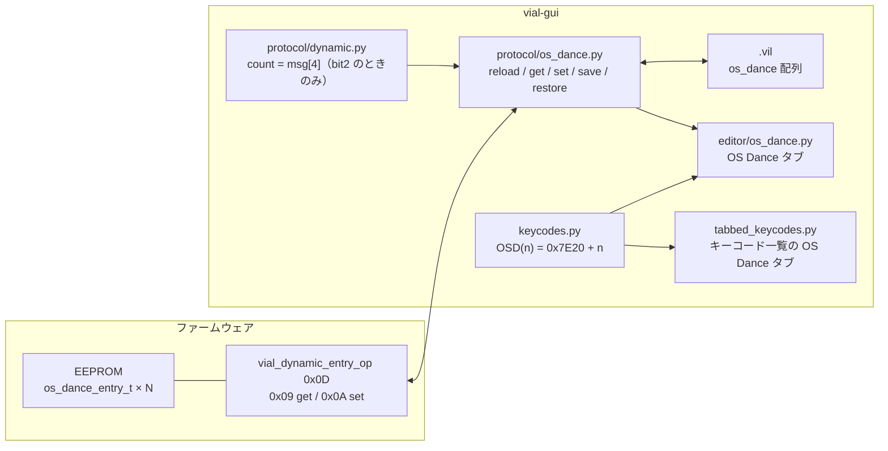
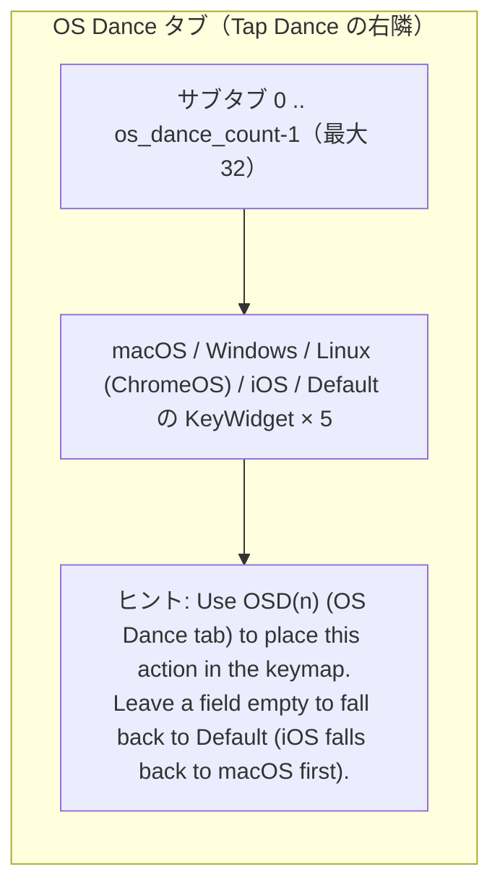
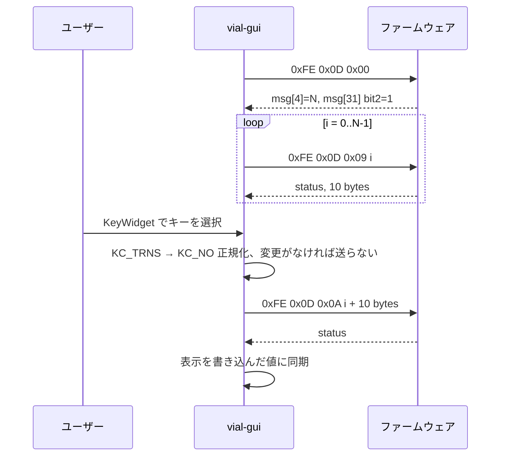

# OS Dance GUI 仕様書（vial-gui 側）

対象: vial-gui（このフォーク）
ファームウェア側仕様: `vial-qmk/quantum/os_dance/docs/os-dance-protocol.md`
作成日: 2026-09-04

---

## 1. 目的

接続先 OS に応じてキーコードを差し替える **OS Dance** を、Combo や Key Override と同じ
「独立した動的エントリ」として Vial GUI から編集できるようにする。

Tap Dance のエントリを間借りしていた旧方式（`vial.json` の `osDance` キー、`TD(base+n)` を `OD(n)` と表示）は
**廃止**し、専用サブコマンド・専用キーコード `OSD(n)`・専用 EEPROM 領域を使うファームウェアに対応する。

## 2. 全体構成



## 3. 対応判定とエントリ数

`dynamic_vial_get_number_of_entries`（`0xFE 0x0D 0x00`）の応答を使う。

| バイト | 内容 |
|---|---|
| `msg[4]` | `VIAL_OS_DANCE_ENTRIES` |
| `msg[31]` bit2 | OS Dance 対応フラグ |

- bit2 が立っているときだけ `msg[4]` を採用し、`keyboard.os_dance_count` とする。立っていなければ `0`。
- `supported_features` に `"os_dance"` を追加する。
- `vial_protocol < 4`（動的エントリ非対応）では `os_dance_count = 0`。
- OS Dance タブとキーコード一覧の OS Dance タブは `os_dance_count > 0` のときだけ表示する。
- `vial.json` の `osDance` キーは読まない（`keyboard.os_dance` 属性は削除）。

## 4. エントリ

10 バイト固定、リトルエンディアン `<HHHHH`。GUI 内部では `Keycode.serialize()` した文字列の 5 要素タプルで持つ。

| 位置 | フィールド | 画面ラベル | 空欄時のフォールバック |
|---:|---|---|---|
| 0 | `kc_macos` | macOS | Default |
| 1 | `kc_windows` | Windows | Default |
| 2 | `kc_linux` | Linux (ChromeOS) | Default |
| 3 | `kc_ios` | iOS | macOS → Default |
| 4 | `kc_default` | Default | 何も送らない |

- 空欄は `KC_NO`（0x0000）で書き込む。ユーザーが `KC_TRNS` を選んだ場合も **書き込み時に `KC_NO` に正規化**する（ファームウェアはどちらも空欄扱いだが、仕様書の「0x0000 に統一」に従う）。
- `QK_BOOT`（`RESET_KEYCODE`）を含む書き込みは、他の動的エントリと同様に事前に Unlock する。
- キー変更は即時に `os_dance_set()` で書き込む（Combo と同じ。Save / Revert ボタンは持たない）。

## 5. キーコード `OSD(n)`

| 項目 | 値 |
|---|---|
| qmk_id / 表示 | `OSD(n)` |
| 値 | `0x7E20 + n`（n = 0..31） |
| 定義場所 | `keycodes_v6.py`（プロトコル 6 のみ。5 には定義しない） |
| 一覧への登録 | `recreate_keyboard_keycodes()` で `os_dance_count` 件だけ `KEYCODES_OS_DANCE` に生成 |
| キーコード一覧 | 「OS Dance」タブ（Tap Dance タブの右隣、`KEYCODES_OS_DANCE` が空なら非表示） |

注意: Vial は `USER00`〜`USER63` を `0x7E00`〜`0x7E3F` に割り当てているため、**カスタムキーコードが 33 個以上**ある
キーボードでは `USER32` 以降と `OSD(n)` の値が重なる。`KEYCODES_OS_DANCE` を最後に登録して `OSD(n)` を優先する。
ファームウェア側の設計判断のため、GUI では仕様として明記するにとどめる。

## 6. `.vil` ファイル

キー名 `os_dance`。要素はフィールド順の 5 要素で、他のキー（`tap_dance` など）と同じく
**`Keycode.serialize()` した文字列**で保存する（ファームウェア側仕様書の例は整数だが、`.vil` は GUI 専用ファイルであり、
既存キーとの一貫性を優先する）。

```json
"os_dance": [
  ["KC_LGUI", "KC_LCTL", "KC_LCTL", "KC_NO", "KC_LCTL"],
  ["KC_NO", "KC_NO", "KC_NO", "KC_NO", "KC_NO"]
]
```

- 保存: `os_dance_count` 件すべて。
- 復元: 配列の各要素を `os_dance_set()` で書き込む。`os_dance_count` を超える要素は無視。
- `os_dance` キーがない旧 `.vil`: 既存の `tap_dance` 等と同じく**何も書き込まない**（現在の設定を保持）。
  ファームウェア側仕様書の「全エントリ空欄として扱う」とは異なる。復元で全消去する挙動は
  誤操作の被害が大きいため、既存の Vial の流儀に合わせた。

## 7. 画面



- Tap Dance タブは制限なし（全エントリ表示）。旧方式の `base` による絞り込みは削除する。
- OS Dance タブの並び順はメインタブ・キーコード一覧とも Tap Dance の直後。

## 8. 読み書きシーケンス



## 9. 変更ファイル

| ファイル | 内容 |
|---|---|
| `protocol/constants.py` | `DYNAMIC_VIAL_OS_DANCE_GET = 0x09` / `SET = 0x0A` |
| `protocol/dynamic.py` | `os_dance_count`、feature bit2 |
| `protocol/os_dance.py` | 新規。`ProtocolOSDance` |
| `protocol/keyboard_comm.py` | 継承に追加、`reload_os_dance()`、`.vil` の `os_dance`、旧 `osDance` 読み込み削除 |
| `keycodes/keycodes_v6.py` | `OSD(n)` の値 |
| `keycodes/keycodes.py` | `KEYCODES_OS_DANCE` を `os_dance_count` 件生成 |
| `editor/os_dance.py` | 5 フィールド化、`os_dance_get/set` に切替、`valid()` を `os_dance_count` 判定に |
| `editor/tap_dance.py` | upstream の状態に戻す |
| `tabbed_keycodes.py` | 変更なし（OS Dance タブは既存） |
| `test/test_gui.py`、`test/test_keycode.py`、`test/test_keyboard.py` | 新方式のテスト |
| `README.md` | OS Dance 節を新方式に書き換え |

## 10. テスト一覧

| テスト | 検証内容 |
|---|---|
| `test_keycode.py::test_os_dance_keycodes` | `OSD(n)` の値・ラベル・シリアライズ、`os_dance_count` 件だけ生成、Tap Dance は無関係 |
| `test_gui.py::test_os_dance_hidden_without_firmware_support` | bit2 なしなら `msg[4]` が非 0 でもタブを出さない。Tap Dance は全件 |
| `test_gui.py::test_os_dance` | タブの位置、5 欄と値、ヒント、キーコード一覧の OSD ボタン、即時書き込み、`KC_TRNS` 正規化、`.vil` 保存・復元 |
| `test_gui.py::test_os_dance_count_clamped` | 33 件以上は 32 件に丸める |
| `test_keyboard.py::test_os_dance_definition_ignored` | `vial.json` の `osDance` を読まない（属性を持たない） |
