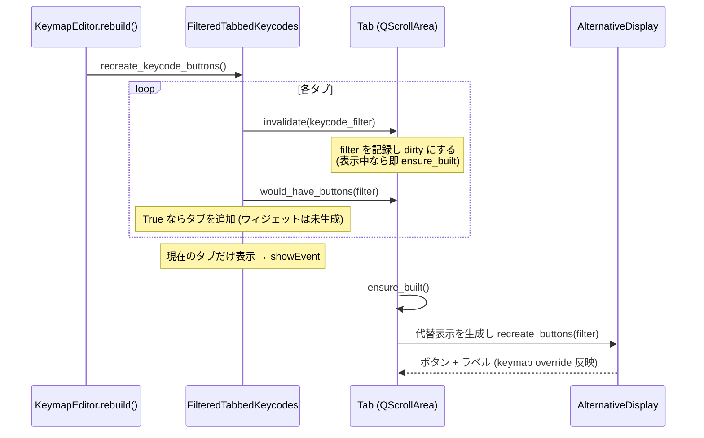

# キーコードピッカーの遅延生成 仕様書

作成日: 2026-09-21

## 1. 目的

「Start Vial」（デスクトップ版ではキーボード接続）からキーボード一覧・キーマップが出るまでの時間を短くする。

2026-09-21 の計測（Mac ネイティブ、仮想キーボード）では MainWindow の生成に約 15 秒かかり、その大半が
キーコードピッカーのボタン生成だった。

| 項目 | 現状 |
| --- | --- |
| 生成される `SquareButton` | 約 19,000 個 / MainWindow |
| 内訳 | ピッカー 2 つ（キーマップ用 `tabbed_keycodes`、トレイ `tray_keycodes`）× 変種 2 つ（全キー `all_keycodes`、基本キーのみ `basic_keycodes`）× タブ 11 個 × 各タブの代替表示（ディスプレイキーボード 3〜4 種 + キーコード一覧） |
| 起動直後に見えているもの | キーマップ用ピッカーの「全キー」変種の「Basic」タブ 1 つだけ |

ブラウザ版（WebAssembly）ではこの処理がさらに数倍遅く、これが「Start Vial」後の長い待ちの主因になる。

## 2. 方針

**タブの中身（代替表示とボタン）は、そのタブが最初に表示されたときに作る。** 隠れているピッカー
（トレイ、基本キーのみの変種）や、選ばれていないタブは何も作らない。タブ自体（タブ見出し）の有無は
キーコードの一覧から計算し、ウィジェットを作らずに決める。

- `Tab` は生成時に `alts`（(キーボード定義, キーコード一覧) の列）と `prefix_buttons` を保持するだけで、
  `AlternativeDisplay` は `ensure_built()` で初めて作る。`alternatives` はそれまで空のリスト。
- `Tab.invalidate(keycode_filter)`: フィルタを保存し `dirty = True`。タブが表示中（`isVisible()`）なら
  その場で `ensure_built()`。
- `Tab.ensure_built()`: `dirty` なら代替表示を（無ければ）作り、各代替表示の `recreate_buttons(filter)` を
  呼び、`select_alternative()` で幅に合う代替表示を選ぶ。`built` を True、`dirty` を False にする。
- `Tab.showEvent()`: `ensure_built()` を呼ぶ（QTabWidget が現在のページを表示するときに呼ばれる）。
- `Tab.would_have_buttons(keycode_filter)`: いずれかの代替表示のキーコード一覧に、`hidden` でなく
  `keycode_filter(qmk_id)` を満たすものがあれば True。従来の `has_buttons()`（生成済みボタンの有無）と同じ
  意味を、ウィジェットを作らずに返す。
- `Tab.relabel_buttons()` / `on_keymap_override`: 生成済み（`built`）のタブだけ再ラベルする。未生成のタブは
  生成時に現在の keymap override を反映するので、結果は同じ。
- `FilteredTabbedKeycodes.recreate_keycode_buttons()`: 各タブに `invalidate()`、`would_have_buttons()` で
  タブの追加を決める。従来と同じく、以前選ばれていたタブを選び直す。
- トレイ（`tray_keycodes`）と基本キーのみの変種（`basic_keycodes`）は最初は隠れているので、上の仕組みだけで
  最初に表示されるまで何も作らない。

### 変わらないこと

- タブの並びと見出し、各タブに出るボタンとラベル、ツールチップ、カード表示（Tap Dance / HostOS / Macro）。
- `entry_labels.update()` からの再ラベル（`on_keymap_override` 経由）。
- テストで使っている `ak.setCurrentIndex(i)` の直後にそのタブのボタンが見えること（`showEvent` は
  `setCurrentIndex` の中で同期的に届く）。

## 3. 期待する効果

起動直後に生成されるのは「Basic」タブ 1 つ分（代替表示 4 つ分のディスプレイキーボードとキーコード一覧、
1,000 個未満）。生成数は現状の約 1/20 になる。

## 4. テスト（`src/main/python/test/test_picker_lazy.py`）

| テスト | 内容 |
| --- | --- |
| `test_startup_builds_only_visible_tab` | 起動直後、MainWindow 内の `SquareButton` は 2,000 個未満。キーマップ用ピッカーは現在のタブ（Basic）だけ `built`、他のタブ・トレイ・基本キーのみの変種は未生成 |
| `test_tab_builds_when_shown` | 「Quantum」タブを選ぶとそのタブが生成され、ボタンが見える。他のタブは未生成のまま |
| `test_tray_builds_when_opened` | エディタのキーをクリックしてトレイを開くと、トレイの現在のタブだけ生成される |
| `test_lazy_tab_shows_current_override` | キーボードレイアウト（Colemak）を選んでから未生成のタブを表示すると、そのタブのボタンにレイアウトのラベルが付いている |
| `test_tab_presence_without_building` | 基本キーのみの変種は Basic / ISO/JIS / App, Media and Mouse のタブだけを持ち、その時点でどのタブも未生成 |
| `test_rebuild_refreshes_built_tab` | 表示中のタブに対して `recreate_keycode_buttons()` を呼ぶと作り直され、未表示のタブは未生成のまま |
