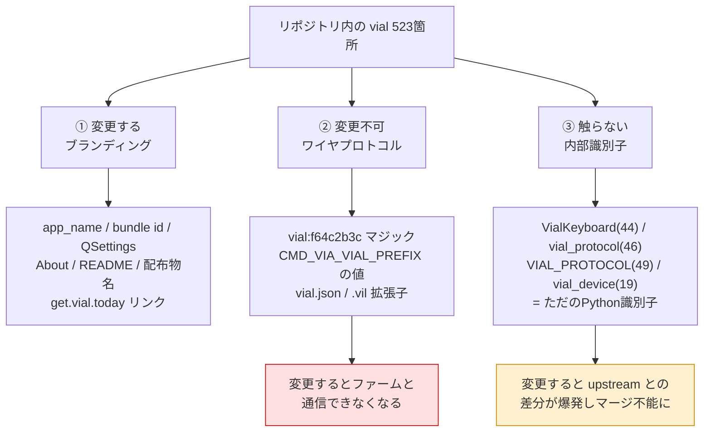
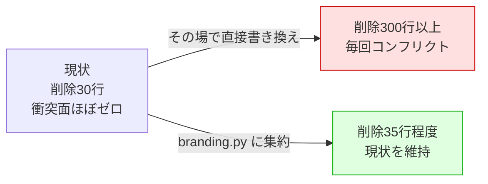
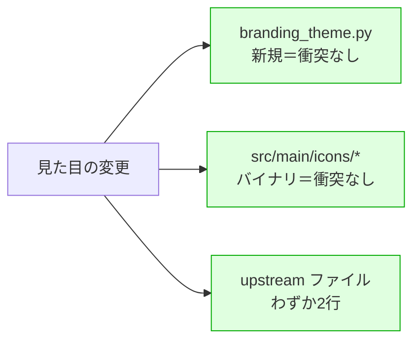
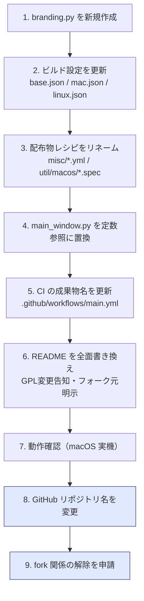

# KeRT-Keymapper リブランディング計画

作成日: 2026-09-20
対象リポジトリ: `digitarhythm/vial-gui`（→ `digitarhythm/KeRT-mapper`、2026-09-22 → `digitarhythm/KeRT-Keymapper`）
フォーク元: [vial-kb/vial-gui](https://github.com/vial-kb/vial-gui)（GPL-2.0）

## 1. 目的

現在は Vial-GUI にパッチを当てた形で公開しているが、HostOS 拡張を備えた独立プロダクトとして
名称を変更し、フォーク元と明確に区別できる状態にする。

ただし **upstream（vial-kb/vial-gui）からの修正は今後も取り込み続ける**方針とする。
そのためリブランディングは「コンフリクト面を増やさない」ことを最優先の制約として設計する。

## 2. 名称と識別子

プロダクト名: **KeRT-Keymapper**

由来は自作キーボード **TReK**（Triple Rotary encoder Keyboard）を逆綴りにした `KeRT` と、
`mapper`（Key ReMapper）の組み合わせ。`TReK` を1文字ずつ反転すると大文字小文字ごと `KeRT` になる。

名称の空き確認（2026-09-20 時点）:

| 確認先 | 結果 |
|---|---|
| GitHub `kert-keymapper in:name` | 0件 |
| `digitarhythm/KeRT-Keymapper` | 未使用（404） |
| PyPI `kert-keymapper` | 未使用（404） |

ハイフンは Debian パッケージ名（英小文字・数字・`+`・`-`・`.`）でも
macOS バンドルID（英数字・ハイフン・ピリオド）でも正式に許可された区切り文字であり、
表記が割れる問題は発生しない。

### 識別子一覧

| 用途 | 現在 | 変更後 |
|---|---|---|
| アプリ表示名 | `Vial` | `KeRT-Keymapper` |
| author | `xyz` | `digitarhythm` |
| GitHub リポジトリ | `vial-gui` | `KeRT-Keymapper`（当初 `KeRT-mapper`） |
| macOS バンドルID | `today.vial` | `io.github.digitarhythm.kert-keymapper` |
| macOS アプリ | `Vial.app` | `KeRT-Keymapper.app` |
| Debian パッケージ / `.desktop` | `Vial` | `kert-keymapper` |
| AppImage | `Vial-x86_64.AppImage` | `KeRT-Keymapper-x86_64.AppImage` |
| QSettings | `QSettings("Vial", "Vial")` | `QSettings("digitarhythm", "KeRT-Keymapper")` |
| バージョン | `0.7.5` | **未決定**（第11章参照） |

機能はリポジトリの説明文と About ダイアログが担う。説明文の案:

> KeRT-Keymapper — Vial-compatible keyboard configurator with HostOS support.
> Remap keys per host OS (macOS / Windows / Linux).

## 3. 変更方針：3分類

リポジトリ内の `vial` の出現は全体で 523 箇所あるが、性質によって扱いが異なる。
**一括置換は絶対に行わない。**



### ② 変更不可（外部互換性）

| 対象 | 場所 | 理由 |
|---|---|---|
| `VIAL_SERIAL_NUMBER_MAGIC = "vial:f64c2b3c"` | `src/main/python/util.py:20` | ファームが返すシリアル番号との照合値。変更するとデバイスを一切検出できない |
| 同上 | `src/main/python/hidproxy.py:41` | WebHID 用の同値 |
| 同上 | `src/main/python/test/test_gui.py:48` | テストの期待値 |
| `CMD_VIA_VIAL_PREFIX` 等の**値** | `src/main/python/protocol/constants.py` | HID コマンドのバイト値 |
| `.vil` 拡張子 | `main_window.py:264, 282` | 既存レイアウトファイルとの互換 |
| `vial.json` | ファーム側の定義ファイル名 | 仕様として固定 |

### ③ 触らない（内部識別子）

`VialKeyboard`、`vial_protocol`、`vial_device.py` 等は単なる Python 識別子であり、
変更しても動作はする。しかし upstream が同じ行を触るたびに衝突するため**据え置く**。

## 4. コンフリクト最小化：branding.py への集約

これが本計画の中核。現在のフォークは upstream 起点 `aef8222` から
**894行追加 / 30行削除**であり、**削除がわずか30行**＝ upstream のコードをほとんど
書き換えていない。この状態が追従マージを容易にしている。

素朴に文字列を直接書き換えると、この利点が失われる。



### 実装

新規ファイル `src/main/python/branding.py` を作成する（新規なので衝突しない）。

```python
# SPDX-License-Identifier: GPL-2.0-or-later
"""製品固有のブランディング定義。upstream との衝突面を1ファイルに閉じ込める。"""

APP_NAME = "KeRT-Keymapper"
APP_ORG = "digitarhythm"
APP_URL = "https://github.com/digitarhythm/KeRT-Keymapper"
APP_DESCRIPTION = "Vial-compatible keyboard configurator with HostOS support"

# フォーク元。GPL-2.0 の表示義務およびユーザーへの案内に使用する
UPSTREAM_NAME = "Vial"
UPSTREAM_URL = "https://get.vial.today/"
```

既存ファイル側は `from branding import APP_NAME` の追加と、文字列を定数に差し替える
数行のみとし、**削除行数を最小に保つ**。

## 5. 変更対象ファイル一覧

### 衝突リスクなし（新規または独自追加ファイル）

| ファイル | 対応 |
|---|---|
| `src/main/python/branding.py` | 新規作成 |
| `util/macos/Vial.spec` | → `util/macos/KeRT-Keymapper.spec` にリネーム（独自追加ファイル） |
| `util/macos/build.sh` | 3, 34, 35, 42, 47, 50, 53, 55, 59 行目の `Vial` を置換（独自追加） |
| `util/macos/rthook_fbs_build_settings.py` | 10行目 `app_name`、13行目 `mac_bundle_identifier`（独自追加） |
| `util/macos/README.md` | 全面更新（独自追加） |
| `docs/host-os-gui-spec.md` | 記載があれば更新（独自追加） |

### 衝突リスク低（upstream がほぼ触らない）

| ファイル | 変更内容 |
|---|---|
| `src/build/settings/base.json` | `app_name`, `author`, `version` |
| `src/build/settings/mac.json` | `mac_bundle_identifier` |
| `src/build/settings/linux.json` | `description`, `author_email`, `url`（現在すべて空） |
| `misc/Vial.yml` | → `misc/KeRT-Keymapper.yml` にリネーム、内容の `Vial` を置換 |

### 衝突リスク中（定数化で最小限に抑える）

| ファイル | 行 | 内容 |
|---|---|---|
| `src/main/python/main.py` | 64 | `result.setOrganizationDomain("vial.today")` |
| `src/main/python/main_window.py` | 47 | `QSettings("Vial", "Vial")` |
| | 105 | `No devices detected...Vial-compatible device` |
| | 316 | `Please download latest Vial from https://get.vial.today/` |
| | 443-444 | About ダイアログのタイトルと本文 |

`264, 282` 行目の `"Vial layout (*.vil)"` は、拡張子 `.vil` を据え置く以上、
表示名のみ変更するか、そのまま残すかを実装時に判断する。

### 衝突リスク高（upstream も頻繁に更新）

| ファイル | 注意点 |
|---|---|
| `README.md` | 全面書き換え。upstream の更新と必ず衝突するが、内容を見て手で選べばよい |
| `.github/workflows/main.yml` | 成果物名（17-18, 44-45, 61, 66, 72-73, 79-81, 117, 121-122, 132-133行） |

#### upstream リポジトリへの依存に注意

`.github/workflows/main.yml:103` が `https://github.com/vial-kb/vial-deps/releases/download/v1/nsis-3.06.1-setup.exe`
を取得している。**upstream 側のリリース資産に依存している**ため、削除・変更されると
Windows ビルドが壊れる。自前でミラーすることを検討する。

## 6. 外観（テーマ・アイコン）の変更方針

別プロダクトとして識別できるよう配色とアイコンを変更する。ここも
「コンフリクト面を増やさない」制約のもとで設計する。

### 6.1 好都合な点：描画色はすべて QPalette 由来

`src/main/python/widgets/keyboard_widget.py` は色をハードコードしておらず、
すべて `QApplication.palette()` から導出している。

| 描画要素 | 参照するパレットロール | 行 |
|---|---|---|
| キー本体の背景 | `QPalette.Button` | 373 |
| キー上面 | `QPalette.Button.lighter(120)` | 377 |
| キーの文字 | `QPalette.ButtonText` | 369 |
| 選択枠 | `QPalette.Highlight` | 386 |
| 押下時 | `QPalette.Highlight` / `.lighter(120)` | 397, 401 |
| ON 状態 | `QPalette.Highlight.darker(150)` / `.darker(120)` | 405, 409 |
| マスク層 | `QPalette.Button.lighter(Theme.mask_light_factor())` | 381 |

**描画コードに一切触れず、パレットの差し替えだけで見た目を刷新できる。**
とりわけ `QPalette.Highlight` はキー選択時・押下時の色なので、ここをブランドカラーに
すると印象が大きく変わる。

### 6.2 themes.py は直接編集しない

upstream は Catppuccin 系4種など**テーマを追加し続けている**。`themes.py` を直接
編集すると追従のたびに衝突するため、**新規ファイルから登録する**方式を採る。

`main_window.py:227` がテーマメニューを `[("System", None)] + themes.themes` から
組み立てているため、リストに追加するだけでメニューにも自動的に並ぶ。

### 6.3 実装：branding_theme.py

```python
# src/main/python/branding_theme.py
# SPDX-License-Identifier: GPL-2.0-or-later
"""KeRT-Keymapper 独自テーマ。upstream の themes.py を変更せずに登録する。"""

from PyQt5.QtGui import QPalette, QColor

import themes

# 明るい系テーマの名前。mask_light_factor の判定に使う
LIGHT_THEME_NAMES = set()

KERT_THEMES = [
    ("KeRT Dark", {
        QPalette.Window: "#1b1d23",
        QPalette.WindowText: "#e6e6e6",
        QPalette.Base: "#15171c",
        QPalette.AlternateBase: "#1b1d23",
        QPalette.ToolTipBase: "#15171c",
        QPalette.ToolTipText: "#e6e6e6",
        QPalette.Text: "#e6e6e6",
        QPalette.Button: "#262a33",        # キー本体の色
        QPalette.ButtonText: "#e6e6e6",    # キーの文字
        QPalette.BrightText: "#ff6b6b",
        QPalette.Link: "#4dd0c7",
        QPalette.Highlight: "#00a3a3",     # ブランドカラー（選択・押下）
        QPalette.HighlightedText: "#15171c",
        (QPalette.Active, QPalette.Button): "#262a33",
        (QPalette.Disabled, QPalette.ButtonText): "#6b7280",
        (QPalette.Disabled, QPalette.WindowText): "#6b7280",
        (QPalette.Disabled, QPalette.Text): "#6b7280",
        (QPalette.Disabled, QPalette.Light): "#262a33",
    }),
]


def register():
    """独自テーマを themes モジュールに登録する。MainWindow 生成前に呼ぶこと。"""
    for name, colors in KERT_THEMES:
        if name in themes.palettes:
            continue
        palette = QPalette()
        for role, color in colors.items():
            if not hasattr(type(role), "__iter__"):
                role = [role]
            palette.setColor(*role, QColor(color))
        themes.palettes[name] = palette
        themes.themes.append((name, colors))

    # mask_light_factor() は theme == "Light" の完全一致で判定しているため、
    # 明るい系の独自テーマを追加する場合はラップして対応する
    original = themes.Theme.mask_light_factor.__func__

    @classmethod
    def mask_light_factor(cls):
        if cls.theme in LIGHT_THEME_NAMES:
            return 103
        return original(cls)

    themes.Theme.mask_light_factor = mask_light_factor
```

※ 上記の配色は**仮の値**。ブランドカラー確定後に差し替える（第11章参照）。

### 6.4 upstream ファイルへの変更は2行

| ファイル | 変更 |
|---|---|
| `src/main/python/main.py` | `MainWindow(appctxt)` の前に `branding_theme.register()` を1行追加（87行目の直前） |
| `src/main/python/main_window.py` | 419行目 `self.settings.value("theme", "Dark")` の既定値を `"KeRT Dark"` に変更 |

`register()` は **MainWindow 生成前**に呼ぶ必要がある。MainWindow はコンストラクタ内で
テーマメニューを構築し（227行目）、テーマを適用する（62行目）ため。

### 6.5 アイコン

`src/main/icons/` 配下に配置されている。**バイナリファイルなのでテキストコンフリクトが
発生せず**、upstream がアイコンを更新することも稀。ブランド刷新の効果が最も大きく、
コストが最も低い。

| パス | 用途 |
|---|---|
| `src/main/icons/Icon.ico` | Windows |
| `src/main/icons/mac/{128,256,512,1024}.png` | macOS |
| `src/main/icons/linux/{128,256,512,1024}.png` | Linux |
| `src/main/icons/base/{16,24,32,48,64}.png` | 共通・小サイズ |

macOS ビルドは `util/macos/build.sh` がこれらの PNG から `.icns` を生成している（独自
追加ファイルなので自由に変更できる）。

### 6.6 コンフリクト面のまとめ



## 7. 作業手順



**リポジトリ名の変更は最後**に行う。コード側が Vial のままの状態で名前だけ変えても意味がない。

なお手順7は**この Linux コンテナでは実行できない**（PyQt5 の aarch64 wheel が存在せず、
X サーバも USB も無い）。macOS 側で実施すること。

## 8. upstream 追従の運用

### 現在のコンフリクト予測

フォーク起点 `aef8222` からの差分 18 ファイル、894行追加 / 30行削除。

| リスク | ファイル | 差分 | 理由 |
|---|---|---|---|
| なし | `editor/host_os.py`, `docs/host-os-gui-spec.md`, `util/macos/*` | +500 -0 | 新規ファイル |
| 低 | `protocol/keyboard_comm.py`, `main.py`, `test_gui.py`, `test_keyboard.py` | +229 -0 | 追記のみ |
| 中 | `tap_dance.py`, `main_window.py`, `keycodes.py`, `tabbed_keycodes.py` | 計 -7 | 数行の書き換え |
| 高 | `.github/workflows/main.yml` | +51 -21 | upstream も CI を頻繁に更新 |
| 高 | `README.md` | +62 -1 | upstream も更新 |

実際に衝突するのは CI 設定と README がほとんどで、いずれも機能ではないため
内容を見て手で選べば解決できる。アプリのロジック部分の衝突面は数行しかない。

### マージ方針

**`merge` を使い、`rebase` は使わない。** 公開済みリポジトリで rebase すると履歴が
書き換わり、利用者の clone や fork が壊れる。既存履歴も merge を使っており一貫する。

```bash
git fetch upstream
git merge upstream/main
# 衝突したら <<<<<<< マーカーを手で解決して commit
```

現在 `upstream/main` はローカルに fetch されていない（ref が存在しない）。追従を始める
時点で最初の fetch が必要。

## 9. GPL-2.0 上の義務

フォークして名称を変更すること自体は GPL-2.0 で認められている。以下は必須。

- `COPYING` を残し、ライセンスを GPL-2.0 のまま維持する
- 既存の著作権表示を削除しない
- **変更した旨と日付を明示する**（GPLv2 第2条a項）
- README にフォーク元と元リポジトリへのリンクを明記する

「Vial」はプロジェクト名として使われており、GPL はライセンスであって商標の使用許諾では
ない。名称変更はこの観点からも妥当。一方「Vial 互換ファームウェアで動作する」といった
事実の記述は問題ない。

## 10. GitHub の fork 関係

GitHub 上で fork として作成されたリポジトリは、**名前を変更しても
"forked from vial-kb/vial-gui" の表記とネットワークグラフが残る**。

独立プロダクトとして見せるには以下のいずれかが必要。

| 方法 | 内容 | 留意点 |
|---|---|---|
| fork 関係の解除を申請 | GitHub サポートに依頼（無料・数日） | Star / Issue / 履歴をそのまま維持できる |
| 新規リポジトリを作成 | 新しく作って push し直す | Star / Watch / Issue は引き継がれない |

まず GitHub のリポジトリページ上部に "forked from ..." の表示があるか確認する。

## 11. 未決定事項

### バージョン番号

| 案 | 内容 | 利点 |
|---|---|---|
| `1.0.0` にリセット | 独立プロダクトとして仕切り直す | 名実ともに別プロダクトであることが明確 |
| `0.7.5` を継承 | upstream のベース時点を示す | どの Vial バージョン相当か分かりやすい |

CI がタグで GitHub Release を作成する設定のため、リリース作業前に確定が必要。

**決定（2026-09-22）: `1.0.0` にリセット。** タグは `v1.0.0`、`src/build/settings/base.json` の `version` も `1.0.0`。

### `.vil` 表示名の扱い

`"Vial layout (*.vil)"` のファイルダイアログ表示名を変更するか。拡張子自体は
互換性のため据え置くので、表示だけ `"KeRT-Keymapper layout (*.vil)"` とするか、
`.vil` が Vial 由来の形式である事実を尊重してそのまま残すかの判断。

### ブランドカラー

`branding_theme.py` の配色は現時点では仮の値（`QPalette.Highlight: "#00a3a3"` 等）。
以下を決める必要がある。

- ブランドカラー（`QPalette.Highlight`：キー選択時・押下時の色）
- キー本体の色（`QPalette.Button`）と背景色（`QPalette.Window`）
- 明るい系テーマも用意するか（用意する場合は `LIGHT_THEME_NAMES` への登録が必要）

### アイコン

`src/main/icons/` の差し替え用画像。必要なサイズは第6.5節の表を参照。
