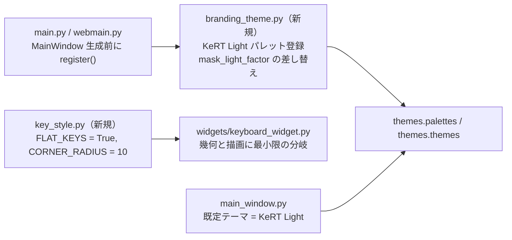

# 白基調テーマとフラットなキー描画 仕様書

作成日: 2026-09-21
関連: `docs/rebranding-plan.md` 第6章（テーマは upstream の `themes.py` を編集せず新規ファイルから登録する）

## 1. 目的

- 既定の見た目を黒基調（Dark）から**白基調**に変える。
- キーの描画を、キーキャップ風の立体表現（影 + 上面）から、**角丸 10px のフラットな正方形**に変える。

## 2. 構成

## 3. テーマ「KeRT Light」

| ロール | 色 | 用途 |
|---|---|---|
| Window / AlternateBase | `#f5f6f8` | 背景 |
| Base / ToolTipBase | `#ffffff` | 入力欄・カード |
| WindowText / Text / ButtonText | `#1f2328` | 文字、キーの文字 |
| Button | `#ffffff` | キー本体 |
| Mid | `#303030` | キーの輪郭線、全ウィジェットの枠線 |
| Highlight | `#00a3a3` | 選択枠・押下（ブランドカラー、暫定） |
| HighlightedText | `#ffffff` | |
| Link | `#0969da` | 国別キーマップで上書きされたキーの文字色 |
| Disabled 系 | `#9aa0a6` | |

- **テーマは KeRT Light のみ**。`register()` は upstream の `themes.themes` / `themes.palettes` の中身を KeRT Light だけに置き換え、Theme メニューは非表示にする（`themes.py` 自体は upstream との衝突を避けるため編集しない）。`resolve_theme()` は常に KeRT Light を返す。
- `Theme.mask_light_factor()` は `"Light"` の完全一致で判定しているため、明るいテーマ名の集合で判定するよう差し替える（マスク付きキーの内側を 103% にする）。
- 既定テーマを `"KeRT Light"` にする。保存済みの設定が **このフォークのテーマ（`BRAND_THEMES`）または `System`** ならそれを使い、upstream 由来のテーマ名（Dark / Bliss など、リブランディング前の保存値）なら既定に戻す（`branding_theme.resolve_theme()`）。

## 4. フラットなキー

`key_style.py` の `FLAT_KEYS = True` のとき、`KeyWidget`（`keyboard_widget.py` 内のキー幾何）と `KeyboardWidget.paintEvent` は次のように振る舞う。

| 項目 | 立体（従来） | フラット |
|---|---|---|
| 背景パス | 角丸（`size × 0.08`） | 角丸 **`CORNER_RADIUS` = 10**（キー座標系。倍率 1.0 で 10px） |
| 上面パス | 影ぶんを内側に寄せた角丸 | **描かない**（空のパス） |
| 文字の矩形 | 影の分だけ上寄せ | キー全体の中央 |
| 輪郭 | なし | `QPalette.Mid` の **3px** 線（`key_style.OUTLINE_WIDTH`） |
| 選択中のキー | Highlight 色の枠 | **背景を Highlight 色、文字を HighlightedText 色**（枠も Highlight）。押下中は Highlight の明色、ON は暗色で従来どおり区別 |
| マスク付きキーの内側 | 下側 65% の角丸矩形 | 同じ領域、角丸は `CORNER_RADIUS × 0.6` |

`FLAT_KEYS = False` にすれば従来描画に戻せる（upstream との差分を切り分けるため）。

## 4.1 キー以外の四角（ウィジェット全般）

Fusion スタイルでは角丸や線幅を変えられないため、`branding_theme.register()` が
テーマ適用時（`Theme.set_theme` をラップ）に**スタイルシート**を当てる。対象と値:

| 対象 | 角丸 | 線 |
|---|---|---|
| カード（`EntryCard`、`EntryCardButton`）、`QPushButton`、`QToolButton`、`QComboBox`、`QSpinBox`、`QLineEdit`、`QTabWidget::pane`、`QTabBar::tab`、`QScrollArea`、`QFrame`（カード） | `10px` | `3px solid` `QPalette.Mid` |

- 値は `key_style.CORNER_RADIUS`（10）と `key_style.OUTLINE_WIDTH`（3）を共用し、キーと揃える。
- チェックボックス（QMK Settings 等）: 標準の薄い描画をやめ、`QCheckBox::indicator` を 18px・枠線 `2px solid #303030`・角丸 4px にし、チェック時は背景を Highlight 色にする（`checked` 状態はスタイルシートの背景で示す）。
- スタイルシートは `KeRT Light` 選択時だけ当て、他のテーマでは空にする（upstream テーマの見た目を変えない）。
- **選択中の表示**: 選択中のタブ（`QTabBar::tab:selected`）と押し込まれたボタン（`QPushButton:checked` = レイヤーボタン）は枠ではなく**背景を Highlight 色**、文字を HighlightedText 色にする。キーマップ上の選択キーもフラット描画では背景を Highlight 色にする（押下 / ON は明暗で区別）。
- **間隔**: 部品どうしの間隔と余白を線幅と同じ **3px** にする。Qt のレイアウト既定値は `QProxyStyle`（`branding_theme.BrandStyle`）の`pixelMetric` で `PM_Layout*Margin` / `PM_Layout*Spacing` を 3 にして与え、カードや FlowLayout の明示値も 3 に揃える。

## 4.2 キーボード選択ドロップダウン

画面最上段の `combobox_devices` は、アプリ既定フォント **+4pt**、高さは既定の **2 倍**（`main_window.py` で `setFont` と `setMinimumHeight`）。
ヘッダー行の並びは **キーボードアイコン `lbl_select_keyboard`（`keyboard-icon.png`）→ ロゴ画像 `lbl_logo_image` → ドロップダウン → Refresh**。アイコンとロゴはドロップダウンの高さに合わせて縮小する。
ドロップダウン内側のキーボード名の左余白は 32px（スタイルシートの `QComboBox { padding-left: 32px; }`）。ドロップダウンの幅は**一番長いキーボード名が収まる幅**（`QComboBox.AdjustToContents`、更新のたびに再計算）。そのすぐ右に Refresh ボタンを置く。ボタンはドロップダウンと同じフォント（既定 +4pt）で、高さはドロップダウンと同じ、幅は文字に合わせる（横長で可）。文字ロゴは置かない。アイコンとロゴは左詰め、ドロップダウンと Refresh は右詰め（間に stretch）。ヘッダー行の内側には `HEADER_MARGIN` = 6px の余白を取る（全体の 3px より広い）。
行の左端にはロゴ画像 `lbl_logo_image`（`src/main/resources/base/kert-mapper.png`、`misc/kert-mapper.png` が原本。`appctx.get_resource()` で解決し、ドロップダウンの高さに合わせて縦横比を保って縮小）を置く。

## 4.3 キーコードピッカーのボタン

画面下半分のキーコードボタン（`tabbed_keycodes.py` が生成する `SquareButton` / `EntryCardButton`）は、
文字数の多い Quantum などが収まるよう、フォントをアプリ既定 **−2pt** にする（`PICKER_FONT_DELTA`）。
`SquareButton` に `setFontDelta()` を追加し、ピッカーの生成箇所でだけ呼ぶ（レイヤーボタン等は変えない）。
文字が切れないよう、ピッカーのボタンはスタイルシートの内側余白を 0 にし、`frame_extra`（線幅 3px）の分だけ正方形を広げる。
キーの一辺は `KEYCODE_BTN_RATIO` × フォント高で、upstream の 3 から **3.4** に上げて少し大きくする。

**配置**: 各タブの中身（キーボード型の並び `DisplayKeyboard` と、その下の折り返しボタン列）は 1 つのブロック `AlternativeDisplay.block` に入れる。ブロック内は**左寄せ**、ブロックの幅はキーボード型の並びの幅に合わせてブロック自体を**中央**に置く。並びが無いタブ（Layers、Backlight、App/Media/Mouse、User、Macro、Tap Dance、HostOS）は、ブロックの幅を **min(ページ幅, 全ボタンを 1 行に並べた幅)** にして中央に置く（`AlternativeDisplay.resizeEvent` で再計算）。1 行に収まらないときは全幅で左から折り返す。

## 5. テスト

| テスト | 検証内容 |
|---|---|
| `test_theme.py::test_kert_light_registered` | `register()` 後に `KeRT Light` が `themes.palettes` / `themes.themes` にあり、Window が明色、Button が白、`mask_light_factor()` が 103 |
| `test_theme.py::test_only_kert_light`（GUI） | 登録テーマが KeRT Light だけ、Theme メニューが非表示、保存値が何であれ KeRT Light |
| `test_theme.py::test_flat_key_geometry` | `KeyWidget` の角丸が 10、上面パスが空、文字矩形がキー全体 |
| `test_theme.py::test_flat_key_paint`（GUI） | 描画結果の中央がキー色、四隅が背景色（角が丸い）、輪郭線が Mid 色 |
| `test_theme.py::test_default_theme_resolution` | 保存値なし / upstream テーマ名 → `KeRT Light`、`KeRT Light` / `System` → そのまま |
| `test_theme.py::test_widget_stylesheet`（GUI） | `KeRT Light` 適用時にアプリのスタイルシートが `border-radius: 10px` と `3px solid` を含み、他テーマでは空 |
| `test_theme.py::test_selected_uses_background`（GUI） | スタイルシートで選択タブと checked ボタンの背景が Highlight 色になる |
| `test_theme.py::test_layout_spacing`（GUI） | `KeRT Light` 適用時に `style().pixelMetric()` の余白・間隔が 3、他テーマでは Fusion の既定値 |
| `test_theme.py::test_selected_key_filled`（GUI） | 選択中のキーの内側が Highlight 色、刻印が HighlightedText 色で描かれる |
| `test_theme.py::test_device_combobox_size`（GUI） | キーボード選択ドロップダウンのフォントがアプリ既定 + 4pt、高さが既定の 2 倍 |
| `test_theme.py::test_select_keyboard_icon`（GUI） | キーボードアイコン（高さ = ドロップダウン）が行の左端、その右にロゴ画像がある |
| `test_theme.py::test_device_row_layout`（GUI） | ドロップダウン幅が最長のキーボード名に合う、Refresh がすぐ右で同じ高さ・同じフォント、両者は右詰め |
| `test_theme.py::test_picker_font_smaller`（GUI） | ピッカーのキーコードボタンのフォントが既定 −2pt、レイヤーボタンは既定のまま |
| `test_theme.py::test_no_text_logo`（GUI） | 文字ロゴ `lbl_logo` は存在しない |
| `test_theme.py::test_header_margin`（GUI） | ヘッダー行のレイアウト余白が四辺とも 6px |
| `test_theme.py::test_logo_image`（GUI） | ロゴ画像が読み込まれ、高さがドロップダウンと同じ、アイコンとドロップダウンの間にある |
| `test_theme.py::test_picker_key_size`（GUI） | ピッカーのキーの一辺 = フォント高 × 3.4 + 線幅 × 2 |
| `test_theme.py::test_picker_block_full_width_without_keyboard`（GUI） | 1 行に収まらないタブ（Layers）でブロックが全幅、ボタンが横に並ぶ |
| `test_theme.py::test_picker_block_centered_without_keyboard`（GUI） | 1 行に収まるタブ（User）でブロックが内容幅・中央、先頭ボタンがブロック左端 |
| `test_theme.py::test_picker_block_centered`（GUI） | Basic タブ: ブロック幅 ≒ キーボード型の並びの幅、ブロックが中央、並びと最初のボタンがブロックの左端に揃う |
