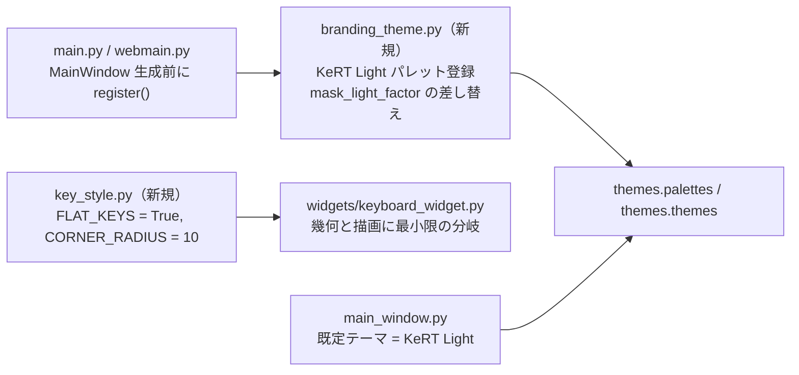
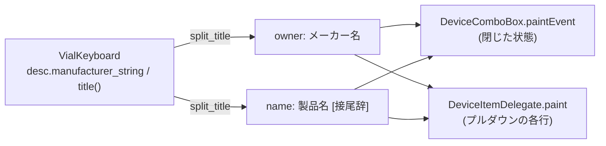
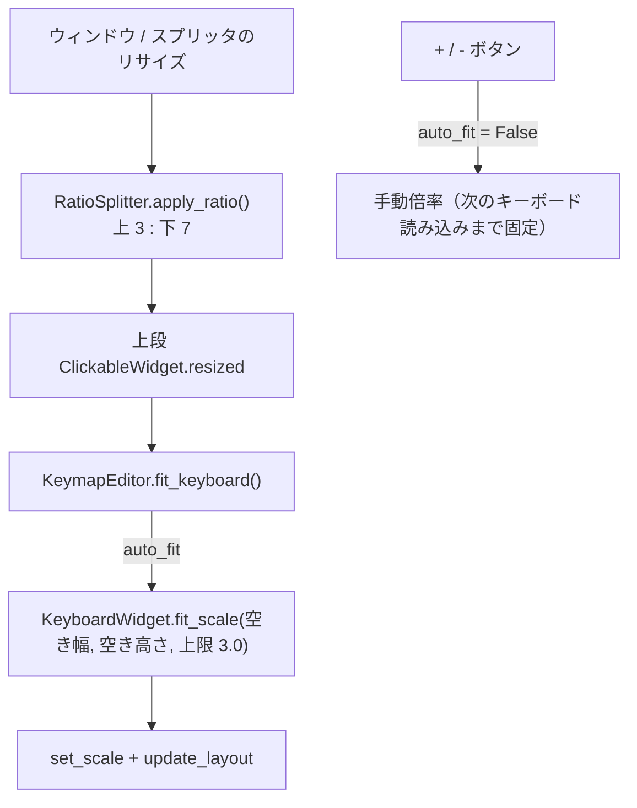
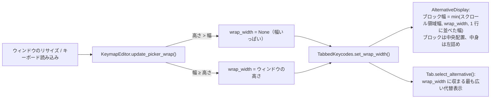

# 白基調テーマとフラットなキー描画 仕様書

作成日: 2026-09-21
関連: `docs/rebranding-plan.md` 第6章（テーマは upstream の `themes.py` を編集せず新規ファイルから登録する）

## 1. 目的

- 既定の見た目を黒基調（Dark）から**白基調**に変える。
- キーの描画を、キーキャップ風の立体表現（影 + 上面）から、**角丸 10px のフラットな正方形**に変える。

## 2. 構成

## 3. テーマ「KeRT Light」

| ロール | 色 | 用途 |
|---|---|---|
| Window / AlternateBase | `#f5f6f8` | 背景 |
| Base / ToolTipBase | `#ffffff` | 入力欄・カード |
| WindowText / Text / ButtonText | `#1f2328` | 文字、キーの文字 |
| Button | `#ffffff` | キー本体 |
| Mid | `#303030` | キーの輪郭線、全ウィジェットの枠線 |
| Highlight | `#00a3a3` | 選択枠・押下（ブランドカラー、暫定） |
| HighlightedText | `#ffffff` | |
| Link | `#0969da` | 国別キーマップで上書きされたキーの文字色 |
| Disabled 系 | `#9aa0a6` | |

- **テーマは KeRT Light のみ**。`register()` は upstream の `themes.themes` / `themes.palettes` の中身を KeRT Light だけに置き換え、Theme メニューは非表示にする（`themes.py` 自体は upstream との衝突を避けるため編集しない）。`resolve_theme()` は常に KeRT Light を返す。
- `Theme.mask_light_factor()` は `"Light"` の完全一致で判定しているため、明るいテーマ名の集合で判定するよう差し替える（マスク付きキーの内側を 103% にする）。
- 既定テーマを `"KeRT Light"` にする。保存済みの設定が **このフォークのテーマ（`BRAND_THEMES`）または `System`** ならそれを使い、upstream 由来のテーマ名（Dark / Bliss など、リブランディング前の保存値）なら既定に戻す（`branding_theme.resolve_theme()`）。

## 4. フラットなキー

`key_style.py` の `FLAT_KEYS = True` のとき、`KeyWidget`（`keyboard_widget.py` 内のキー幾何）と `KeyboardWidget.paintEvent` は次のように振る舞う。

| 項目 | 立体（従来） | フラット |
|---|---|---|
| 背景パス | 角丸（`size × 0.08`） | 角丸 **`CORNER_RADIUS` = 10**（キー座標系。倍率 1.0 で 10px） |
| 上面パス | 影ぶんを内側に寄せた角丸 | **描かない**（空のパス） |
| 文字の矩形 | 影の分だけ上寄せ | キー全体の中央 |
| 輪郭 | なし | `QPalette.Mid` の **3px** 線（`key_style.OUTLINE_WIDTH`） |
| 選択中のキー | Highlight 色の枠 | **背景を Highlight 色、文字を HighlightedText 色**（枠も Highlight）。押下中は Highlight の明色、ON は暗色で従来どおり区別 |
| マスク付きキーの内側 | 下側 65% の角丸矩形 | 同じ領域、角丸は `CORNER_RADIUS × 0.6` |

`FLAT_KEYS = False` にすれば従来描画に戻せる（upstream との差分を切り分けるため）。

## 4.1 キー以外の四角（ウィジェット全般）

Fusion スタイルでは角丸や線幅を変えられないため、`branding_theme.register()` が
テーマ適用時（`Theme.set_theme` をラップ）に**スタイルシート**を当てる。対象と値:

| 対象 | 角丸 | 線 |
|---|---|---|
| カード（`EntryCard`、`EntryCardButton`）、`QPushButton`、`QToolButton`、`QComboBox`、`QSpinBox`、`QLineEdit`、`QTabWidget::pane`、`QTabBar::tab`、`QScrollArea`、`QFrame`（カード） | `10px` | `3px solid` `QPalette.Mid` |

- 値は `key_style.CORNER_RADIUS`（10）と `key_style.OUTLINE_WIDTH`（3）を共用し、キーと揃える。
- チェックボックス（QMK Settings 等）: 標準の薄い描画をやめ、`QCheckBox::indicator` を 18px・枠線 `2px solid #303030`・角丸 4px にし、チェック時は背景を Highlight 色にし、その上に白い「✓」（リソース `check.svg`、18px）を重ねる（2026-09-21 追加。背景色だけではチェック状態が分かりにくいため）。`check.svg` の絶対パスは `main_window.py` が `branding_theme.set_check_image(appctx.get_resource("check.svg"))` で渡し、スタイルシートの `QCheckBox::indicator:checked { image: url(...) }` に入る。パス未設定なら背景色のみ。
- スタイルシートは `KeRT Light` 選択時だけ当て、他のテーマでは空にする（upstream テーマの見た目を変えない）。
- **選択中の表示**: 選択中のタブ（`QTabBar::tab:selected`）と押し込まれたボタン（`QPushButton:checked` = レイヤーボタン）は枠ではなく**背景を Highlight 色**、文字を HighlightedText 色にする。キーマップ上の選択キーもフラット描画では背景を Highlight 色にする（押下 / ON は明暗で区別）。
- **間隔**: 部品どうしの間隔と余白を線幅と同じ **3px** にする。Qt のレイアウト既定値は `QProxyStyle`（`branding_theme.BrandStyle`）の`pixelMetric` で `PM_Layout*Margin` / `PM_Layout*Spacing` を 3 にして与え、カードや FlowLayout の明示値も 3 に揃える。

## 4.2 キーボード選択ドロップダウン

画面最上段の `combobox_devices` は、アプリ既定フォント **+4pt**、高さは既定の **2 倍**（`main_window.py` で `setFont` と `setMinimumHeight`）。
ヘッダー行の並びは **キーボードアイコン `lbl_select_keyboard`（`keyboard-icon.png`）→ ロゴ画像 `lbl_logo_image` → ドロップダウン → Refresh**。アイコンとロゴはドロップダウンの高さに合わせて縮小する。
ドロップダウン内側のキーボード名の左余白は 32px（スタイルシートの `QComboBox { padding-left: 32px; }`）。ドロップダウンの幅は**一番長いキーボード名が収まる幅**（`QComboBox.AdjustToContents`、更新のたびに再計算）。そのすぐ右に Refresh ボタンを置く。ボタンはドロップダウンと同じフォント（既定 +4pt）で、高さはドロップダウンと同じ、幅は文字に合わせる（横長で可）。文字ロゴは置かない。アイコンとロゴは左詰め、ドロップダウンと Refresh は右詰め（間に stretch）。ヘッダー行の内側には `HEADER_MARGIN` = 6px の余白を取る（全体の 3px より広い）。
行の左端にはロゴ画像 `lbl_logo_image`（`src/main/resources/base/kert-mapper.png`、`misc/kert-mapper.png` が原本。`appctx.get_resource()` で解決し、ドロップダウンの高さに合わせて縦横比を保って縮小）を置く。

## 4.2.1 ドロップダウンの 2 段表示（2026-09-21 追加）

キーボード名は `VialKeyboard.title()` が「メーカー名 製品名 [VIA]」の 1 行で返す。ドロップダウンでは、これを
**上段: メーカー名（オーナー）を現在のフォントの半分 + 2pt のサイズ**、**下段: 製品名（と `[VIA]` などの接尾辞）を現在のフォントサイズ**
で 2 段に描く。ブートローダーやダミーキーボードのようにメーカー名が無い項目は、下段だけを縦中央に描く。

- 実装は `widgets/device_combobox.py` の `DeviceComboBox(QComboBox)` と `DeviceItemDelegate(QStyledItemDelegate)`。
  `main_window.py` は `QComboBox()` の代わりに `DeviceComboBox()` を使い、`add_device(dev)` で項目を追加する。
- `split_title(dev)` は `(owner, name)` を返す。`owner` は `desc["manufacturer_string"]`（無ければ空文字）、
  `name` は `title()` から先頭の owner を取り除いた残り。`title()` が owner で始まらない場合は owner を空にして
  `title()` 全体を `name` にする。項目のテキスト（`itemText` / `currentText`）は従来どおり `title()` のまま。
- フォント: `name_font()` はドロップダウンのフォント（既定 +4pt）、`owner_font()` は同じフォントで
  ポイントサイズを `max(6, round(size / 2) + 2)` にしたもの（半分より 2pt 大きい。2026-09-21 の指示）。
- 描画: `paintEvent` はスタイル（スタイルシート）で枠と矢印だけを描き（`currentText` を空にして
  `CC_ComboBox` を描画）、テキストは自前で描く。テキスト領域は左端から `COMBOBOX_PADDING_LEFT`（= 32px、
  スタイルシートの `padding-left` と共通の定数）を空け、右は矢印の分（`SC_ComboBoxArrow` の幅）を空ける。
  `text_layout(rect)` が `(owner_rect, name_rect)` を返し、owner が空なら `owner_rect` は `None` で
  `name_rect` は縦中央。2 行の場合は「owner 行 + name 行」を縦中央にまとめて置き、owner が上、name が下。
- サイズ: `sizeHint()` の幅は `padding-left + max(全項目の owner 幅, name 幅) + 矢印 + 枠` で、1 行の全文
  （`title()`）の幅には依存しない。高さは従来の 2 倍（`setMinimumHeight`）のままで、2 行が収まる。
- プルダウンの各行は `DeviceItemDelegate` が同じ 2 段レイアウトで描き、`sizeHint()` の高さは 2 行分。

## 4.4 キーマップ画面の上下比率と自動フィット（2026-09-21 追加）

Keymap タブは上段（キーボード）と下段（キーコードピッカー）を縦の `RatioSplitter`（`QSplitter` 派生、
`editor/keymap_editor.py`）で分け、比率は **3 : 7**（`SPLIT_RATIO`）。ウィンドウのリサイズごとに比率を
かけ直すが、ユーザーがハンドルをドラッグした後はその位置を保つ。ハンドル幅は `LAYOUT_SPACING`（3px）。

- 上段のキーボードは、レイヤー列とズーム列を除いた空き領域（`keyboard_space()`）に**全キーが収まる最大の倍率**で
  描く（`KeyboardWidget.fit_scale()`、`content_size()` は倍率 1 のキー領域）。上限は `MAX_FIT_SCALE` = 3.0、
  下限は `MIN_FIT_SCALE` = 0.3。
- 自動フィット中は `KeyboardWidget.fit_mode` を立て、`minimumSizeHint()` を 0 にする（キーボードの大きさが
  スプリッタの比率を邪魔しないため。`sizeHint()` は従来どおりキーボードの大きさ）。
- `+` / `-` を押すと `auto_fit` を切って手動倍率にする。キーボードを読み込み直す（`rebuild()`）と自動フィットに戻る。

## 4.5 下段ピッカーの折り返し幅（2026-09-21 追加、同日改訂）

Keymap タブの下段ピッカーの折り返し幅は、**ウィンドウの縦横比**で決める（上段キーボードの幅には
依存しない。マクロパッドのような狭いキーボードで極端に狭くならないため）。

| ウィンドウ | 折り返し幅 | 配置 |
| --- | --- | --- |
| 縦長（高さ > 幅） | 画面幅いっぱい（従来どおり） | ブロックは中央配置（幅いっぱいなので実質そのまま） |
| 横長（幅 ≥ 高さ） | **ウィンドウの高さと同じ幅** | ブロックは中央配置（中身は左詰め。2026-09-21 の指示で左寄せから変更） |

- `KeymapEditor.update_picker_wrap()` は上段ペインのリサイズ（ウィンドウのリサイズを含む）とキーボード
  読み込みのたびに呼ばれ、`keyboard_area.window()` の幅と高さから折り返し幅を決めて
  `tabbed_keycodes.set_wrap_width()` に渡す。
- `AlternativeDisplay.available_width()` はスクロール領域の幅と `wrap_width` の小さい方。ブロックの配置は
  従来どおり中央（左右の stretch）で、ブロックの中身は左詰め。
- ディスプレイキーボード付きのタブ（Basic / ISO/JIS / Quantum）は `select_alternative()` で
  「`wrap_width` に収まる最も広い代替表示」を選ぶ。どれも収まらなければキーボード無しの一覧（折り返し）。
- トレイ（他タブで出るピッカー）は従来どおり画面幅を使う。

## 4.3 キーコードピッカーのボタン

画面下半分のキーコードボタン（`tabbed_keycodes.py` が生成する `SquareButton` / `EntryCardButton`）は、
文字数の多い Quantum などが収まるよう、フォントをアプリ既定 **−2pt** にする（`PICKER_FONT_DELTA`）。
`SquareButton` に `setFontDelta()` を追加し、ピッカーの生成箇所でだけ呼ぶ（レイヤーボタン等は変えない）。
文字が切れないよう、ピッカーのボタンはスタイルシートの内側余白を 0 にし、`frame_extra`（線幅 3px）の分だけ正方形を広げる。
キーの一辺は `KEYCODE_BTN_RATIO` × フォント高で、upstream の 3 から **3.4** に上げて少し大きくする。

**配置**: 各タブの中身（キーボード型の並び `DisplayKeyboard` と、その下の折り返しボタン列）は 1 つのブロック `AlternativeDisplay.block` に入れる。ブロック内は**左寄せ**、ブロックの幅はキーボード型の並びの幅に合わせてブロック自体を**中央**に置く。並びが無いタブ（Layers、Backlight、App/Media/Mouse、User、Macro、Tap Dance、HostOS）は、ブロックの幅を **min(ページ幅, 全ボタンを 1 行に並べた幅)** にして中央に置く（`AlternativeDisplay.resizeEvent` で再計算）。1 行に収まらないときは全幅で左から折り返す。

## 5. テスト

| テスト | 検証内容 |
|---|---|
| `test_theme.py::test_kert_light_registered` | `register()` 後に `KeRT Light` が `themes.palettes` / `themes.themes` にあり、Window が明色、Button が白、`mask_light_factor()` が 103 |
| `test_theme.py::test_only_kert_light`（GUI） | 登録テーマが KeRT Light だけ、Theme メニューが非表示、保存値が何であれ KeRT Light |
| `test_theme.py::test_flat_key_geometry` | `KeyWidget` の角丸が 10、上面パスが空、文字矩形がキー全体 |
| `test_theme.py::test_flat_key_paint`（GUI） | 描画結果の中央がキー色、四隅が背景色（角が丸い）、輪郭線が Mid 色 |
| `test_theme.py::test_default_theme_resolution` | 保存値なし / upstream テーマ名 → `KeRT Light`、`KeRT Light` / `System` → そのまま |
| `test_theme.py::test_widget_stylesheet`（GUI） | `KeRT Light` 適用時にアプリのスタイルシートが `border-radius: 10px` と `3px solid` を含み、他テーマでは空 |
| `test_theme.py::test_selected_uses_background`（GUI） | スタイルシートで選択タブと checked ボタンの背景が Highlight 色になる |
| `test_theme.py::test_layout_spacing`（GUI） | `KeRT Light` 適用時に `style().pixelMetric()` の余白・間隔が 3、他テーマでは Fusion の既定値 |
| `test_theme.py::test_selected_key_filled`（GUI） | 選択中のキーの内側が Highlight 色、刻印が HighlightedText 色で描かれる |
| `test_keymap_split.py::test_top_bottom_split`（GUI） | 上下が `RatioSplitter` で 3:7、リサイズ後も 3:7 |
| `test_keymap_split.py::test_keyboard_auto_fit`（GUI） | 倍率が `fit_scale()` と一致し、キーボードが空き領域に収まり、幅か高さが埋まっている（または上限）。縮小後も収まる |
| `test_keymap_split.py::test_manual_zoom_stops_auto_fit`（GUI） | `+` で倍率が上がり自動フィットが切れ、リサイズしても倍率が変わらない |
| `test_keymap_split.py::test_picker_wraps_in_landscape`（GUI） | 横長ウィンドウで折り返し幅がウィンドウの高さ、Layers タブのブロックがその幅以内で中央配置、Basic タブの代替表示もその幅以内 |
| `test_keymap_split.py::test_picker_full_width_in_portrait`（GUI） | 縦長ウィンドウでは折り返し幅なし、ブロックは従来どおり（幅いっぱい / 中央配置） |
| `test_keymap_split.py::test_picker_wrap_follows_resize`（GUI） | 横長から縦長にリサイズすると折り返しが外れ、戻すと再び高さ幅になる |
| `test_theme.py::test_checkbox_check_mark`（GUI） | チェック済みインジケータのスタイルに `check.svg` の `image: url(...)` があり、描画結果ではチェック時だけ緑の中に白い画素がある |
| `test_theme.py::test_device_combobox_size`（GUI） | キーボード選択ドロップダウンのフォントがアプリ既定 + 4pt、高さが既定の 2 倍 |
| `test_theme.py::test_select_keyboard_icon`（GUI） | キーボードアイコン（高さ = ドロップダウン）が行の左端、その右にロゴ画像がある |
| `test_theme.py::test_device_row_layout`（GUI） | ドロップダウン幅が最長のキーボード名に合う、Refresh がすぐ右で同じ高さ・同じフォント、両者は右詰め |
| `test_device_combobox.py::test_split_title` | `split_title()` がメーカー名と製品名（接尾辞込み）に分ける。メーカー名の無いデバイスは owner が空で name が `title()` 全体 |
| `test_device_combobox.py::test_two_line_fonts`（GUI） | name のフォントがドロップダウンのフォント、owner のフォントがその半分 + 2pt のポイントサイズ |
| `test_device_combobox.py::test_two_line_layout`（GUI） | `text_layout()` で owner 行が name 行の上、owner 行の方が低い、両方がテキスト領域内。owner 無しなら name 行だけが縦中央 |
| `test_device_combobox.py::test_two_line_paint`（GUI） | 描画結果で owner 行・name 行それぞれに文字のピクセルがあり、両行の間には無い |
| `test_device_combobox.py::test_width_follows_longest_line`（GUI） | `sizeHint()` の幅が 1 行全文の幅より狭く、`padding-left + 最長行 + 矢印` に収まる |
| `test_device_combobox.py::test_popup_delegate`（GUI） | 項目デリゲートが `DeviceItemDelegate` で、行の高さが 2 行分ある |
| `test_theme.py::test_picker_font_smaller`（GUI） | ピッカーのキーコードボタンのフォントが既定 −2pt、レイヤーボタンは既定のまま |
| `test_theme.py::test_no_text_logo`（GUI） | 文字ロゴ `lbl_logo` は存在しない |
| `test_theme.py::test_header_margin`（GUI） | ヘッダー行のレイアウト余白が四辺とも 6px |
| `test_theme.py::test_logo_image`（GUI） | ロゴ画像が読み込まれ、高さがドロップダウンと同じ、アイコンとドロップダウンの間にある |
| `test_theme.py::test_picker_key_size`（GUI） | ピッカーのキーの一辺 = フォント高 × 3.4 + 線幅 × 2 |
| `test_theme.py::test_picker_block_full_width_without_keyboard`（GUI） | 1 行に収まらないタブ（Layers）でブロックが全幅、ボタンが横に並ぶ |
| `test_theme.py::test_picker_block_centered_without_keyboard`（GUI） | 1 行に収まるタブ（User）でブロックが内容幅・中央、先頭ボタンがブロック左端 |
| `test_theme.py::test_picker_block_centered`（GUI） | Basic タブ: ブロック幅 ≒ キーボード型の並びの幅、ブロックが中央、並びと最初のボタンがブロックの左端に揃う |
