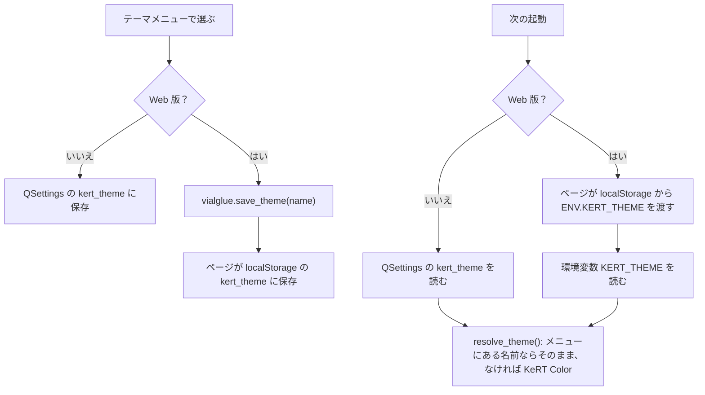

# テーマメニューの復活と「KeRT Color」 仕様書（2026-10-04）

## 1. 目的

非表示にしていた「テーマ」メニューを復活させ、これまでの唯一のテーマ「KeRT Light」を「KeRT Color」と改名して
デフォルトにする。上流（Vial）のテーマもすべて選べるようにし、Web 版にもメニューを出す。

## 2. メニュー

| 順 | 項目 | 内容 |
|---|---|---|
| 1 | System | OS 標準の配色（上流と同じ） |
| 2 | KeRT Color | 旧 KeRT Light。デフォルト。角丸・線・黒いキーなど独自の見た目一式 |
| 3〜 | Light, Dark, Arc, Nord, Olivia, Dracula, Bliss, Catppuccin Latte / Frappé / Macchiato / Mocha | 上流のテーマ（`themes.py` は無変更） |

- 各項目の `data()` にテーマ名を入れる（表示名は翻訳されうるため）。
- 選ぶと、その場で配色とスタイルシートを切り替え、完全な適用には再起動（Web 版はページの再読み込み）が必要と
  知らせる。Web 版は入れ子のイベントループ（`exec_()`）が使えないので、メッセージを `open()` で出す（待たない）。

## 3. 上流テーマでの見た目

上流テーマと System には KeRT Color の角丸・線のスタイルシートを付けない。ただし、キーは常に黒く描くので、
黒いキーの見た目（`key_button_style`: ピッカーのキー、タブ、キーボード名、透明なレイヤーボタン）だけは付ける。
選択色はそのテーマのパレットの Highlight / HighlightedText を使う。

タブの中央寄せ（`QTabWidget::tab-bar { alignment: center; }`）は、全テーマ共通の `COMMON_STYLE` に置き、どのテーマでも
タブを中央に寄せる（2026-10-04。それまでは KeRT Color だけで、上流テーマ・System では左寄せだった）。

## 4. 選んだテーマの保存

- 保存先のキーは `kert_theme`。メニューを隠していた間の古い `theme` の値（上流のテーマ名がありうる）は読まない。
- 旧名「KeRT Light」や未知の名前、未保存は KeRT Color になる。
- Web 版の Qt（Qt 5.14 for WebAssembly）は QSettings をメモリにしか持たないので、ページの `localStorage` に保存する。
  `localStorage` が使えないとき（プライベートウィンドウなど）は保存されず、毎回 KeRT Color で始まる。

| 場所 | 内容 |
|---|---|
| `branding_theme.py` | `DEFAULT_THEME = "KeRT Color"`、`SETTINGS_KEY = "kert_theme"`、`resolve_theme` / `saved_theme` / `save_theme`、`register()` は上流テーマを残して KeRT Color を先頭に置く、`stylesheet()` は上流テーマにも黒いキーの規則を付ける |
| `main_window.py` | メニューを常に表示（Web 版も）、項目に `setData(name)`、Web 版は `open()` で再読み込みを案内 |
| `web/src/main.c` | `vialglue.save_theme(name)` → `{cmd: "theme", name}` |
| `web/src/index.html` | `cmd == "theme"` で `localStorage` に保存、起動時に `ENV.KERT_THEME` へ渡す |
| `kert_ja.ts` | 「テーマを完全に適用するにはページを再読み込みしてください。」 |

## 5. テスト

| テスト | 確認内容 |
|---|---|
| `test_theme.py::test_kert_color_registered` | KeRT Color が登録され、KeRT Light は無い。二重登録しない。配色の値 |
| `test_theme.py::test_upstream_themes_are_back` | テーマの並びが KeRT Color、上流 11 種の順 |
| `test_theme.py::test_theme_menu_visible` | メニューが見え、System・KeRT Color・上流の順。保存されたテーマ（既定 KeRT Color）にチェック |
| `test_theme.py::test_default_theme_resolution` | 未保存・空・未知・KeRT Light → KeRT Color、メニューにある名前はそのまま |
| `test_theme.py::test_theme_saved_under_its_own_key` | `kert_theme` に保存・読み込み、古い `theme` は無視 |
| `test_theme.py::test_theme_saved_by_the_web_page` | Web 版は `KERT_THEME` から読み、`vialglue.save_theme` で送る（QSettings は使わない） |
| `test_theme.py::test_upstream_theme_keeps_the_key_look` | Dark と System に KeRT の線は付かず、黒いキー・透明なレイヤーボタンの規則は付く |
| `test_theme.py::test_tabs_centred_in_every_theme` | KeRT Color・Dark・Nord・System のどれでもタブの中央寄せがある |
| `test_web_start_page.py::test_page_keeps_the_theme` | `main.c` の `save_theme`、ページの保存と `ENV.KERT_THEME` |
