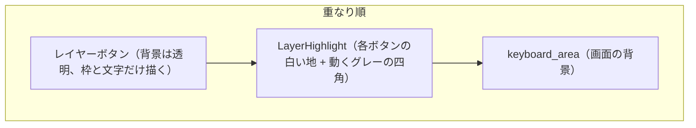
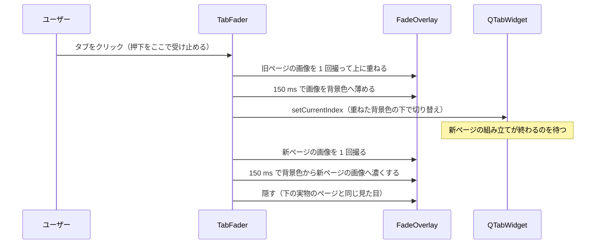
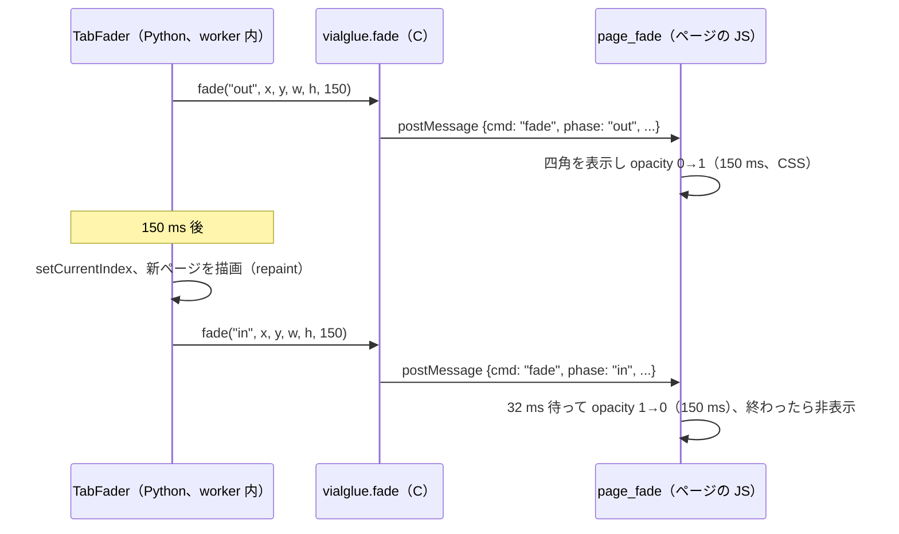

# ハイライト色と画面の動き

作成: 2026-09-27

## 1. ハイライト色

| 項目 | 値 | 備考 |
|---|---|---|
| Highlight | `#f0f0f0` | 選択中・押下中の塗り（2026-09-30 変更。黒いキー・タブ・レイヤーボタンの中で目立つ明るい色） |
| HighlightedText | `#1f2328` | ハイライト上の文字（濃色） |
| チェックマーク `check.svg` | `#1f2328` | |

経緯: KeRT グリーン `#00a3a3`（白文字）→ `#cccccc`（濃色文字、2026-09-27）→ `#767676`（白文字、同日）→ `#f0f0f0`（濃色文字、2026-09-30。黒いキーの試行に合わせて）。
「もう少し暗く、文字を白に」という指示に対し、白文字が読める条件から `#767676` を選んだ。これより明るいグレー
では白文字のコントラストが 4.5:1 を下回る。選択中の項目は枠線を濃色 `#303030` のまま残す（変更なし）。
Web 版の起動ページの色変数（`web/src/index.html` の `:root`）も同じ値にした。アプリアイコンの地は `#cccccc`
のまま（ハイライトとは独立）。

## 2. レイヤー切り替えボタンのスライド

レイヤーボタンをクリックすると、ハイライトの四角が今のレイヤーから選んだレイヤーまで上下に滑って移動する。

| 項目 | 値 |
|---|---|
| 時間 | 250 ms（`layer_highlight.SLIDE_MS`） |
| 動き | `QEasingCurve.InOutCubic`（ゆっくり動き出し、ゆっくり止まる） |
| 白文字になるボタン | 四角がボタンの中央線（文字の位置）を覆っているボタンだけ。2 つのボタンの中間では両方とも濃色文字のまま |

- `widgets/layer_highlight.py` の `LayerHighlight` がボタンの下に置かれ、各ボタンの白い地と、ハイライト色の
  四角を描く。レイヤーボタンはスタイルシート `QPushButton[layerButton="true"]` で背景を透明にしているので、
  四角がボタン越しに見える。
- 四角の位置は小数のレイヤー番号 `slide` で持ち、`QPropertyAnimation` で動かす。名前を `pos` にすると
  QWidget 自身の位置のプロパティと重なり、ウィジェットごと動いてしまうので使わない。
- キーボードを読み込み直したとき（ボタンの作り直し）はアニメーションせずレイヤー 0 に置く。ウィンドウに
  表示されていないときも瞬時に移動する。
- ボタンの移動やサイズ変更はイベントフィルタで拾い、四角の描画領域を追従させる。そのたびに白文字にするボタンも
  判定し直す（2026-09-27 修正。起動時はボタンが配置前で全部同じ位置に重なっており、その時点で全ボタンが
  「四角に覆われている」と判定されて白文字になり、配置後も直らなかった。白い地に白文字で、番号が見えなかった）。

## 3. タブ切り替えのフェード

タブをクリックすると、旧ページがフェードアウト → 切り替え → 新ページがフェードイン する。

| 項目 | 値 |
|---|---|
| フェードアウト | 150 ms（`tab_fade.FADE_OUT_MS`） |
| フェードイン | 150 ms（`tab_fade.FADE_IN_MS`）、合計 0.3 秒 |
| 対象 | すべての `QTabWidget`: 上段のエディタタブ、下段ピッカーのタブ、Macros / Key Override / Alt Repeat Key / QMK Settings の中のタブ、トレイ |
| 対象外 | キーボード操作やプログラムからの切り替え（`setCurrentIndex`）は従来どおり即時 |

- ページ全体に `QGraphicsOpacityEffect` を掛ける方式は、毎フレーム全ページ（キーマップは数百個のボタン）を
  描き直すため遅い（キーマップからの初回で 0.77 秒）。ブラウザ版ではさらに遅くなるので、画像を撮って重ねる
  方式にした。
- 重ねる層は全画素を自分で塗る（`WA_OpaquePaintEvent`）ので、表示中は下のページが描き直されない。フェードイン
  も実物のページではなく新ページの画像で行う（2026-09-27 修正。最初の版はフェードインで実物のページを毎フレーム
  描き直しており、下のページも毎フレーム描き直されていた。ブラウザ版では 0.15 秒に 1 コマ程度しか描けず、
  フェードせずに切り替わるように見えた）。修正後、キーマップからのフェードアウト 10 コマの間にキーボード表示が
  描かれるのは画像を撮るときの 1 回だけ。
- 新ページの組み立て（エディタやピッカーのタブを初めて開くとき）が終わってからフェードインの時計を動かす。
  先に動かすと組み立て中に前半が飛ばされる。
- フェード中に別のタブを押すと、今のフェードを即座に終えてから新しいフェードを始める。
- 計測（オフスクリーン、デスクトップ）: 2 回目以降の切り替えは約 0.33 秒、初めて開くページは組み立て時間を
  含めて約 0.44 秒。

### 3.1 ブラウザ版（2026-09-27 追加）

ブラウザ版の Qt は CPU だけで描画する。画面が広く高解像度（実測: CSS 2560×1289、devicePixelRatio 2）だと、
画像 1 枚を重ねる方式でも 1 コマに 100 ms 以上かかった（計測: 旧ページの画像を撮るのに 264 ms、150 ms の
フェードアウトが 3 コマ、フェードイン込みで約 1.1 秒に 6 コマ）。これではフェードせずに切り替わったように見える。

そこでブラウザ版ではフェードをページ側に任せる。ページ部分の上に HTML の四角（`#page_fade`、窓の背景色
`--kert-window`）を重ね、CSS の `opacity` の transition で薄くしたり濃くしたりする。ブラウザが GPU で合成する
ので、Qt の描画速度に関係なく滑らかに動く。

- 座標はページ部分（タブのページ領域）の画面上の位置で、Qt の座標がそのまま CSS ピクセルになる。
- `requestAnimationFrame` は使わない。バックグラウンドのタブでは止まるので、四角が消えずに残った。普通の
  タイマーを使い、さらに「in」が届かなくても 5 秒（`PAGE_FADE_FAILSAFE_MS`）で四角を消す。
- 計測（ブラウザ、実機キーボード）: クリックから約 0.17 秒で切り替わり、その 0.18 秒後にページへ「in」が届く。
  最後に四角が消え、タブが切り替わっていることを確認した（確認用のタブが非表示扱いだったため、動きそのものは
  目視していない）。
- 時刻とコマ数の記録: デスクトップは環境変数 `KERT_DEBUG_MOTION=1`、ブラウザはページを `?debug=motion` 付きで
  開くと、コンソールに `[motion]` で出る。

## 4. テスト

| テスト | 確認内容 |
|---|---|
| `test_ui_motion.py::test_highlight_grey_with_white_text` | ハイライトが無彩色で `#cccccc` より暗く、白文字・白チェックマークとのコントラスト比 4.5 以上 |
| `test_ui_motion.py::test_layer_highlight_slides` | レイヤー切り替えでアニメーションが走り（InOut 系、150〜400 ms）、途中の位置を通って目的のレイヤーに止まる。止まった位置のボタンだけ白文字 |
| `test_ui_motion.py::test_layer_highlight_rect_follows_button` | 止まったときの四角がボタンと同じ位置・大きさ |
| `test_ui_motion.py::test_label_white_only_when_covered` | 2 つのボタンの中間では両方とも濃色文字 |
| `test_ui_motion.py::test_layer_button_stylesheet` | レイヤーボタンの背景が透明、覆われたボタンは白文字 |
| `test_ui_motion.py::test_tab_click_fades` | クリック直後は旧ページのまま重ね画像が出ており、重ねた層は不透明扱い。切り替わった後は新ページの画像でフェードインし、最後に層が消える。ページ自体には効果を掛けない |
| `test_ui_motion.py::test_programmatic_switch_is_immediate` | プログラムからの切り替えは即時 |
| `test_ui_motion.py::test_every_tab_widget_fades` | ウィンドウ内とトレイのすべてのタブにフェードが付いている |
| `test_ui_motion.py::test_web_fade_uses_the_page_overlay` | ブラウザ版では Qt の重ね層を使わず、`vialglue.fade` に「out」（ページ領域の位置と 150 ms）を送り、切り替え後に「in」を送る |
| `test_web_start_page.py::test_page_draws_the_tab_fade` | ページに `#page_fade` があり、クリックを受けず、メッセージ `fade` で CSS の transition を使う。`requestAnimationFrame` に頼らず、5 秒の安全策がある |
| `test_web_start_page.py::test_glue_has_fade` | `web/src/main.c` に `fade` が登録され、`cmd: "fade"` を送る |
| `test_ui_motion.py::test_lit_labels_correct_after_first_layout` | 配置前のボタンを渡されても、配置後はレイヤー 0 の番号だけが白文字 |
