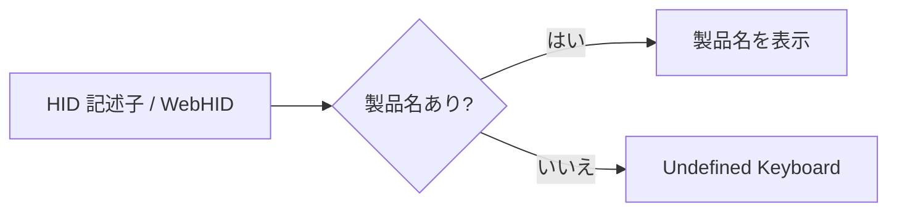

# 製品名のないキーボードの表示名

作成: 2026-09-24

## 1. 背景

RMK ファームウェアのキーボードを無線（Bluetooth）で接続すると、HID の製品名（`product_string` /
WebHID の `productName`）が取得できず、右上のセレクターや Web 版のキーボード一覧が空欄になる。

## 2. 仕様

| 場所 | 変更 |
|---|---|
| アプリ版 `VialKeyboard.title()` | 製品名が空または `None` のとき `UNDEFINED_KEYBOARD_NAME`（"Undefined Keyboard"）を使う。メーカー名があれば「メーカー名 Undefined Keyboard」（2 段表示では上段にメーカー名）。`[sideload]` / `[VIA]` の接尾辞は従来どおり |
| Web 版 `device_name()` | `productName` が空のとき "Undefined Keyboard"（以前は `vid:pid` の 16 進表記）。一覧の箱と、Python 側へ渡す `product_string` の両方に使う |

## 3. テスト

| テスト | 確認内容 |
|---|---|
| `test_device_combobox.py::test_undefined_keyboard_name` | 空 / None / 項目なしのとき "Undefined Keyboard"、メーカー名のみのとき 2 段に分かれる |
| `test_web_start_page.py::test_undefined_keyboard_name_on_the_web_page` | ページの `device_name` が "Undefined Keyboard" を返し、`product_string` にも使う |
