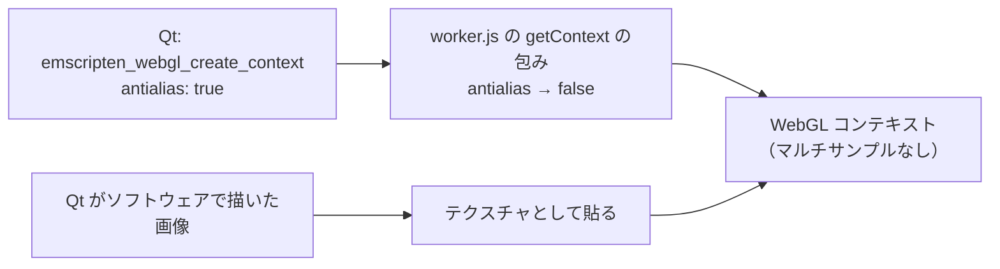

# Web 版の描画の重さ（キーとレイヤーボタンのホバー）仕様書（2026-10-04）

## 1. 症状

ローカル Web 版で、上部キーマップのキーとレイヤーボタンの上をマウスで動かすと、拡大・縮小が非常に重い。
ホバーのアニメーション（v1.1.11）を入れたころから起きていた。

## 2. 計測（2560×1233、devicePixelRatio 2、キャンバス 5120×2466）

| 条件 | ページのコマ間隔（中央値 / 最悪） |
|---|---|
| 何もしない | 17 ms / 18 ms |
| キーのない所でマウスを動かす（約 110 回/秒） | 17 ms / 18 ms |
| キーの上でマウスを動かす（ホバーの拡大・縮小が続く） | **64〜71 ms** / 131〜155 ms |

- Qt 側のキーの描画は 1 コマ 3〜6 ms（周りの 4〜9 キーだけ描き直し）で、アニメーション自体は軽い。
- ページのメインスレッドに長いタスクはない（マウスイベントの処理は 3 秒で合計 20 ms）。
- つまり、ワーカーのキャンバス（WebGL）から画面のコマを作る所が詰まっていた。

## 3. 原因

Qt for WebAssembly 5.14 は WebGL のコンテキストを `antialias: true`（マルチサンプル）で作る
（`qwasmopenglcontext.cpp`）。Qt は画面をすべて CPU で描き、WebGL では描き終えた画像を貼るだけなので、
マルチサンプルは見た目に何も足さない。それなのに、Retina の大きなキャンバス（5120×2466）では毎コマの
マルチサンプルのバッファの処理が重く、Qt が描き直すたびにコマの生成が遅れていた。

## 4. 対策

`web/src/worker.js` で、Qt がコンテキストを作る前に `OffscreenCanvas.prototype.getContext` を包み、WebGL の
ときは `antialias` を `false` にする（Qt の再ビルドは不要）。

| 条件 | 修正前（中央値 / 最悪） | 修正後（中央値 / 最悪） |
|---|---|---|
| キーの上でマウスを動かす | 64〜71 ms / 131〜155 ms | 17 ms / 51〜123 ms（3 秒で 45 → 141〜170 コマ） |
| レイヤーボタンの上でマウスを動かす | — | 17 ms / 174 ms（3 秒で 172 コマ） |

見た目は変わらない（文字やキーの縁のなめらかさは Qt が CPU で描いた時点で決まっている）。

| テスト | 確認内容 |
|---|---|
| `test_web_start_page.py::test_worker_asks_for_a_plain_webgl_canvas` | `worker.js` が `getContext` を包んで `antialias` を `false` にし、それが Python を動かす処理より前（読み込み時）にある |
