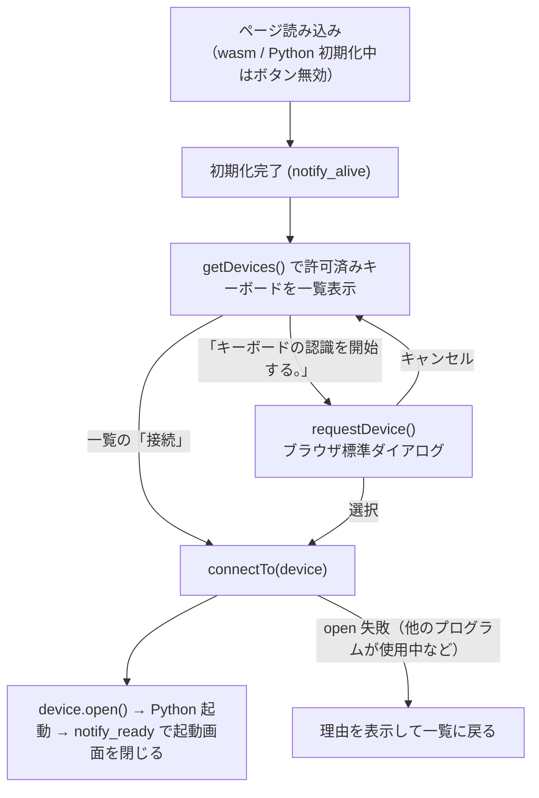

# ブラウザ版 起動画面 仕様書

作成日: 2026-09-22

## 1. 目的

ブラウザ版（`web/src/index.html`）の起動画面（今の「Exec KeRT-Keymapper」ボタンだけの画面）を、
何をすればよいかが分かる案内付きの画面にし、キーボードの選択をできる限りアプリの画面内で行えるようにする。

## 2. WebHID の制約

ブラウザがキーボード（HID デバイス）へのアクセスを許可する仕組みは WebHID で、次の制約がある。

| できること | できないこと |
| --- | --- |
| `navigator.hid.getDevices()`: **このサイトで一度許可したキーボードの一覧**をダイアログ無しで取得できる（許可はブラウザに保存され、次回以降も有効） | 一度も許可していないキーボードを、ブラウザ標準の選択ダイアログ（`requestDevice()`）**以外の方法で選ぶこと**。セキュリティ上の仕様で、ページ側で代替できない |
| 許可済みのキーボードには、ページ内の UI から直接接続できる | 標準ダイアログの見た目を変えること |
| `device.forget()`: 許可を取り消す（一覧から外す） | |

したがって、**初めてのキーボードだけはブラウザ標準ダイアログで 1 回選び、2 回目以降はアプリ画面内の一覧から選ぶ**、
という形にする。

## 3. 画面

> **決定（2026-09-22）**: 未許可のキーボードはブラウザ標準ダイアログでしか選べないため（§2）、
> ページ内の一覧は作らず、キーボードの選択は従来どおり標準ダイアログで行う。実装したのは案内文、
> ボタン文言、状態表示、エラー文言の国際化のみ。以下の一覧に関する記述は検討時の案として残す。
>
> **追記（同日）**: 「認識を開始する」を押したとき、このサイトで**すでに許可済みで接続中のキーボードが
> あればダイアログを出さず、その先頭に接続する**。無いときだけ標準ダイアログを出す。許可済みのキーボードが
> あるときは、案内文の代わりに見出し「編集するキーボードを選択」（16pt）と、許可済みキーボード 1 台につき 1 つの箱（10px 角丸・3px 枠、製品名をボタンと同じ 140% の太字で中央表示）を縦に並べ（箱とボタンの横幅は、先頭のキーボード名の文字幅の 3 倍に揃える）、**箱をクリックするとそのキーボードに接続して起動**する。
> その下に少し間隔（0.8em）を空けて箱と同じ幅の「別のキーボードを選択」ボタンを置き、押すと常に標準ダイアログを開いて、選んだキーボードが一覧に加わる。接続中・起動中は画面全体を半透明の黒（55%）で覆って下のアプリ画面にイベントが届かないようにし（起動完了で外す）、選んだ箱を KeRT グリーン（白文字）にしてその上に黒系（#303030）のスピナーを重ね、他の箱を無効にし、「別のキーボードを選択」ボタンを見えなくする（場所は保ったまま。他の要素が動かないように。「起動中」などの文字は出さない）。箱は文字（ボタンと同じ 140%）に対して上下の余白を詰めた低い高さ（行の高さは通常、上下余白 0.4em・左右 1.4em。「別のキーボードを選択」ボタンの方は文字を 4pt 小さく（140% − 4pt）、行の高さ 1 で、高さは変えずに上下余白で吸収し、箱より低い）。エラー時の補足文（対応ブラウザ、デスクトップ版の入手先）も日本語 / 英語で出す
> （追加や切り替え用）。ページ側は未許可のキーボードを知り得ないため、「ダイアログに出るものが全て
> ペア設定済みか」は判定できず、「許可済みが 1 台以上ある」を条件にしている。

起動画面（`#startup_inner`）の構成、上から順に:

1. **案内文**（要国際化）:
   「KeRT-Keymapper を起動する前に、接続されているキーボードをブラウザで認識する必要があります。
   下記のボタンをクリックすると接続されているキーボード一覧が表示されるので、そこからキーマップを
   編集するキーボードを選択してください。」
2. **認識済みキーボードの一覧**（許可済みのものがあるときだけ表示）: 1 台につき 1 枚のカード
   （10px 角丸、`#303030` の 3px 枠、白背景）に製品名と「接続」ボタン、「一覧から削除」（`forget()`）。
   カードの見出し「認識済みのキーボード」（要国際化）。
3. **「キーボードの認識を開始する」ボタン**（要国際化。現在の「Exec KeRT-Keymapper」の位置・スタイル）。
   押すとブラウザ標準ダイアログを開き、選ばれたキーボードに接続する。キャンセルしたら一覧に戻る。
   初期化中は無効で、文言は「起動準備中…」（要国際化）。
4. エラー表示（`#error_msg`）: 接続失敗の理由（要国際化。他のプログラムがキーボードを使っている可能性を添える）。

接続の処理（`connectTo(device)`）は現在の `connect()` の後半をそのまま使う（`open()`、レポート受信、
デバイス情報の設定、Python 起動）。接続中はボタン類を無効にし、文言を「接続中…」にする。

## 4. 国際化

ページの文言は `index.html` 内の辞書 `STRINGS = {ja: {...}, en: {...}}` から、`navigator.language` が
`ja` で始まれば日本語、それ以外は英語を使う（アプリ本体と同じ判定）。翻訳キー:

| キー | 日本語 | English |
| --- | --- | --- |
| intro | 上記の案内文 | Before KeRT-Keymapper can start, the browser has to be given access to the connected keyboard. Click the button below: the browser lists the connected keyboards, pick the one whose keymap you want to edit. |
| known | 認識済みのキーボード | Recognized keyboards |
| connect | 接続 | Connect |
| forget | 一覧から削除 | Remove from the list |
| start | キーボードの認識を開始する | Recognize a keyboard |
| preparing | 起動準備中… | Preparing… |
| connecting | 接続中… | Connecting… |
| open_failed | キーボードを開けませんでした: {error}。他のプログラム（デスクトップ版など）がキーボードを使っていないか確認してください。 | Could not open the keyboard: {error}. Check that no other program (e.g. the desktop app) is using it. |
| known_title | 編集するキーボードを選択 | Select the keyboard to edit |
| other | 別のキーボードを選択 | Choose another keyboard |
| support_note | WebHID への対応状況は … で確認できます。… | You can check web browser support at … |
| unsupported | このブラウザは WebHID に対応していません。Chrome / Edge などをお使いください。 | This browser does not support WebHID; use Chrome, Edge or another Chromium browser. |

## 5. 確認方法

`python3 web/dev_server.py` のローカルプレビュー（http://localhost:8765/）で確認する（ページの変更のみ
なのでビルド不要）。自動テストは無い（ブラウザの WebHID 権限操作は自動化できないため）。
