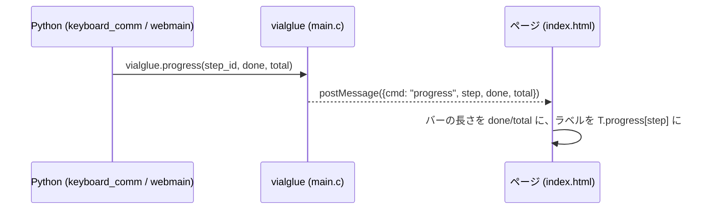

# ブラウザ版 起動プログレス表示 仕様書

作成日: 2026-09-22

## 1. 目的

キーボードを選んでから画面が出るまで（先読み後で約 12 秒）の間、何をしているかと進み具合を
プログレスバーで見せる。起動の手順は決まっているので、段階ごとに進捗を報告できる。

## 2. 構成

- Python 側は Qt 非依存の小さなモジュール `startup_progress.py` を通す。`report(step_id)` は
  ブラウザ版（`vialglue` がある）なら `vialglue.progress(step_id, done, total)` を呼び、デスクトップ版では
  何もしない。`done` は報告した段階の番号（1 始まり）、`total` は段階の総数。
- 段階（順序固定）と報告する場所:

| # | step_id | 場所 | 意味（日本語 / English） |
| --- | --- | --- | --- |
| 1 | connect | `webmain.main()` の先頭 | 接続 / Connecting |
| 2 | definition | `keyboard_comm.reload()` の `reload_layout` 後 | キーボード定義 / Keyboard definition |
| 3 | settings | `reload_settings` 後 | 設定 / Settings |
| 4 | entries | `reload_dynamic` 後 | 拡張機能の件数 / Feature entries |
| 5 | keymap | `reload_keymap` 後 | キーマップ / Keymap |
| 6 | macros | `reload_macros_late` 後 | マクロ / Macros |
| 7 | tapdance | `reload_tap_dance` 後 | Tap Dance / HostOS |
| 8 | combos | `reload_combo` / `reload_key_override` / `reload_alt_repeat_key` 後 | Combo / Key Override / Alt Repeat |
| 9 | ui | `MainWindow.rebuild()` の先頭 | 画面の組み立て / Building the window |
| 10 | layout | `webmain.main()` の機器取り込み後（`show()` の前） | 画面の配置 / Laying out |
| 11 | ready | `webmain.main()` の `show()` 後 | 完了 / Ready |

- ラベルの文言はページ側の辞書（日本語 / 英語）が持つ。Python は `step_id` だけを送る。
- 先読み中（キーボード選択前）にも `ui` などが報告されるが、ページはバー非表示の間の報告を無視し、クリック時にバーを 0 に戻す。
- 段階の間が長い（画面の組み立ては数秒）ので、ページは次の段階の手前まで少しずつバーを進める（1 秒あたり段階幅の約 1/8、次の段階の 90% で止まる）。
- ページ: 選んだキーボードの箱（緑）の下、「別のキーボードを選択」ボタンがあった場所に、箱と同じ幅の
  プログレスバー（10px 角丸、`#303030` の 3px 枠、KeRT グリーンの塗り）と、その下に現在の段階のラベルを
  表示する。箱の上のスピナーは残す。`ready` で 100% になり、直後に起動画面が閉じる。
- C 側: `vialglue_progress(step, done, total)` を `vialglue` モジュールに追加し、`EM_ASM` で
  `postMessage({cmd: "progress", step, done, total})` する。

## 3. テスト (`src/main/python/test/test_startup_progress.py`)

| テスト | 内容 |
| --- | --- |
| `test_report_is_noop_without_vialglue` | デスクトップ版（`vialglue` 無し）で `report()` が何もしない |
| `test_report_calls_vialglue` | 代替の `vialglue` を差し込むと `progress(step, done, total)` が正しい番号で呼ばれる |
| `test_reload_reports_steps_in_order` | 仮想キーボードに接続すると、段階が仕様の順序で報告される（`report` を記録用に差し替えて確認） |
