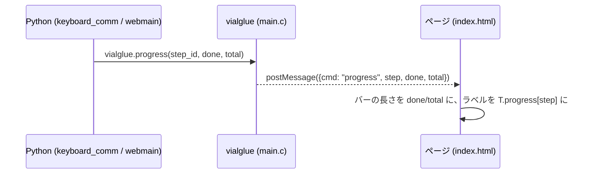

# ブラウザ版 起動プログレス表示 仕様書

作成日: 2026-09-22

## 1. 目的

キーボードを選んでから画面が出るまで（先読み後で約 12 秒）の間、何をしているかと進み具合を
プログレスバーで見せる。起動の手順は決まっているので、段階ごとに進捗を報告できる。

## 2. 構成

```mermaid
sequenceDiagram
    participant Py as Python (keyboard_comm / webmain)
    participant C as vialglue (main.c)
    participant P as ページ (index.html)
    Py->>C: vialglue.progress(step_id, done, total)
    C-->>P: postMessage({cmd: "progress", step, done, total})
    P->>P: バーの長さを done/total に、ラベルを T.progress[step] に
```

- Python 側は Qt 非依存の小さなモジュール `startup_progress.py` を通す。`report(step_id)` は
  ブラウザ版（`vialglue` がある）なら `vialglue.progress(step_id, done, total)` を呼び、デスクトップ版では
  何もしない。`done` は報告した段階の番号（1 始まり）、`total` は段階の総数。
- 段階（順序固定）と報告する場所:

| # | step_id | 場所 | 意味（日本語 / English） |
| --- | --- | --- | --- |
| 1 | connect | `webmain.main()` の先頭 | 接続 / Connecting |
| 2 | definition | `keyboard_comm.reload()` の `reload_layout` 後 | キーボード定義 / Keyboard definition |
| 3 | settings | `reload_settings` 後 | 設定 / Settings |
| 4 | entries | `reload_dynamic` 後 | 拡張機能の件数 / Feature entries |
| 5 | keymap | `reload_keymap` 後 | キーマップ / Keymap |
| 6 | macros | `reload_macros_late` 後 | マクロ / Macros |
| 7 | tapdance | `reload_tap_dance` 後 | Tap Dance / HostOS |
| 8 | combos | `reload_combo` / `reload_key_override` / `reload_alt_repeat_key` 後 | Combo / Key Override / Alt Repeat |
| 9 | ui | `MainWindow.rebuild()` の先頭 | 画面の組み立て / Building the window |
| 10 | layout | `webmain.main()` の機器取り込み後（`show()` の前） | 画面の配置 / Laying out |
| 11 | ready | `webmain.main()` の `show()` 後 | 完了 / Ready |

- ラベルの文言はページ側の辞書（日本語 / 英語）が持つ。Python は `step_id` だけを送る。
- 先読み中（キーボード選択前）にも `ui` などが報告されるが、ページはバー非表示の間の報告を無視し、クリック時にバーを 0 に戻す。
- 段階の間が長い（画面の組み立ては数秒）ので、ページは次の段階の手前まで少しずつバーを進める（1 秒あたり段階幅の約 1/8、次の段階の 90% で止まる）。
- ページ: 選んだキーボードの箱（緑）の下、「別のキーボードを選択」ボタンがあった場所に、箱と同じ幅の
  プログレスバー（10px 角丸、`#303030` の 3px 枠、KeRT グリーンの塗り）と、その下に現在の段階のラベルを
  表示する。箱の上のスピナーは残す。`ready` で 100% になり、直後に起動画面が閉じる。
- C 側: `vialglue_progress(step, done, total)` を `vialglue` モジュールに追加し、`EM_ASM` で
  `postMessage({cmd: "progress", step, done, total})` する。

## 3. テスト (`src/main/python/test/test_startup_progress.py`)

| テスト | 内容 |
| --- | --- |
| `test_report_is_noop_without_vialglue` | デスクトップ版（`vialglue` 無し）で `report()` が何もしない |
| `test_report_calls_vialglue` | 代替の `vialglue` を差し込むと `progress(step, done, total)` が正しい番号で呼ばれる |
| `test_reload_reports_steps_in_order` | 仮想キーボードに接続すると、段階が仕様の順序で報告される（`report` を記録用に差し替えて確認） |

## 「仕上げ」の短縮（2026-10-02）

「仕上げ」は、`window.show()` の後に起動完了をページへ知らせるまでの区間。完了の通知は 0.1 秒後のタイマーで
出すが、それまでにたまった処理（配置の計算と描画）が終わるまで実行されない。ブラウザ版の Qt は画面への反映を
ブラウザの描画タイミングに合わせるため、たまった描画が多いほど長くなる（非表示のタブでは終わらなかった）。

### 計測

ページを `?debug=startup` 付きで開くと、各段階の時刻と、表示から完了通知までの Python のプロファイルが
コンソールに `[startup]` で出る（`webmain.py` の `DEBUG_STARTUP`、デスクトップは環境変数 `KERT_DEBUG_STARTUP=1`）。

| 区間（プロファイルあり） | 修正前 | 修正後 |
|---|---|---|
| 画面の作成まで | 11.2 秒 | 9.2 秒 |
| ウィンドウの表示 | 5.2 秒 | 4.6 秒 |
| 仕上げ | 3.9 秒 | 0.1 秒 |
| 合計 | 20.7 秒 | 14.3 秒 |

修正前のプロファイルで重かったもの: 上段キーボードの配置計算 9 回（0.72 秒、ウィンドウの大きさが変わるたび）、
ピッカーのキーの描画 340 回（0.46 秒、影のための Python の描画処理）、ピッカーの折り返しの再計算 5 回（0.41 秒）。

### 対策

| 対策 | 内容 |
|---|---|
| 大きさが変わっただけでは配置し直さない | キーの位置は倍率と余白だけで決まる。`KeyboardWidget.resizeEvent` は前回の配置時から `(scale, padding)` が変わったときだけ `update_layout()` する。レイヤー・配列・拡大縮小の変更は従来どおり自分で配置し直す |
| 同じ折り返し幅は伝えない | `TabbedKeycodes.set_wrap_width` は前回と同じ値なら何もしない |
| ピッカーのキーの影を親がまとめて描く | `SquareButton` の Python の描画処理をやめ、キーを並べている親（ピッカーのブロック、キーボード型の並び、拡大・縮小ボタンの親）がイベントフィルタで描画範囲にかかるキーの影をまとめて描く（`widgets/key_shadow.py` の `install_parent`） |

一度試した「大きさの変化が続く間は計算を後回しにする」方式は、大きさを変えた直後の状態を前提にする処理と
テストが多く、取りやめた。

| テスト | 確認内容 |
|---|---|
| `test_startup_cost.py::test_plain_resize_does_not_relayout_the_keyboard` | 大きさの変更だけでは配置し直さず、倍率が変わったら配置し直す |
| `test_startup_cost.py::test_same_wrap_width_is_a_no_op` | 同じ折り返し幅では何もしない |
| `test_startup_cost.py::test_picker_key_shadows_painted_by_the_parent` | `SquareButton` に Python の描画処理がなく、キーの親に影を描くフィルタが付いている |

残りで最も長いのは「画面の作成」（9 秒前後、キーボードを読み込んだ後の画面の組み立て）。
