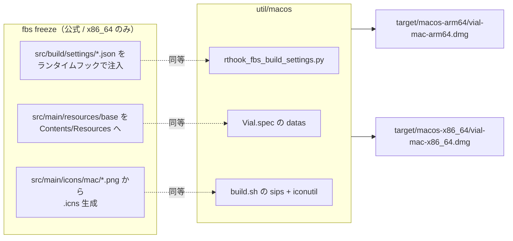
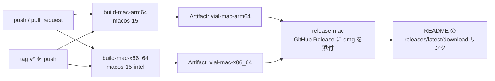

# macOS 版 Vial.app のビルド（Apple Silicon / Intel）

公式 CI の `build-mac` ジョブは Python 3.6.8 と fbs 0.9.0 で `fbs freeze` を実行しており、生成物は x86_64 版のみです。
Apple Silicon では Rosetta 2 で動きますが、Rosetta 2 は将来の macOS でサポート終了が予告されているため、
ここでは **arm64 ネイティブ**と **x86_64（Intel / AMD64）**の両方を PyInstaller で作ります。

fbs 0.9.0 は Python 3.6 / PyInstaller 3.4 に固定されていて現行環境では使えないので、
PyInstaller を直接使い、fbs が行っていた処理を再現しています。



## アーキテクチャの決まり方

pip の wheel は単一アーキテクチャなので、**ビルドに使う Python 自体のアーキテクチャ**で決まります。
`build.sh` は `VIAL_ARCH`（未指定なら `uname -m`）と venv の Python のアーキテクチャが一致しているか確認し、
一致しなければ中断します。arm64 の Mac で x86_64 版を作ることはできません（CI では Intel ランナーを使います）。

| 対象 | ビルド環境 | 生成物 |
|---|---|---|
| Apple Silicon | arm64 の Python（M1 以降の Mac、`macos-15` ランナー） | `target/macos-arm64/vial-mac-arm64.dmg` |
| Intel / AMD64 | x86_64 の Python（Intel Mac、`macos-15-intel` ランナー） | `target/macos-x86_64/vial-mac-x86_64.dmg` |

## ローカルでのビルド

```bash
python3 -m venv venv && source venv/bin/activate
pip install --upgrade pip
pip install -r util/macos/requirements.txt
pip install --no-deps "fbs==0.9.0"

util/macos/build.sh
```

生成物は `target/macos-<arch>/` 配下（`target` は `.gitignore` 済み）。
`./venv` 以外の Python を使う場合は `VIAL_PYTHON=/path/to/python util/macos/build.sh` のように指定します。

## GitHub Actions でのビルドとリリース

`.github/workflows/main.yml` に次のジョブがあります。



- push と pull request のたびに両アーキテクチャをビルドし、Artifacts に dmg を上げます。
- `v` で始まるタグ（例: `v0.7.5`）を push すると、ビルド後に `release-mac` ジョブが GitHub Release を作り、
  両方の dmg を添付します。リポジトリの README にある「最新版のダウンロード」リンクは
  `releases/latest/download/<ファイル名>` を指しているので、新しいリリースを作るたびに自動で最新版になります。

リリースの手順:

```bash
# 1. src/build/settings/base.json と util/macos/rthook_fbs_build_settings.py の version を上げる
# 2. コミットしてタグを打ち、push する
git tag v0.7.6
git push origin main v0.7.6
```

## 仕組みの補足

- `main.py` は `fbs_runtime.ApplicationContext` を使い、凍結時は `Contents/Resources` からリソースを読み、
  アプリ名・バージョンは `fbs_runtime._frozen.BUILD_SETTINGS` から取ります。
  後者は `fbs freeze` がランタイムフックで注入するため、同じことを `rthook_fbs_build_settings.py` で行います。
  バージョンを上げるときは `src/build/settings/base.json` と合わせてこのフックも更新してください。
- HID は vial-kb フォークではなく PyPI 版 `hidapi` を使います（フォークは現行 Python でビルド不可）。
  vial-gui が使う API はすべて PyPI 版にあります。

## 起動時のプロセスについて

起動すると `Vial` のプロセスが **2つ** 見えます。1つは GUI 本体、もう1つは `multiprocessing` のリソーストラッカー
（`Vial -c from multiprocessing.resource_tracker import main`）で、これは正常です。

`autorefresh_thread.py` が `multiprocessing.RLock` を使っており、Python 3.8 以降の macOS ではこれが
`sys.executable` で補助プロセスを起動します。凍結アプリでは `sys.executable` がアプリ自身なので、
`main.py` の先頭で `multiprocessing.freeze_support()` を呼んでいないと **Vial が Vial を無限に起動**します。
`main.py` にはこの呼び出しを入れてあるので、削除しないでください（ソース実行時は何もしない関数です）。

## 署名について

コード署名と公証はしていません。初回起動時に「開発元を確認できません」と出た場合は、
Finder で右クリック → 開く、または次を実行してください。

```bash
xattr -d com.apple.quarantine /path/to/Vial.app
```
